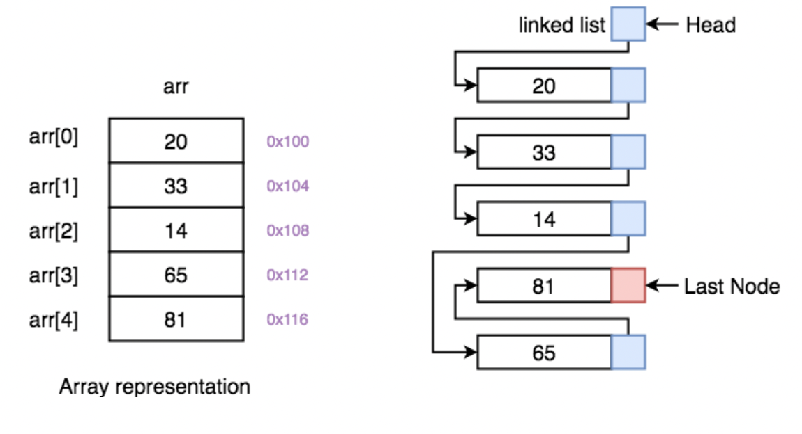

기본적으로 JS, TS는 객체지향 언어이면서, 인터프리터, 함수형 언어이므로
데이터는 모두 reference로 관리된다.

## const, let

const {변수명} = {초기값} → reference를 변경할 수 없는 데이터

let {변수명} = {초기값} → reference를 변경할 수 있는 데이터

<br>
<br>

## Dictionary와 List

**Dictionary**는 { key: value } 순서쌍을 이용하여 데이터를 관리하는 객체이다.

**List**는 { index: value } 순서쌍을 이용하여 데이터를 관리하는 객체이다

- Linked List란 말을 들어본 적이 있다?
  → 기본적으로 객체지향에서는 모든 객체가 Linked List로 구현되어 관리된다.
- List(리스트)는 Array(배열)가 아니다.
  → Array는 C, C++ 등에서 쓰이는 데이터의 시작점과 크기가 정해져있다
  → List는 데이터의 시작점은 정해져있지만, 크기와 다음 데이터의 위치가 정해져 있지 않다.



<br><br>

## 객체를 잘 다뤄야 하는 이유

프로그램의 비즈니스로직을 간결하게 수행할 수 있다.

- 비즈니스로직이란 프로그램이 일련된 기능을 반복 수행하도록 하는 기능단위의 묶음이다.

UI개발이 쉬워진다.

- UI표현에 적합한 객체형태로 변환하여 사용하게 되므로 UI표현에 필요한 공수가 줄어들어 스타일을 잡는데 집중할 수 있다.

통신요청시 함께 보낼 데이터를 편하게 관리가 가능하다.

- 통신을 요청하기위해 UI와 Action을 통해 만들어진 데이터를 잘 관리하면 통신을 하기위해 복잡한 절차를 거치지 않아도 된다.

1. [List](https://developer.mozilla.org/en-US/docs/Web/JavaScript/Reference/Global_Objects/Array)

2. [Dictionary](https://developer.mozilla.org/en-US/docs/Web/JavaScript/Reference/Global_Objects/Object)

<br><br>

## 객체 데이터의 명시적 사용과 캡슐화

명시적 사용이란 용어는 컴퓨터과학에 존재하지 않지만 추상적인 데이터를 다루기 위해서는 기능 외부에서 입력하는 파라미터 또는 기능 수행 결과로부터 전달받은 내용이 어떤 데이터를 가지고 있는지 명시적으로 표시하여 사용하는 것을 통칭하기 위해 사용한다.

#### 형변환

##### 명시적 변환 Explicit Conversion

```jsx
let variable = 100;

console.log(variable, typeof variable); // 100 "number"

variable = Object(variable);
console.log(variable, typeof variable); // Number {100} "object"

variable = String(variable);
console.log(variable, typeof variable); // 100 "string"

variable = Boolean(variable);
console.log(variable, typeof variable); // true "boolean"
```

##### 암시적 변환 Structual Conversion

```jsx
let num = 10;
let str = "10";

console.log(num + str, typeof (num + str)); // "1010" "string"
```
