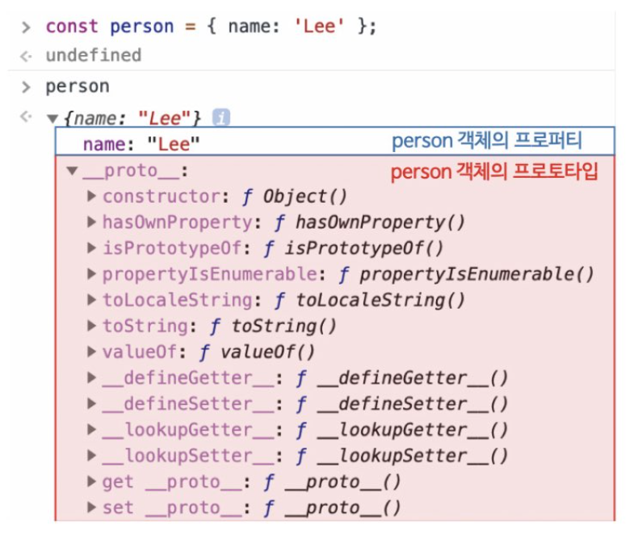
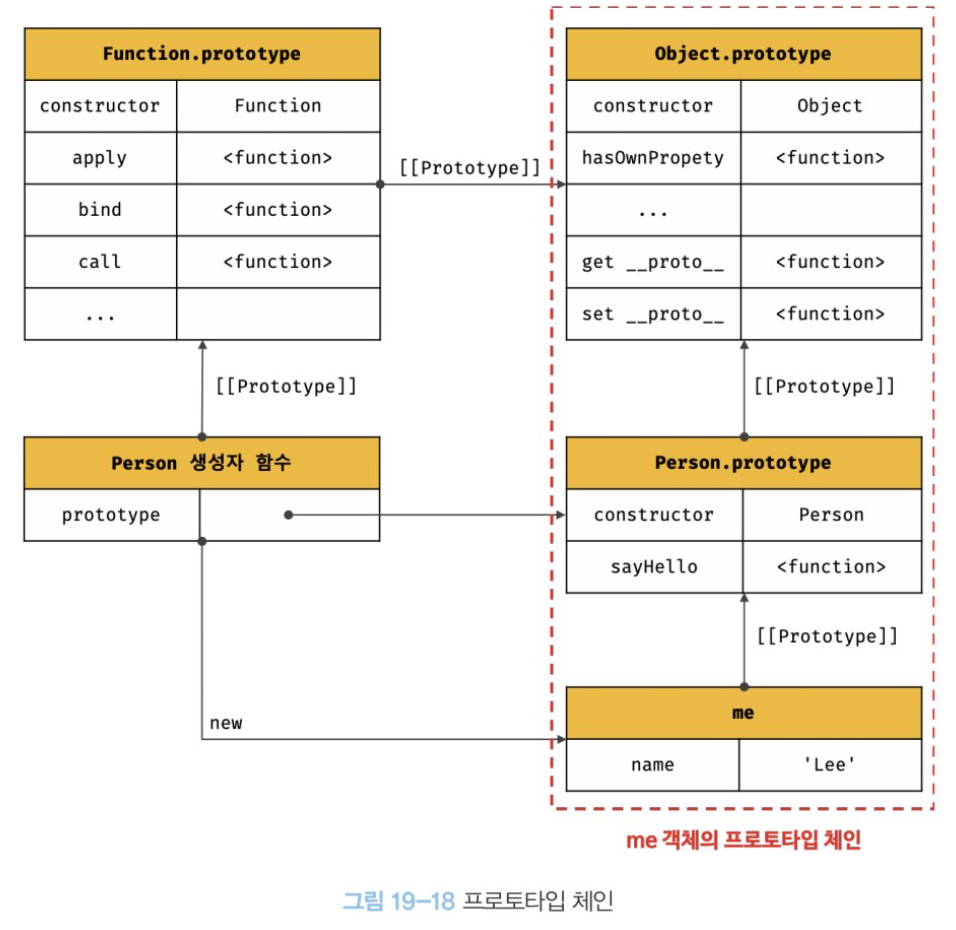

# 프로토타입

JS는 프로토타입 기반의 객체지향 프로그래밍 언어.

클래스는 생성자 함수보다 엄격, 생성자 함수에서 제공하지 않는 기능도 제공.

<br>

## 객체지향 프로그래밍

프로그램을 명령어 또는 함수의 목록으로 보는 전통적인 명령형 프로그래밍의 절차지향적 관점에서 벗어나

여러 개의 독립적 단위, 객체의 집합으로 프로그램을 표현하려는 프로그래밍 패러다임.

프로그램에 필요한 속성만 간추려 내어 표현하는것을 `추상화`라 한다.

```js
const circle = {
  radius: 5,

  getDiameter() {
    return 2 * this.radius;
  },

  getperimeter() {
    return 2 * Math.PI * this.radius;
  },
  getArea() {
    return Math.PI * this.radius ** 2;
  },
};
```

객체의 상태를 나타내는 `데이터`와 상태 데이터를 조작할 수 있는 `동작`을

하나의 논리적인 단위로 묶어 생각한다.

따라서 객체는 **상태 데이터와 동작을 하나의 논리적인 단위로 묶은 복합적인 자료구조**라 할 수 있다.

<br>

## 상속과 프로토타입

어떤 객체의 프로퍼티 또는 메서드를 다른 객체가상속받아 그대로 사용할 수 있다.

```js
function Circle(radius) {
  this.radius = radius;
  this.getArea = function () {
    return Math.PI * this.radius ** 2;
  };
}

const circle1 = new Circle(1);
const circle2 = new Circle(2);
```

생성자 함수는 동일한 프로퍼티 구조를 갖는 객체를 여러개 생성할 때 유리.

하지만 문제는 인스턴스를 생성할 때마다 getArea메서드를 중복 생성, 중복 소유한다는 것. -> 메모리 낭비

상속을 통해 불필요한 중복을 제거할 수 있다.

JS는 프로토타입을 기반으로 상속을 구현한다.

```js
function Circle(radius) {
  this.radius = radius;
}

Circle.prototype.getArea = function () {
  return Math.PI * this.radius ** 2;
};

// 모든 인스턴스는 부모 객체의 역할을 하는 프로토타입 으로부터 getArea 메서드를 상속받는다.

const circle1 = new Circle(1);

console.log(circle1.getArea()); // 3.141592...
```

<br>

## **proto** 접근자 프로퍼티

모든 객체는 **proto** 접근자 프로퍼티를 통해 자신의 프로토타입, 즉 [[Prototype]] 내부 슬롯에 간접 접근할 수 있다.



Object.prototype의 접근자 프로퍼티로써 자체적으로 값은 갖지 않고

다른 데이터의 값을 익거나 저장할 때 사용. (getter/setter)

```js
const obj = {};
const parent = { x: 1 };

//getter 함수인 get __proto__가 호출되어 obj객체의 프로토타입을 취득
obj.__proto__;

//setter 함수인 set __proto__가 호출되어 objrorcpdml 프로토타입을 교체
obj.__proto__ = parent;

console.log(obj.x); // 1
```

<br>

프로토타입 체인은 단방향 링크드 리스트로 구현되어야 한다.

검색 방향이 한쪽 방향으로만 흘러야 한다는 의미.

코드내에서 직접 **proto**를 쓰는것은 권장되지 않는다.

모든 객체가 **proto** 접근자 프로퍼티를 사용할 수 있는건 아니기 때문.

```js
const obj = Object.create(null);

// 메서드를 사용하는 편이 좋다.
console.log(Object.getPrototype(obj)); // null

// 교체는
const obj = {};
const parent = { x: 1 };

Object.getPrototypeOf(obj); // obj.__proto__;

Object.setPrototypeOf(obj, parent); // obj.__proto__ = parent;

console.log(obj.x); //1
```

<br>

화살표 함수와 ES6 메서드 축약 표현으로 정의한 메서드는 prototype 프로퍼티를

소유하지 않으며 프로토타입도 생성하지 않는다.

```js
function Person(name) {
  this.name = name;
}

const me = new Person("Lee");

console.log(Person.prototype === me.__proto__); //true
```

<br>

```js
//생성자 함수
function Person(name) {
  this.name = name;
}

const me = new Person("Lee");

console.log(me.constructor === Person); //true
// me 객체는 프로토타입의 constructor프로퍼티를 통해 생성자 함수와 연결.
// me 객체에는 constructor 프로퍼티가 없지만 me의 프로토타입인 Person.prototype에는 있다.
// Person.prototype의 constructor프로퍼티를 상속받아 사용하는 것.
```

<br>

리터럴 표기법에 의해 생성된 객체도 물론 프로토타입이 존재.

하지만 constructor프로퍼티가 가리키는 생성자 함수가 반드시 생성자 함수라고 단정할 수 없다.

```js
const obj = {};

console.log(obj.constructor === Object); //true
```

Object 생성자 함수로 생성한 객체가 아니라 객체 리터럴에 의해 생성된건데

Object 생성자 함수와 constructor 프로퍼티로 연결되어 있다.

객체 리터럴이 평가될 때 추상연산이 호출되어 빈 객체를 생성하고 Object 프로토타입을 갖게한다.

```js
function foo() {}

console.log(foo.constructor === Function); //true

// 함수도 마찬가지

//가상적인 생성자 함수를 갖는다. -> constructor와 연결됨.
```

<br>

프로토타입과 생성자 함수는 단독으로 존재할 수 없고 언제나 쌍으로 존재.

프로토타입은 생성자 함수가 생성되는 시점에 더불어 생성된다.

호이스팅으로 런타임 이전에 함수 객체가 생성되는 시점에 프로토타입도 더불어 생성된다.

<br>

JS 엔진은 객체 리터럴을 평가하여 객체를 생성할 때 추상연산 OrdinaryObjectCreate을 호출한다.

이때 추상 연산에 전달되는 프로토타입은 `Object.prototype`이다.

즉 객체 리터럴에 의해 생성되는 객체의 프로토타입은 `Object.prototype`이다.

```js
const obj = { x: 1 };

console.log(obj.constructor == Object); //true
console.log(obj.hasOwnProperty("x")); //true

// const obj = new Object() 생성자 함수도 마찬가지다.
```

#### 프로토타입 Person.prototype에 프로퍼티를 추가해 하위 객체가 상속받을 수 있도록 구현해보자.

```js
function Person(name) {
  this.name = name;
}

Person.prototype.sayHello = function () {
  console.log(`Hi, My name is ${this.name}`);
};

const me = new Person("Lee");
const you = new Person("kim");

me.sayHello(); // Hi, My name is Lee
you.sayHello(); // Hi, My name is Kim
```

<br>

## 프로토타입 체인

```js
function Person(name) {
  this.name = name;
}

Person.prototype.sayHello = function () {
  console.log(`Hi, My name is ${this.name}`);
};

const me = new Person("Lee");

console.log(me.hasOwnPropery("name")); //true
```

Person 생성자 함수에 의해 생성된 me 객체는 Person.prototype 뿐 아니라,

Object.prototype도 상속받았다는것을 볼 수 있다.

```js
Object.getPrototypeOf(me) === Person.prototype; //true

Object.getPrototypeOf(Person.prototype) === Object.prototype; //true
```



객체의 프로퍼티에 접근하려고 할 때, 해당 객체에 프로퍼티가 없으면

내부 슬롯의 참조를 따라 부모 프로토타입의 프로퍼티를 순차적으로 검색한다. -> 프로토타입 체인

최상위에 위치하는 객체는 언제나 Object.prototype이다.

여기에도 프로퍼티를 검색할 수 없는 경우 undefined를 반환한다.

스코프 체인과 프로토타입 체인은 서로 협력하여 식별자와 프로퍼티를 검색하는데 사용된다.

<br>

## 오버라이딩과 프로퍼티 섀도잉

프로토타입 프로퍼티와 같은 이름의 프로퍼티를 인스턴스에 추가하면

프로토타입 체인을 따라 프로토타입 프로퍼티를 검색하여 프로토타입

프로퍼티를 덮어쓰는 것이 아니라 인스턴스 프로퍼티로 추가한다.

이때 인스턴스 메서드는 프로토타입 메서드를 `오버라이딩`했고

프로토타입 메서드는 가려진다.

이처럼 상속 관계에 의해 프로퍼티가 가려지는 현상을 `프로퍼티 섀도잉` 이라한다.

인스턴스의 프로퍼티를 삭제하면 다시 프로토타입의 메서드를 참조.

하위 객체를 통해 프로토타입의 프로퍼티를 변경 또는 삭제하는것은 불가능하다.

프로퍼티를 변경 또는 삭제하려면 하위객체를 통해 접근하는게 아니라 프로토타입에 직접 접근해야 한다.

<br>

## 프로토타입의 교체

```js
const Person = (function () {
  function Person(name) {
    this.name = name;
  }

  Person.prototype = {
    sayHello() {
      console.log(`Hi! My name is ${this.name}`);
    },
  };
  return Person;
})();

const me = new Person("Lee");

console.log(me.constructor === Person); // false
console.log(me.constructor === Object); // true
```

Person 생성자 함수가 생성할 객체의 프로토타입을 객체 리터럴로 교체했다.

이처럼 프로토타입을 교체하면 constructor 프로퍼티와 생성자 함수 간의 연결이 파괴된다.

다시 되살리려면 객체 리터럴에 constructor 를 추가한다.

```js
const Person = (function () {
  function Person(name) {
    this.name = name;
  }

  Person.prototype = {
    constructor: Person,
    sayHello() {
      console.log(`Hi! My name is ${this.name}`);
    },
  };
  return Person;
})();

const me = new Person("Lee");

console.log(me.constructor === Person); // false
console.log(me.constructor === Object); // true
```

<br>

## 인스턴스에 의한 프로토타입의 교체

생성자 함수의 prototype 프로퍼티에 다른 임의의 객체를 바인딩하는 것은 미래에 생성할 인스턴스의 프로토타입을 교체하는것.

**proto** 접근자 프로퍼티를 통해 프로토타입을 교체하는것은 이미 생성된 객체의 프로토타입을 교체하는 것.

```js
function Person(name) {
  this.name = name;
}

const me = new Person("Lee");

const parent = {
  sayHello() {
    console.log(`Hi! My name is ${this.name}`);
  },
};

//me 객체의 프로토타입을 parent 객체로 교체한다.
Object.setPrototypeOf(me, parent);
// me.__proto__ = parent; 와 같음.

me.sayHello(); // Hi! My name is Lee

console.log(me.constructor === Person); // false
console.log(me.constructor === Object); // true
```

마찬가지로 교체한 객체에는 constructor프로퍼티가 없어 생성자 함수와의 연결이 파괴됨.

<br>

## instanceof 연산자

우변의 생성자 함수의 prototype에 바인딩되 객체가 좌변의 객체의 프로토타입 체인 상에 존재하면 true, 아니면 false.

```js
fucntion Person(name) {
  this.name = name;
}

const me = new Person('Lee')

console.log(me instanceof Person) // true
console.log(me instanceof Onject) // true
```

프로토타입을 교체해보자.

```js
fucntion Person(name) {
  this.name = name;
}

const me = new Person('Lee')

const parent = {};

Object.setPrototypeOf(me, parent)

console.log(me instanceof Person) // false
console.log(me instanceof Onject) // true
```

parent객체를 Person 생성자 함수의 prototype 프로퍼티에 바인딩하면 true로 평가됨

```js
fucntion Person(name) {
  this.name = name;
}

const me = new Person('Lee')

const parent = {};

Object.setPrototypeOf(me, parent)

console.log(Person.prototype === parent) // false
console.log(parent.constructor === Person) // false

Person.prototype = parent;

console.log(me instanceof Person) //true
console.log(me instanceof Object) //true

```

이처럼 instanceof 연산자는 프로토타입의 constructor 프로퍼티가 가리키는 생성자 함수를 찾는게 아니라

생성자 함수의 prototype에 바인딩된 객체가 프로토타입 체인 상에 존재하는지 확인한다.

<br>

## 직접 상속

Object.create 메서드는 명시적으로 프로토타입을 지정해 새로운 객체를 생성한다.

첫 번째 매개변수에 생성할 객체의 프로토타입으로 지정할 객체.

두 번째 매개변수에는 생성할 객체의 프로퍼티 키와 디스크립터 객체. 생략가능.

```js
let obj = Object.create(Object.prototype, {
  x: { value: 1, writable: true, enumerable: true, configurable: true },
});

console.log(obj.x); // 1
console.log(Object.getPrototypeOf(obj) === Object.prototype); //true

const myProto = { x: 10 };
obj = Object.create(myProto);
console.log(obj.x); //10
console.log(Object.getPrototypeOf(obj) === myProto); // true

function Person(name) {
  this.name = name;
}

obj = Object.create(Person.prototype);
obj.name = "Lee";
console.log(obj.name); // Lee
console.log(Object.getPrototypeof(obj) === Person.prototype); // true
```

장점

- new 연산자 없이 객체를 생성
- 프로토타입을 지정하면서 객체를 생성할 수 있다.
- 객체 리터럴에 의해 생성된 객체도 상속받을 수 있다.

<br>

## 객체 리터럴 내부에서 **proto**에 의한 직접 상속

```js
const myProto = { x: 10 };

const obj = {
  y: 20,
  __proto__: myProto,
};

console.log(obj.x, obj.y); // 10 20
console.log(Object.getPrototypeOf(obj) === myProto); // true
```

<br>

## in 연산자

객체 내에 특정 프로퍼티가 존재하는지 여부를 확인한다.

```js
const person = {
  name: "Lee",
  address: "Seoul",
};

console.log("name" in person); //true
console.log("address" in person); //true
console.log("age" in person); //false

console.log("toString" in person); //true
// peprson 객체가 속한 프로토타입 체인상에 존재하는 모든 프로토타입에서 toString 프로퍼티를 검색했기 때문에

// ES6에서 도입된 Reflect.has 도 똑같다.
console.log(Reflect.has(person, "name")); //true
console.log(Reflect.has(person, "toString")); //true

//hasOwnProperty도 사용할 수 있다.
// 객체 고유의 프로퍼티인 경우에만 true, 상속받은 프로토타입의 프로퍼티키면 false
console.log(person.hasOwnProperty("name")); //true
console.log(person.hasOwnProperty("toString")); //false
```

<br>

## 프로퍼티 열거

```js
const person = {
  name: "Lee",
  address: "Seoul",
};

for (const key in person) {
  console.log(key + ":" + person[key]);
}

// name : 'Lee'
// address : Seoul
```

for ...in 문도 객체가 상속받은 모든 프로토타입의 프로퍼티를 열거하지만

toString 과 같은 Object.prototype의 프로퍼티가 열거되지 않는다.

프로퍼티의 어트리뷰터 [[Enumerable]]은 프로퍼티의 열거 가능 여부를 갖는데 이때 false기 때문.

키가 심벌인 프로퍼티도 열거하지 않는다.

하지만 상속받은 프로퍼티까지 열거하므로 객체 고유 프로퍼티만 열거하려면

hasOwnProperty 메서드로 걸러줘야함.

<br>

## Object.keys/values/entries 메서드

객체 고유 프로퍼티만 열거하기 위해서는 for in 문보다 Object.keys/values/entries 메서드가 권장된다.

```js
const person = {
  name: "Lee",
  address: "Seoul",
  __proto__: { age: 20 },
};

console.log(Object.keys(person)); // ['name', 'address']
console.log(Object.values(person)); // ['Lee', 'Seoul']
```

```js
console.log(Objectentries(person)); // [['name','Lee'],['address','Seout']]

Object.entries(person).forEach(([key, value]) => console.log(key, value));

// name Lee
// address Seoul
```
