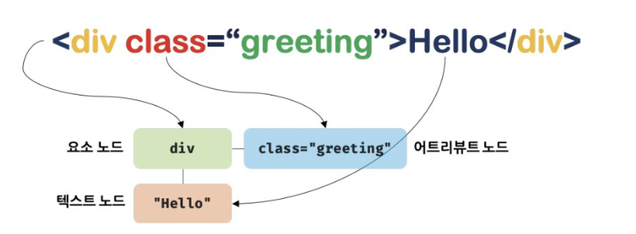
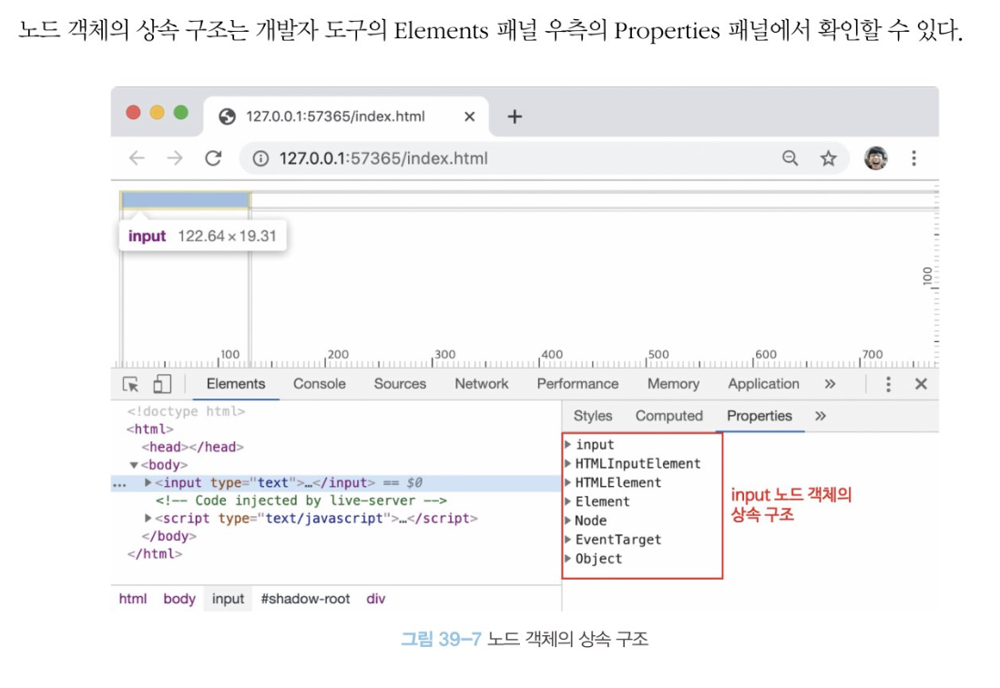
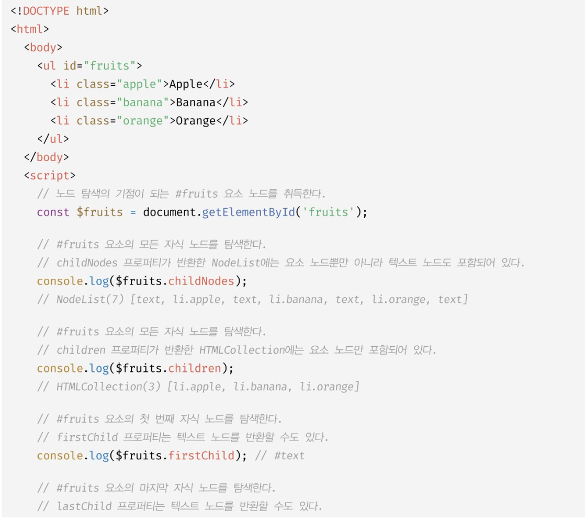
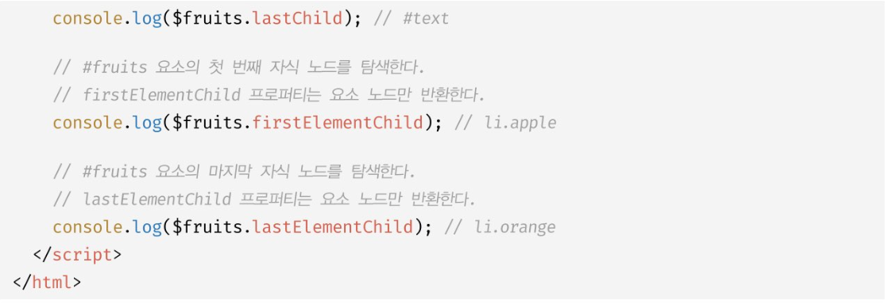
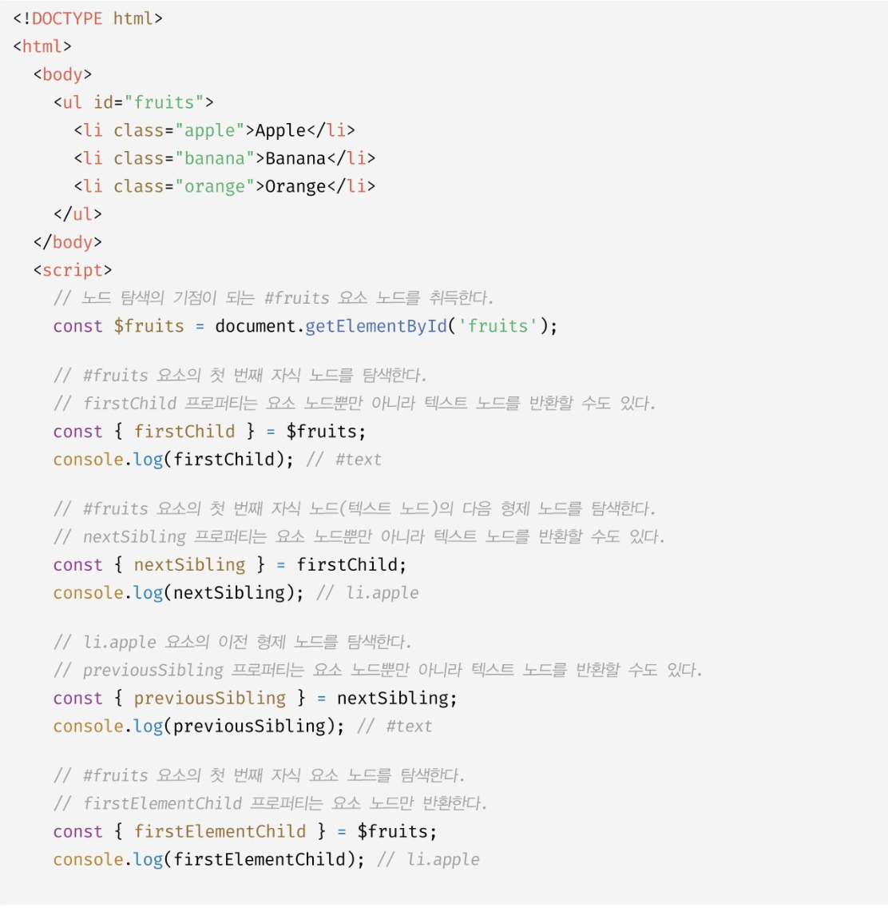
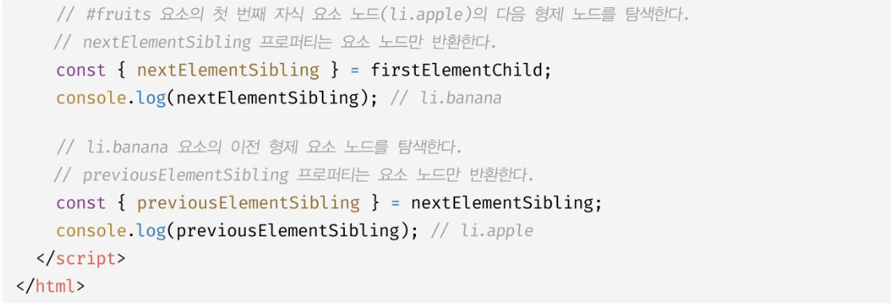
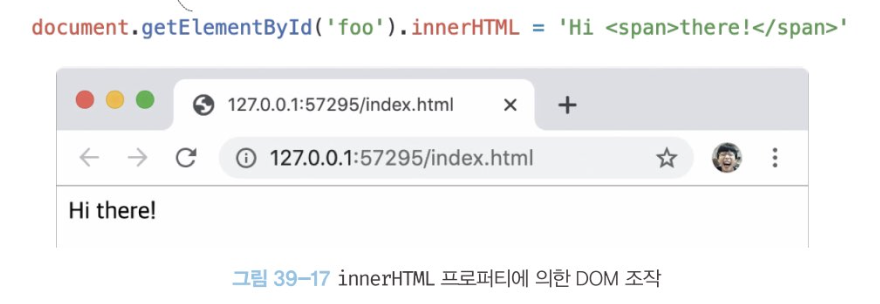
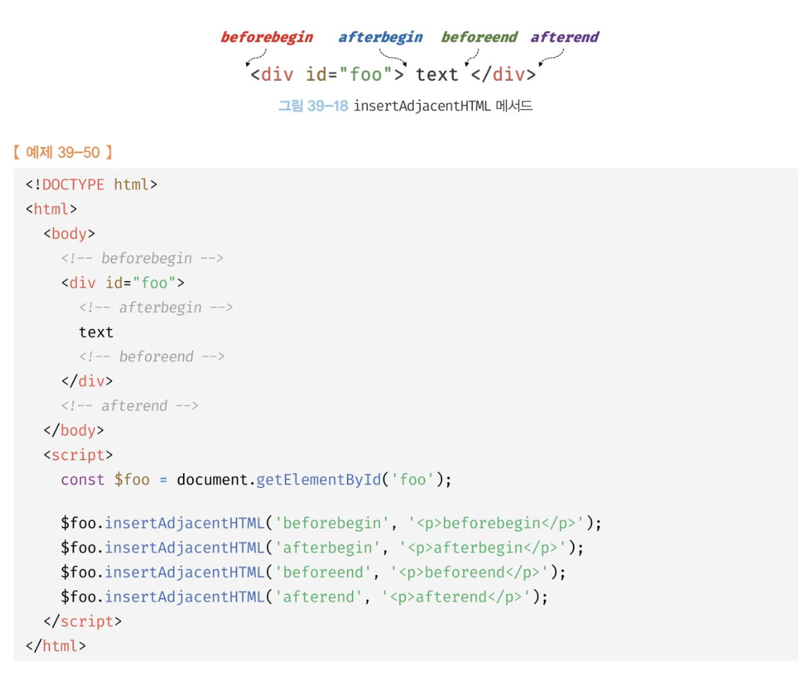
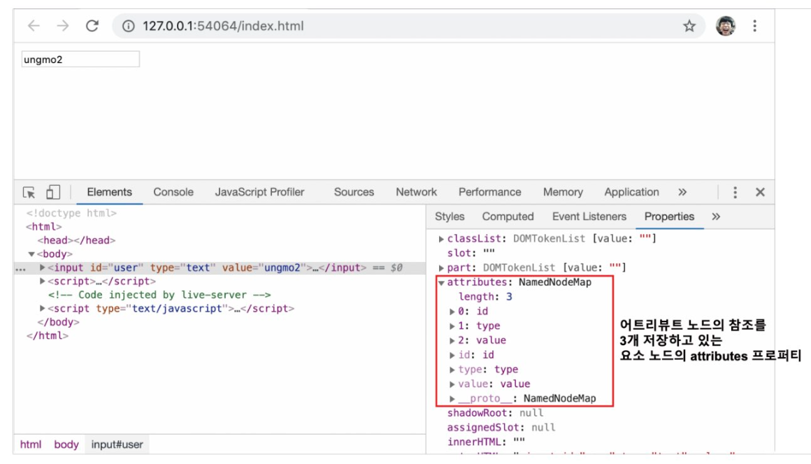
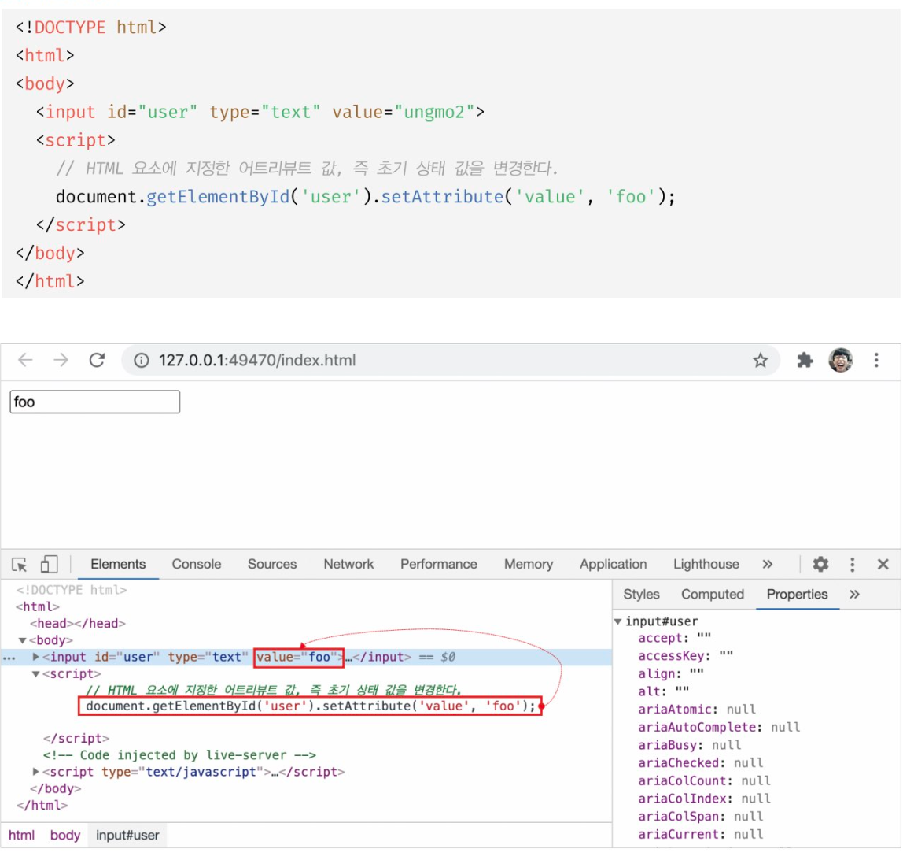

# DOM

브라우저의 렌더링 엔진은 HTML 문서를 파싱하여 브라우저가 이해할 수 있는 자료구조인 DOM을 생성한다.

HTML 문서의 계층적 구조와 정보를 표현하며 이를 제어할 수 있는 API, 

즉 프로퍼티와 메서드를 제공하는 트리 자료구조다.

<br>

## 노드

html 요소는 html 문서를 구성하는 개별적인 요소를 의미한다.

(시작태그, 어트리뷰트, 어트리뷰트 값, 콘텐츠, 종료 태그)

html 요소는 렌더링 엔진에 의해 파싱되어 DOM을 구성하는 요소 `노드 객체`로 변환된다.



<br>

## 트리 자료구조

는 노드들의 계층 구조로 이뤄진다.

노드간의 계층적 구조를 표현하는 비선형 자료구조를 말함.

최상위 부모가 없는 노드는 루트 노드라 한다.

자식 노드가 없는 노드를 리프 노드라 한다.

노드 객체들로 구성된 트리 자료구조를 DOM이라 한다.

<br>

## 노드 객체의 타입

html 문서를 렌더링 엔진이 파싱한다고 생각해보자.

```html
<!DOCTYPE html>
<html>
    <head>
        <meta charset="UTF-8">
        <link rel="stylesheet" href="style.css">
    </head>
    <body>
        ~~~
    </body>
</html>
```

렌더링 엔진은 위 html 문서를 파싱해 DOM을 생성한다.

DOM은 노드 객체의 계층적인 구조로 구성된다.

노드객체는 총 12 종류가 있는데 중요한건 다음과 같이 4가지.

- 문서노드
    DOM 트리 최상위에 존재하는 루트 노드, Document 객체를 가리킴.

- 요소노드
    html요소를 가리키는 객체. html 요소간의 중첩에 의해 부자 관계를 가지며 이 부자 관계를 통해 정보를 구조화한다. 따라서 문서의 구조를 표현한다고 할 수 있다.

- 어트리뷰트 노드
    어트리뷰트가 지정된 HTML 요소의 요소 노드와 연결되어 있다. 어트리뷰트 노드에 접근해 어트리뷰트를 참조하거나 변경하려면 먼저 요소 노드에 접근해야함.
    요소 노드는 부모 노드와 연결되어 있지만 어트리뷰트 노드는 부모 노드와 연결되지 않고 요소 노드에만 연결되기 때문.

- 텍스트노드
    html 요소의 텍스트를 가리키는 객체. 요소 노드가 문서의 구조를 표현한다면 텍스트 노드는 문서의  정보를 표현한다고 볼 수 있다. 텍스트 노드는 요소 노드의 자식 노드이며 자식 노드를 가질 수 없는 리프 노드다. 즉, 텍스트 노드는 DOM 트리의 최종단이다. 따라서 텍스트 노드에 접근하려면 먼저 부모노드인 요소 노드에 접근해야함.


<br>

DOM을 구성하는 노드 객체는 ESMAScript 사양에 정의된 표준 빌트인 객체가 아니라 브라우저 환경에서 추가적으로 제공하는 호스트 객체다.

하지만 노드 객체도 자바스크립트 객체이므로 프로토타입에 의한 상속 구조를 갖는다.

배열이 객체인 동시에 배열인 것처럼 input 요소 노드 객체도 다양한 특성을 갖는 객체이며,

이러한 특성을 나타내는 기능들을 상속을 통해 제공받음.



<br>

노드 객체에는 노드 객체의 종류, 타입에 상관없이

모든 노드 객체가 공통으로 갖는 기능도 있고

노드 타입에 따라 고유한 기능도 있다.

예로, 모든 노드 객체는 공통적으로 이벤트를 발생시킬 수 있다.

탐색기능, 정보 제공기능도 공통적으로 필요하다.

node 인터페이스가 제공한다.

html 요소가 객체화된 요소 노드 객체는 html요소가 갖는

공통적인 기능이 있다.

예로, input 노드 객체와 div 요소 노드 객체는 모두

html 요소의 스타일을 나타내는 style 프로퍼티가 있다.

이처럼 html 요소가 갖는 공통적인 기능은 htmlElement 인터페이스가 제공한다.

요소의 종류에 따라 고유한 기능도 있다.

예로, input 요소 노드 객체는 value 프로퍼티가 필요하지만 

div 요소 노드 객체는 value 프로퍼티가 필요없다.

따라서 필요한 기능을 제공하는 인터페이스가 html 요소의 종류에 따라 각각 다르다.

노드 객체는 공통된 기능일수록 프로토타입 체인의 상위에,

개별적인 고유 기능일수록 프로토타입 체인의 하위에 체인을 구축해 노드 객체에 필요한 기능, 즉 프로퍼티와 메서드를 제공하는 상속구조를 갖는다.

<br>

DOM은 HTML 문서의 계층적 구조와 정보를 표현하는 것은 물론

노드 객체의 종류, 즉 노드 타입에 따라 필요한 기능을 프로퍼티와 메서드의 집합인 DOM API로 제공한다.

이 DOM API를 이용해 HTML의 구조나 내용 또는 스타일 등을 동적으로 조작한다.

프론트엔드 개발자에게 HTML은 단순히 태그와 어트리뷰트를 선언적으로 배치하여 뷰를 구성하는 것 이상의 의미를 갖는다.

즉, HTML을 DOM과 연관지어 바라보아야 한다.

<br>

## 요소 노드 취득

HTML의 구조나 내용 또는 스타일을 동적 조작하려면 먼저 요소 노드를 취득해야 한다.

1. id를 이용한 요소 노드 취득

```js
const $elem = document.getElementById('banana')

$elem.style.color = 'red'

```

중복된 id값을 갖는 요소가 여러개일 수 있다. 이런 경우 첫 번째 요소 노드만 반환한다.

일치하는 id 값을 갖는 요소가 없으면 null을 반환한다.

id 어트리뷰트를 부여하면 id 값과 동일한 이름의 전역 변수가 암묵적으로 선언되고 해당 노드 객체가 할당되는 부수 효과가 있다.

단 id값과 동일한 이름의 전역 변수가 이미 선언되어 있으면 이 전역 변수에 노드 객체가 재할당되지 않는다.

2. 태그 이름을 이용한 요소 노드 취득

```js
document.getElementsByTagName(*) // 인자로 * 넣으면 문서의 모든 요소 노드를 취득

```

3. class를 이용한 요소 노드 취득

documents.getElementsByClassName

4. CSS 선택자를 이용한 요소 노드 취득

```js
* {...} // 전체 선택자 모든 요소

p {...} // 태그 선택자 : 모든 p태그 요소를 선택

#foo {...} // id가 foo인 요소를 모두 선택

.foo {...} // class가 foo인 요소

.
.
.

```

querySelector는 인수로 전달한 CSS 선택자를 만족시키는 하나의 요소를 탐색 반환.

querySelectorAll 은 모든 요소 노드. nodelist 객체를 반환한다. 유사 배열 객체이며 이터러블이다.

getElementsByTagName, getElementsByClassName, querySelector, querySelectorAll 메서드는 DOM의 루트 노드인 document 를 통해 호출하며

DOM 전체에서 요소 노드를 탐색해 반환한다.

CSS 선택자 문법을 사용하는 querySelector, querySelectorAll 메서드는 getElementById, getElementsBy...메서드보다 다소 느린 것으로 알려져 있다.

하지만 CSS 선택자 문법을 사용해 좀 더 구체적인 조건으로 요소 노드를 취득할 수 있고 일관된 방식으로 요소 노드를 취득할 수 있다는 장점이 있다.

따라서 id노드를 취득하는 경우 getElementById 메서드를 사용하고

그 외에는 querySelector, querySelectorAll 메서드를 사용하는걸 권장함.


<br>

## 특정 노드를 취득할 수 있는지 확인

Element.prototype.matches 특정 요소 노드를 취득할 수 있는지 확인한다.

```html
<body>
    <ul id="fruits">
        <li class="apple">Apple</li>
        <li class="banana">banana</li>
        <li class="orange">orange</li>
    </ul>
</body>
<script>
    const $apple = document.querySelector('.apple')

    console.log($apple.matches('#fruits > li.apple')) //true
    // 자식 선택자 >
    console.log($apple.matches('#fruits > li.banana')) //false
</script>

```

<br>

## HTMLCollection

노드 객체의 상태 변화를 실시간으로 반영하는 살아있는 DOM 컬렉션 객체다.

반복문으로 요소의 클래스 네임을 변경해 폰트 컬러를 바꾸는 경우에서

첫번째 li 요소의 클래스가 바뀌면서 바로 HTMLCollection에서 빠지게 되어

원하는 결과가 나오지 않는다.

이처럼 실시간으로 노드 객체의 상태 변경을 반영하는 DOM 컬렉션 객체다.


위 문제는 역방향 순회로 회피할 수 있다.

요소가 빠져도 인덱스 역으로 순회하며 작동하니까.

또는 while 문으로 HTMLCollection 객체에 노드 객체가 남아있지 않을 때까지 무한 반복하는 방법으로 회파할 수도 있다.

더 간단한 해결책은 부작용을 일으키는 HTMLCollection 객체를 사용하지 않는 것이다.

유사 배열 객체이며 이터러블인 HTMLCollection 객체를 배열로 변환해 사용한다.

<br>

## NodeList

HTMLCollection 객체의 부작용을 해결하기 위해 다른 메서드들 대신 querySelectorAll 메서드를 사용하는 법도 있다. 이 메서드는 NodeList 객체를 반환한다.

NodeList 객체는 실시간으로 노드 객체의 상태 변경을 반영하지 않는 객체다.

그러나 이것도 ChildNodes 프로퍼티가 반환하는 NodeList 객체는 HtmlCollection 객체와 같이 실시간으로 노드 객체의 상태 변경을 반영하는 Live 객체.

결론적으로 노드 객체의 상태 변경과 상관없이 안전하게 DOM컬렉션을 사용하려면

HTMLCollection 이나 NodeList 객체를 배열로 변환하여 사용하는것을 권장한다.

```html
<body>
    <ul id="fruits">
        <li>Apple</li>
        <li>Banana</li>
    </ul>
</body>
<script>
    const $fruits = document.getElementById('fruits')
    
    const { childNodes} = $fruits

    [...childNodes].forEach(childNode => {
        $fruits.removeChild(childNode)
    })

    console.log(childNodes) // NodeList [] 전부 삭제됨.
</script>
```

<br>

## 자식 노드 탐색

자식 노드를 탐색하는 노드 탐색 프로퍼티

- Node.prototype.childNodes
    자식 노드를 모두 탐색, DOM 컬렉션 객체인 NodeList에 담아 반환.
    childNodes 프로퍼티가 반환한 NodeList에는 요소 노드 뿐 아니라 텍스트 노드도 포함될 수 있다.

- Element.prototype.children
    자식 노드 중 요소 노드만 모두 탐색하여 HTMLCollection에 담아 반환.
    텍스트 노드가 포함되지 않는다. (공백을 포함하는 텍스트노드)

- Node.prototype.firstChild
    첫번째 자식 노드를 반환. 텍스트노드이거나 요소 노드다.

- Node.prototype.lastChild
    마지막 자식 노드를 반환. 텍스트노드이거나 요소 노드다.

- Element.prototype.firstElementChild
    첫 자식 요소 노드를 반환. 요소노드만 반환.

- Element.prototype.lastElementChild
    마지막 자식 요소 노드를 반환. 요소노드만 반환.





<br>

## 자식 노드 존재 확인

Node.prototype.hasChildNodes

텍스트 노드를 포함하여 자식 노드의 존재를 확인.

<br>

## 부모 노드 탐색

Node.prototype.parentNode 

텍스트 노드는 DOM 트리의 최종단노드인 리프노드이므로 부모 노드가 텍스트 노드인 경우는 없다.

<br>

## 형제 노드 탐색

- Node.prototype.previousSibling
- Node.prototype.nextSibling
- Element.prototype.previousElementSibling 요소노드만 반환
- Element.prototype.nextElementSibling 요소노드만 반환





<br>

## 노드 정보 취득

- Node.prototype.nodeType
    노드 객체의 종류, 노드 타입을 나타내는 상수를 반환.
    Node.ElEMENT_NODE : 요소 노드 타입을 나타내는 상수 1
    Node.TEXT_NODE : 텍스트 노드 타입 상수 3
    Node.DOCUMENT_NODE: 문서 노드 상수 9

- Node.prototype.nodeName
    노드의 이름을 문자열로 반환.

<br>

## 요소 노드의 텍스트 조작

### nodeValue

지금까지 노드탐색, 정보 프로퍼티는 모두 읽기 전용 접근자 프로퍼티.

nodeValue 프로퍼티는 setter, getter 모두 존재하는 접근자 프로퍼티.

참조와 할당 모두 가능하다.

노드 객체의 값을 반환, 노드 객체의 값이란 텍스트 노드의 텍스트.

텍스트 노드가 아닌 노드, 문서 노드나 요소 노드의 nodeValue프로퍼티를 참조하면 null을 반환하다.

```html
<body>
    <div id="foo">Hello</div>
</body>
<script>
    console.log(document.nodeValue) //null
    const $foo = document.getElementById('foo')
    console.log($foo.nodeValue) //null

    const $textNode = $foo.firstChild
    console.log($textNode.nodeValue) //Hello
</script>
```

이처럼 텍스트 노드의 nodeValue 프로퍼티를 참조할때만 텍스트를 반환한다.

텍스트 노드의 nodeValue 프로퍼티에 값을 할당하면 텍스트 변경이 가능.

따라서 요소 노드의 텍스트를 변경하려면

1. 텍스트를 변경할 요소 노드를 취득, 취득한 요소 노드의 텍스트 노드를 탐색, 텍스트 노드는 요소 노드의 자식 노드이므로 firstChild 프로퍼티를 사용해 탐색.

2. 탐색한 텍스트 노드의 nodeValue 프로퍼티를 사용해 텍스트 노드의 값을 변경.

```html
<body>
    <div id="foo">Hello</div>
</body>
<script>
   const $textNode = document.getElementById('foo').firstChild

    $textNode.nodeValue = 'world'

    console.log($textNode.nodeValue) //world
</script>

```

<br>

### textContent

요소 노드의 컨텐츠 영역(시작태그와 종료 태그 사이) 내의 텍스트를 모두 반환한다.

html마크업은 무시된다.


```html
<body>
    <div id="foo">Hello <span> world</span></div>
</body>
<script>
    console.log(document.getElementById('foo').textContent) // Hello world
</script>

```

문자열을 할당할땐 모든 자식 노드가 제거되고 할당한 문자열이 텍스트로 추가된다.

이때 할당한 문자열에 HTML 마크업이 포함되어 있어도 그대로 인식되어 텍스트로 취급된다.

즉, HTML 마크업이 파싱되지 않는다.

```html
<body>
    <div id="foo">Hello <span> world</span></div>
</body>
<script>
    document.getElementById('foo').textContent = 'Hi <span>there!</span>'
</script>

```

텍스트 그대로 렌더된다.

textContent 프로퍼티와 유사한 동작을 하는 innerText 프로퍼티가 있다.

그러나 innterText 는 

1. CSS 순종적. visibility:hidden 로 지정된 요소 노드의 텍스트를 반환하지 않는다.

2. innerText 프로퍼티는 css를 고려해야하므로 textContent 프로퍼티보다 느리다.

<br>

## DOM 조작

새로운 노드를 생성, 추가, 기존 노드를 삭제, 교체 가능하다.

DOM 조작에 의해 노드가 추가되거나 삭제되면 리플로우와 리페인트가 발생.

### innerHTML

요소 노드의 콘텐츠 영역 내에 포함된 모든 HTML 마크업을 문자열로 반환한다.

textContent 는 마크업을 무시하고 텍스트만 반환하지만

innerHTML은 마크업이 포함된 문자열을 그대로 반환한다.

```html
<body>
    <div id="foo">Hello <span> world</span></div>
</body>
<script>
    console.log(document.getElementById('foo').innerHTML) // "Hello <span>world</span> "
</script>

```

할당하면

```html
<body>
    <div id="foo">Hello <span> world</span></div>
</body>
<script>
    document.getElementById('foo').innerHTML = 'Hi <span>there</span>'
</script>

```



이처럼 innerHTML 프로퍼티를 사용하면 HTML마크업 문자열로 간단히 DOM 조작이 가능하다.

이때 사용자로부터 입력받은 데이터를 그대로 innerHTML 프로퍼티에 할당하는 것은 `크로스 사이트 스크립팅 공격`에 취약하므로 위험하다.

HTML 마크업 내에 자바스크립트 악성 코드가 포함되어 있다면 파싱 과정에서 그대로 실행될 가능성이 있기 때문이다.

innerHTML 프로퍼티로 스크립트 태그를 삽입해 JS가 실행되도록 하는 예제를 살펴보자.

```html
<body>
    <div id="foo">Hello</div>
</body>
<script>
    document.getElementById('foo').innerHTML = '<script>alert(document.cookie)</script>'
</script>

```

HTML5는 innerHTML 프로퍼티로 삽입된 script 요소내의 자바스크립트 코드를 실행하지 않는다.

따라서 html5를 지원하는 브라우저에서 위 예제는 동작하지 않는다.

하지만 script 요소 없이도 크로스 사이트 스크립팅 공격은 가능하다.

다음의 간단한 크로스 사이트 스크립팅 공격은 모던 브라우저에서도 동작한다.

```html
<body>
    <div id="foo">Hello</div>
</body>
<script>
    document.getElementById('foo').innerHTML = ''
</script>

```

이처럼 innerHTML 프로퍼티를 사용한 DOM 조작은 구현이 간단하고 직관적이라는 장점이 있지만 크로스 사이트 스크립팅 공격에 취약하다.

<br>

### HTML 새니티제이션

사용자로부터 입력받은 데이터에 의해 발생할 수 있는 크로스 사이트 스크립팅 공격을 예방하기 위해 잠재적 위험을 제거하는 기능.

새니티제이션 함수를 직접 구현할 수도 있겠지만 DOMPurity라이브러리를 사용하는 것을 권장.

잠재적 위험을 내포한 HTML 마크업을 새니티제이션(살균)해 잠재적 위험을 제거한다.

```html
DOMPurity.sanitize('')

// 

```

요소 노드의 innerHTML 프로퍼티에 HTML 마크업 문자열을 할당하는 경우 요소 노드의 모든 자식 노드를 제거하고 할당한 HTML 마크업 문자열을 파싱하여 DOM을 변경하는 단점도 있다.

유지되어도 좋은 기존의 자식 노드까지 모두 제거하고 다시 처음부터

새롭게 자식 노드를 생성하여 DOM에 반영한다. 비효율적.

새로운 요소를 삽입할 때 삽입될 위치를 지정할 수 없다는 단점도 있다.

단점 투성이네.

<br>

### insertAdjacentHTML 메서드

이 메서드는 기존 요소를 제거하지 않으면서 위치를 지정해 새로운 요소를 삽입.



첫번째 인수로 위치를 표현하는 문자열을,

두번째 인수로 마크업 문자열을 전달.

기존 요소에 영향을 주지않고 새롭게 삽입될 요소만을 파싱해

자식요소로 추가한다.

but, innerHTML 프로퍼티와 마찬가지로 insertAdjacentHTML 도 크로스 사이트 스크립팅 공격에 취약하다는 점은 동일하다.

<br>

## 노드 생성과 추가

지금까지 innerHTML, insertAdjacentHTML 메서드는 HTML 마크업 문자열을 파싱해

노드를 생성하고 DOM에 반영한다.

DOM은 노드를 직접 생성/삽입/삭제/치환하는 메서드도 제공한다.

```html
<body>
    <ul id="fruits">
        <li>Apple</li>
    </ul>
</body>
<script>
    const $fruits = document.getElementById('fruits')

    const $li = document.createElement('li')

    const textNode = document.createTextNode('Banana')

    $li.appendChild(textNode)

    $fruits.appendChild($li)
</script>

```


단 하나의 요소 노드를 생성, DOM에 한 번 추가하므로

DOM은 한 번 변경됨 -> 리플로우 리페인트가 실행됨.

<br>

### 복수의 노드 생성과 추가

```html
<body>
    <ul id="fruits">
    </ul>
</body>
<script>
    const $fruits = document.getElementById('fruits')

    ['Apple','Banana','Orange'].forEach(text => {
        // 요소 노드 생성
        const $li = document.createElement('li')
        // text노드 생성
        const textNode = document.createTextNode(text)
        // 텍스트 노드를 li 요소 노드의 자식노드로 추가
        $li.appendChild(textNode)
        // li 요소 노드를 #fruits 요소 노드의 마지막 자식 노드로 추가
        $fruits.appendChild($li)
    })
</script>

```

3개의 요소 노드를 생성, DOM에 3번 추가하므로 DOM이 3번 변경된다.

리플로우, 리페인트도 3번 실행된다.

이처럼 dom을 여러번 변경하는 문제를 해결하기위해 컨테이너 요소를 사용할 수 있다.

```html
<body>
    <ul id="fruits">
    </ul>
</body>
<script>
    const $fruits = document.getElementById('fruits')

    ['Apple','Banana','Orange'].forEach(text => {
        // 요소 노드 생성
        const $li = document.createElement('li')
        // text노드 생성
        const textNode = document.createTextNode(text)
        // 텍스트 노드를 li 요소 노드의 자식노드로 추가
        $li.appendChild(textNode)
        // li 요소 노드를 #fruits 요소 노드의 마지막 자식 노드로 추가
        $container.appendChild($li)
    })

    $fruits.appendChild($container)
</script>

```

위처럼 하면 DOM을 한번만 변경하므로 성능상 유리하긴 하지만

불필요한 컨테이너 요소가 DOM에 추가되는 부작용이 있다.(아래) 이는 바람직하지 않다.

```html
<ul id="fruits">
    <div>
        <li>apple</li>
        <li>banana</li>
        <li>orange</li>
    </div>
</ul>

```

DocumentFragment 노드를 통해 해결할 수 있다.


```html
<body>
    <ul id="fruits">
    </ul>
</body>
<script>
    const $fruits = document.getElementById('fruits')

    ['Apple','Banana','Orange'].forEach(text => {
        // 요소 노드 생성
        const $li = document.createElement('li')
        // text노드 생성
        const textNode = document.createTextNode(text)
        // 텍스트 노드를 li 요소 노드의 자식노드로 추가
        $li.appendChild(textNode)
        // li 요소 노드를 #fruits 요소 노드의 마지막 자식 노드로 추가
        $fragment.appendChild($li)
    })

    $fruits.appendChild($fragment)
</script>

```

<br>

### 지정한 위치에 노드 삽입

```html
<body>
    <ul id="fruits">
        <li>apple</li>
        <li>banana</li>
    </ul>
</body>
<script>
    const $fruits = document.getElementById('fruits')

        const $li = document.createElement('li')
       
       $li.appendChild(document.createTextNode('Orange'))

       $fruits.insertBefore($li, $fruits.lastElementChild)

</script>

<!-- 
Apple
Orange
Banana 
-->

```

<br>

## 노드 이동

DOM에 이미 존재하는 노드를 appendChild 또는 insertBefore 메서드를 사용해 DOM에 다시 추가하면 현재 위치에서 노드를 제거하고 새로운 위치로 노드를 이동시킨다.


```html
<body>
    <ul id="fruits">
        <li>apple</li>
        <li>banana</li>
         <li>orange</li>
    </ul>
</body>
<script>
    const $fruits = document.getElementById('fruits')

    const [$apple, $banana] = $fruits.children

    $fruits.appendChild($apple) // banana - orange - apple 로 바뀜

    $fruits.insertBefore($banana, $fruits.lastElementChild)
    // orange-banana-apple로 바뀜.
</script>

```

<br>

## 노드 복사

Node.prototype.cloneNode([deep:true | false]) 메서드는 노드의 사본을 생성해 반환.

매개변수 deep에 true를 인수로 전달하면 노드를 깊은복사해 모든 자손 노드가 포함된 사본을 생성하고,

false를 인수로 전달하거나 생략하면 노드를 얕은 복사해 노드 자신만의 사본을 생성한다.

얕은 복사로 생성된 요소 노드는 자손 노드를 복사하지 않으므로 텍스트 노드도 없다.


```html
<body>
    <ul id="fruits">
        <li>apple</li>
    </ul>
</body>
<script>
    const $fruits = document.getElementById('fruits')

    const $apple = $fruits.firstElementChild

    // 얕은 복사, 텍스트 노드가 없는 사본 생성.
    const $shallowClone = $apple.cloneNode()

    $shallowClone.textContent = 'banana'

    $fruits.appendChild($shallowClone)

    const $deepClone = $fruits.cloneNode(true)

    $fruits.appendChild($deepClone)
</script>

```


<br>

## 노드 교체

```html
<body>
    <ul id="fruits">
        <li>apple</li>
    </ul>
</body>
<script>
    const $fruits = document.getElementById('fruits')

    const $newChild = document.createElement('li')
    $newChild.textContent = 'Banana'

    $fruits.replaceChild($newChild, $fruits.firstElementChild)
</script>

<!-- banana 출력 -->
```

<br>

## 노드 삭제

```html
<body>
    <ul id="fruits">
        <li>apple</li>
        <li>banana</li>
    </ul>
</body>
<script>
    const $fruits = document.getElementById('fruits')

    $fruits.removeChild($fruits.lastElementChild)
</script>

<!-- apple 출력 -->
```

<br>

## 어트리뷰트

- 글로벌 어트리뷰트
    id, class, style, title, lang, tabindex, draggable, hidden

- 이벤트 핸들러 어트리뷰트
    onclick, onchange, onfocus, onblur, oninput, onkeypress, onkeydown, onkeydown, onkeyup, onmouseover, onsubmit, onload 등

html 요소의 어트리뷰트는 어트리뷰트 노드로 변환되어 요소 노드와 연결된다. 

이때 모든 어트리뷰트 노드의 참조는 유사 배열 객체이자 이터러블인

NamedNodeMap 객체에 담겨서 요소 노드의 attributes 프로퍼티에 저장된다.



```html
<body>
    <input id="user" type="text" value="ungmo2">
    <script>
        const {attributes} = document.getElementById('user')

        console.log(attributes)
        //NamedNodeMap {0: id, 1: type, 2: value, id: id, type:type, value:value, length:3}

        //어트리뷰트 값 취득
        console.log(attributes.id.value) //user
        console.log(attributes.type.value) //text
        console.log(attributes.value.value) //ungmo2
    </script>
</body>

```

attributes 프로퍼티는 getter만 존재하는 읽기 전용 접근자 프로퍼티 이므로 HTML 어트리뷰트 값을 취득할 수 있지만 변경할 수는 없다.

Element.prototype.getAttribute/setAttribute 메서드를 사용하면 attributes 프로퍼티를 통하지 않고 요소 노드에서 메서드를 통해 직접 HTML 어트리뷰트 값을 취득하거나 변경할 수 있어서 편리함.

어트리뷰트 값을 참조하려면 getAttribute(attributeName),

값을 변경하려면 setAttribute(attributeName, attributeValue) 를 사용한다.


```html
<body>
    <input id="user" type="text" value="ungmo2">
    <script>
        const $input = document.getElementById('user')

        const inputValue = $input.getAttribute('value')
        console.log(inputValue) // ungmo2

        $input.setAttribute('value', 'foo')
        console.log($input.getAttribute('value')) // foo
    </script>
</body>

```

존재 확인, 삭제

```html
<body>
    <input id="user" type="text" value="ungmo2">
    <script>
        const $input = document.getElementById('user')

        if($input.hasAttribute('value')){
            $input.removeAttribute('value')
        }

        console.log($input.hasAttribute('value')) //false
    </script>
</body>

```
<br>

## HTML 어트리뷰트 vs DOM 프로퍼티

HTML 어트리뷰트의 역할은 HTML 요소의 초기 상태를 지정하는 것이다.

즉, HTML 어트리뷰트 값은 HTML 요소의 초기 상태를 의미하며 이는 변하지 않는다.

```html
<input id="user" type="text" value="harry">
```

예를들어 위 요소의 value 어트리뷰트는 input 요소가

렌더링될 때 입력 필드에 표시할 초기값을 지정한다.

이때 input 요소의 value 어트리뷰트는 어트리뷰트 노드로 변환되어 요소 노드의 attributes 프로퍼티에 프로퍼티에 저장된다.

이와는 별도로 value 어트리뷰트의 값은 요소 노드의 value 프로퍼티에 할당된다.

<br>

하지만, 첫 렌더링 이후 사용자가 input에 무언가 입력한다면.

요소 노드는 상태(state)를 갖고있다.

사용자가 input요소의 입력 필드에 'foo'라는 값을 입력한 경우

최신상태 'foo'를 관리해야하는 것은 물론,

HTML어트리뷰트로 지정한 초기상태 'harry'도 관리해야한다.

초기 상태 값을 관리하지 않으면 웹 페이지를 처음 표시하거나 새로고침할 때 초기 상태를 표시할 수 없다.

이처럼 요소 노드는 2개의 상태, 초기 상태와 최신 상태를 관리해야한다.

**요소 노드의 초기 상태는 어트리뷰트 노드가 관리하며, 요소 노드의 최신 상태는 DOM 프로퍼티가 관리한다.**

<br>

### 어트리뷰트 노드
초기 상태를 관리한다.

사용자의 입력에 의해 상태가 변경되어도 변하지 않고 초기 상태를 유지한다.

setAttribute 메서드는 어트리뷰트 노드에서 관리하는 초기상태값을 변경한다.




<br>

### DOM 프로퍼티

사용자가 입력한 최신 상태를 관리.


```html
<body>
    <input id="user" type="text" value="ungmo2">
    <script>
        const $input = document.getElementById('user')

        // 사용자가 input 요소의 입력 필드에 입력한 값, 동적으로 변경된다.
        $input.oninput = () => {
            console.log('value 프로퍼티값', $input.value)
        }

        console.log('value 어트리뷰트 값', $input.getAttribute('value')) // 변경없는 초기값.
    </script>
</body>

```

<br>

## HTML 어트리뷰트와 DOM 프로퍼티의 대응 관계

대부분 동일한 이름으로 대응한다.

단, 언제나 1:1 대응은 아니며 반드시 일치하는 것도 아니다.

<br>

## data 어트리뷰트와 dataset 프로퍼티

둘을 사용하면 HTML요소에 정의한 사용자 정의 어트리뷰트와 자바스크립트 간에 데이터를 교환할 수 있다.

data 어트리뷰트는 data-user-id, data-role 과 같이 접두사 다음에 임의의 이름을 붙여 사용한다.

```html
<body>
    <ul class="users">
        <li id="1" data-user-id="7621" data-role="admin">Lee</li>
        <li id="2" data-user-id="3341" data-role="subscriber">Kim</li>
    </ul>
    <script>
        const users = [...document.querySelector('.users').children]

        const user = users.find(user => user.dataset.userId === '7621')

        console.log(user.dataset.role) // 'admin'

        user.dataset.role = 'subscriber'

        console.log(user.dataset) // DOMStringMap {userId:'7621', role:'subscriber}
    </script>
</body>

```

존재하지 않는 이름을 키로 dataset프로퍼티에 값을 할당하면 

HTML 요소에 data 어트리뷰트가 추가된다.

```html
<body>
    <ul class="users">
        <li id="1" data-user-id="7621">Lee</li>
        <li id="2" data-user-id="3341">Kim</li>
    </ul>
    <script>
        const users = [...document.querySelector('.users').children]

        const user = users.find(user => user.dataset.userId === '7621')

        user.dataset.role = 'admin'

        console.log(user.dataset) // DOMStringMap {userId:'7621', role:'admin'}
        // -> <li id="1" data-user-id="7621" data-role="admin">Lee</li>
    </script>
</body>

```

<br>

