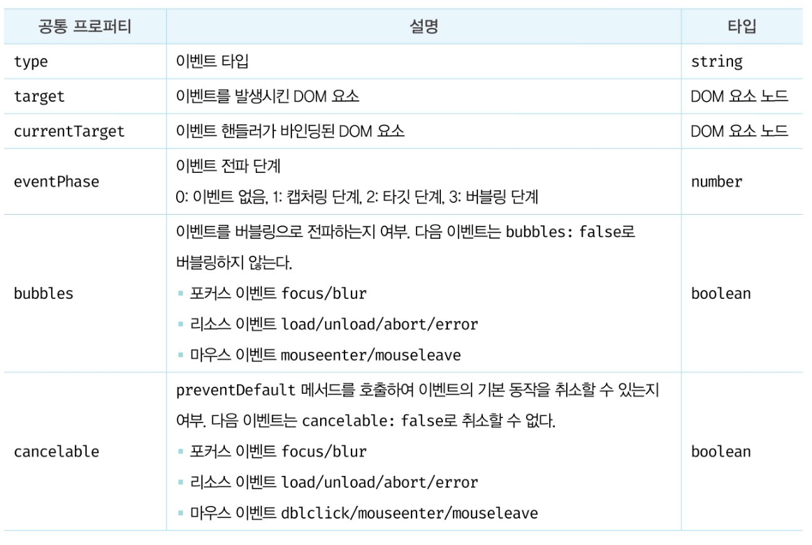
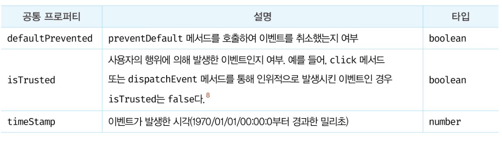

# 이벤트

## 이벤트 드리븐 프로그래밍

이벤트가 발생했을 때 호출될 함수를 `이벤트 핸들러`라 한다.

브라우저가 사용자의 버튼 클릭이나 이벤트를 감지하여 위임받은 특정 함수를 호출한다.

이벤트와 그에 대응하는 함수를 통해 사용자와 애플리케이션은 상호작용 할 수 있다.

프로그램의 흐름을 이벤트 중심으로 제어하는 프로그래밍 방식을 `이벤트 드리븐 프로그래밍`이라 한다.

<br>

## 이벤트 핸들러 어트리뷰트 방식

```html
<body>
    <button onclick="sayHi('Lee')">Click me</button>
    <script>
        function sayHi(name) {
            console.log(`Hi, ${name}`)
        }
    </script>
</body>
```

이벤트 핸들러 등록이란 함수 호출을 브라우저에게 위임하는 것.

CBD (component based development) 방식의 angular/react/svelte/vue 같은

프레임워크/라이브러리에서는 이벤트 핸들러 어트리뷰트 방식으로 이벤트를 처리한다.

CBD에서는 HTML, CSS, JS 를 관심사가 다른 개별적인 요소가 아닌, 뷰를 구성하기 위한 구성 요소로 보기 때문에

관심사가 다르다고 생각하지 않는다.


<br>

## 이벤트 핸들러 프로퍼티 방식

```html
<body>
    <button>Click me</button>
    <script>
        const $button = document.querySelector('button')
        $button.onclick = () => { alert('button click')}
    </script>
</body>
```

앞서 살펴본 어트리뷰트 방식도 결국 DOM 노드 객체의 이벤트 핸들러 프로퍼티로 변환되므로 결과적으로 이벤트 핸들러 프로퍼티 방식과 동일하다고 할 수 있다.

프로퍼티 방식은 어트리뷰트 방식의 HTML과 JS가 섞이는 문제를 해결할 수 있다.

하지만 이벤트 핸들러 프로퍼티에 하나의 이벤트 핸들러만 바인딩할 수 있다는 단점이 있다.

```html
<body>
    <button>Click me</button>
    <script>
        const $button = document.querySelector('button')
        $button.onclick = function() {
            console.log('button clicked 1')
        }
        $button.onclick = function() {
            console.log('button clicked 2')
        }
    </script>
</body>

<!-- 두번째 바인딩된 이벤트 핸들러에의해 첫번째꺼는 실행되지 않는다.  -->

```

<br>

## addEventListener 메서드 방식


```html
<body>
    <button>Click me</button>
    <script>
        const $button = document.querySelector('button')
        
        $button.addEventListener('click', function() {
            console.log('button click')
        })
    </script>
</body>

```

만일 동일한 html요소에서 발생한 동일한 이벤트에 대해

프로퍼티 방식과 addEventListener메서드 방식을 모두 사용해 이벤트 핸들러를 등록하면 어떻게 동작할까

```html
<body>
    <button>Click me</button>
    <script>
        const $button = document.querySelector('button')
        
        $button.onclick = function() {
            console.log('이벤트 핸들러 프로퍼티 방식')
        }
        $button.addEventListener('click', function() {
            console.log('addEventListener 방식')
        }) 
    </script>
</body>

<!-- add EventListener 메서드 방식은 이벤트 핸들러 프로퍼티에 바인딩된 이벤트 핸들러에 아무런 영향을 주지 않는다.

따라서 2개의 이벤트 핸들러가 모두 호출된다.

프로퍼티 방식은 하나 이상의 이벤트 핸들러를 등록할 수 없지만

addEventListener 방식은 하나 이상의 이벤트 핸들러 등록이 가능.

등록된 순서대로 호출된다. -->


<body>
    <button>Click me</button>
    <script>
        const $button = document.querySelector('button')
        
        $button.addEventListener('click', function() {
            console.log('1버튼 클릭')
        })
        $button.addEventListener('click', function() {
            console.log('2버튼 클릭')
        }) 
    </script>
</body>
```

단, addEventListener 를 통해 참조가 동일한 이벤트 핸들러를 중복 등록하면

하나의 이벤트 핸들러만 등록된다.

```html
<body>
    <button>Click me</button>
    <script>
        const $button = document.querySelector('button')
        
        const handleClick = () => console.log('button click')

        // 참조가 동일한 이벤트 핸들러를 중복 등록 -> 하나만 등록된다.
        $button.addEventListener('click', handleClick)
        $button.addEventListener('click', handleClick) 
    </script>
</body>
```

<br>

## 이벤트 핸들러 제거

addEventListener메서드에 전달한 인수와 removeEventListener 메서드에

전달한 인수가 다르면 이벤트 핸들러가 제거되지 않는다.


```html
<body>
    <button>Click me</button>
    <script>
        const $button = document.querySelector('button')
        
        const handleClick = () => console.log('button click')

        $button.addEventListener('click', handleClick)
        // 두 메서드에 전달하는 인수가 일치하지 않으면 제거되지 않음.
        $button.removeEventListener('click', handleClick, true) //실패
        $button.addEventListener('click', handleClick) //성공
    </script>
</body>
```


무명함수를 이벤트 핸들러로 등록한 경우 제거할 수 없다.

이벤트 핸들러를 제거하려면 이벤트 핸들러의 참조를 변수나 자료구조에 저장하고 있어야 하기 때문.

단, 기명 이벤트 핸들러 내부에서 removeEventListener 메서드를 호출해

이벤트 핸들러를 제거하는 것은 가능.

이때 이벤트 핸들러는 단 한번만 호출된다.

다음의 경우 버튼 요소를 여러번 클릭해도 단 한번만 이벤트 핸들러가 호출된다.

```js
$button.addEventListener('click', function foo(){
    console.log('button click')

    $button.removeEventListener('click', foo)
})
```

<br>

이벤트 핸들러 프로퍼티 방식으로 등록한 이벤트 핸들러는 removeEventListener 메서드로 제거할 수없다.

프로퍼티 방식으로 등록한 이벤트 핸들러를 제거하려면 null을 할당한다.
```html
<script>
        const $button = document.querySelector('button')
        
        const handleClick = () => console.log('button click')

        $button.onclick = handleClick

        $button.removeEventListener('click', handleClick) //실패
        
        //null을 할당해 이벤트 핸들러를 제거한다.
        $button.onclick=null;
</script>
```

<br>

## 이벤트 객체

이벤트 핸들러의 첫번째인수로 이벤트 객체가 전달된다.

```html
<head>
    <style>
        html, body {height: 100%}
    </style>
</head>
<!-- 이벤트 핸들러 어트리뷰트방식의 경우 event가 아닌 다른 이름으로는 이벤트 객체를 전달받지 못한다. -->
<body onclick="showCoords(event)">
    <p>클릭하세요. 클릭한 곳의 좌표가 표시됩니다.</p>
    <em class="message"></em>
    <script>
        const $msg = document.queerySelector('.message')

        function showCoords(e) {
            $msg.textContent = `clientX: ${e.clientX}, clientY:${e.clientY}`
        }
    </script>
</body>

```

```js

onclick="showCoords(event)" 어트리뷰트는 파싱되어 다음과 같은 함수를 암묵적으로 생성하여

onclick이벤트 핸들러 프로퍼티에 할당한다.

function onclick(event) {
    showCoords(event)
}

```

이때 생성된 onclick 이벤트 핸들러의 첫 번째 매개변수 이름이 event로 암묵적으로 명명되기 때문에

event가 아닌 다른 이름으로 이벤트 객체를 전달받지 못한다.

이벤트가 발생하면 암묵적으로 생성되는 이벤트 객체도 생성자 함수에 의해 생성된다.

<br>

이벤트 객체의 프로퍼티는 발생한 이벤트의 타입에 따라 달라진다.

<br>

## 이벤트 객체의 공통 프로퍼티

Event.prototype에 정의되어 있는 이벤트 관련 프로퍼티는 UIEvent, CustomEvent, MouseEvent 등

모든 파생 이벤트 객체에 상속된다.




<br>

currentTarget 프로퍼티는 이벤트 핸들러가 바인딩된 DOM요소를 가리킴.

일반적으로 이벤트 객체의 target 프로퍼티와 currentTarget 프로퍼티는

동일한 DOM 요소를 가리키지만 나중에 살펴볼 이벤트 위임에서는

이벤트 객체의 target 프로퍼티와 currentTarget 프로퍼티가 서로 다른 DOM요소를 가리킬 수 있다.

<br>

## 마우스 정보 취득

MouseEvent 타입의 이벤트 객체는 다음과 같은 고유의 프로퍼티를 갖는다.

- 마우스 포인터의 좌표 정보를 나타내는 프로퍼티
    screenX/screenY, clientX/clinentY, pageX/pageY, offsetX/offsetY

- 버튼 정보를 나타내는 프로퍼티 : altKey, ctrlKey, shiftKey, button

<br>

드래그하는 예제를 생각해보면,

마우스 버튼을 누른 상태(mousedown)에서 mousemove 이벤트가 발생한 시점에 시작하고 

mouseup 이벤트가 발생한 시점에 종료한다.

드래그 시작 시점, 즉 mousedown 이벤트가 발생했을때의 마우스 포인터 좌표와

드래그를 하고 있는 시점, 즉 mousemove 이벤트가 발생할 때마다 마우스 포인터 좌표를 비교해 드래그 대상의 이동 거리를 계산한다.

mouseup 이벤트가 발생하면 드래그가 종료한 것이다.

이때 드래그 대상 요소를 이동시키는 이벤트 핸들러를 제거해 이동을 멈춘다.

<br>

## 이벤트 전파

이벤트를 발생시킨 이벤트 타깃은 물론 상위 DOM 요소에서도 캐치할 수 있다.

즉, DOM 트리를 통해 전파되는 이벤트는 이벤트 패스에 위치한 모든 DOM 요소에서 캐치할 수 있다.

대부분의 이벤트는 캡처링과 버블링을 통해 전파된다.

하지만 다음 이베트는 버블링을 통해 전파되지 않는다.

- 포커스 이벤트 : focus/blur
- 리소스 이벤트 : load/unload/abort/error
- 마우스 이벤트 : mouseenter/mouseleave


<br>

## 이벤트 위임

li 요소마다 이벤트에 반응하도록 모든 내비게이션 아이템에 이벤트 핸들러를 등록하면

많은 DOM요소에 이벤트 핸들러를 등록하므로 성능 저하의 원인이 되고

유지 보수에도 부적합하다.

`이벤트 위임`은 여러개의 하위 DOM 요소에 각각 이벤트 핸들러를 등록하는 대신

하나의 상위 DOM요소에 이벤트 핸들러를 등록하는 방법을 말한다.

<br>

`$fruits` 요소에 이벤트 핸들러를 바인딩.

target 은 li요소를 가리키지만(실제 이벤트를 발새시킨 DOM 요소)

currentTarget 프로퍼티는 fruits를 가리킴.

<br>

## 이벤트 핸들러 내부의 this

### 이벤트 핸들러 어트리뷰트 방식

```html
<button onclick="handleClick()">Click me</button>
<script>
    function handleClick() {
        console.log(this) //window
    }
</script>

```

어트리뷰트 값으로 지정한 문자열은 사실 암묵적으로 생성되는 이벤트 핸들러의 문.

따라서 handleClick 함수는 이벤트 핸들러에 의해 일반 함수로 호출됨.

그러므로 일반 함수 내부의 This는 전역 객체를 가리킨다.

단, 이벤트 핸들러를 호출할 때 인수로 전달한 this는 이벤트를 바인딩한 DOM요소를 가리킴.

```html
<button onclick="handleClick(this)">click me</button>
<script>
    function handleClick(button) {
        console.log(button) // 이벤트를 바인딩한 button 요소
        console.log(this) // window
    }
</script>

```

<br>

### 이벤트 핸들러 프로퍼티 방식과 addEventListener 메서드 방식

두 방식 모두 내부의 this는 이벤트를 바인딩한 DOM 요소를 가리킨다.

즉 , 이벤트 핸들러 내부의 this는 이벤트 객체의 currentTarget 프로퍼티와 같다.

```js
$button1.onclick = function(e){
    console.log(this) // $button1
    console.log(e.currentTarget) // "
    console.log(this === e.currentTarget) //true
}

$button2.addEventListener('click', function(e){
    console.log(this) // $button2
    console.log(e.currentTarget) // "
    console.log(this === e.currentTarget) //true
})

//arrow function은 함수 자체의 this 바인딩을 갖지 않으니.
$button1.onclick = e => {
    console.log(this) // window
    console.log(e.currentTarget) // $button1
    console.log(this === e.currentTarget) //false
}
```

<br>

클래스에서 이벤트 핸들러를 바인딩하는 경우 this 에 주의한다.

bind 메서드를 사용해 this를 전달해주지 않으면

클래스 내부 메서드 안의 this는 생성할 인스턴스를 가리키지 않는다.

또는 클래스 필드에 할당한 화살표 함수를 이벤트 핸들러로 등록해

내부의 this가 인스턴스를 가리키도록 할 수 있다.

다만 이때 이벤트 핸들러는 프로토타입 메서드가 아닌 인스턴스 메서드가 된다.

<br>

## 이벤트 핸들러에 인수 전달

어트리뷰트 방식은 함수 호출문을 사용할 수 있기 때문에 인수를 전달할 수 있지만

프로퍼티 방식과 addEventListener 메서드 방식은 이벤트 핸들러를 브라우저가 호출하기 때문에

함수 호출문이 아닌 함수 자체를 등록해야 한다.

이벤트 핸들러 내부에서 함수를 호출하면서 인수를 전달해야 한다.

```js
$input.onblur = () => {
    checkUserNameLength(MIN_USER_NAME_LENGTH)
}
```

또는 이벤트 핸들러를 반환하는 함수를 호출하면서 인수를 전달할 수 있다.

```js
const checkUserNameLength = min => e => {
    $msg.textContent = $input.value.length < min ? `이름은 ${min}자 이상 입력해주세요` : ''>
}

$input.onblur = checkUserNameLength(MIN_USER_NAME_LENGTH)
```

checkUserNameLength 함수는 함수를 반환한다. 

`$input.onblur`에는 결국 checkUserNameLength 함수가 반환하는 함수가 바인딩된다.

<br>

## 커스텀 이벤트

이벤트도 생성자 함수로 생성할 수 있다.

발생한 이벤트의 종류에 따라 이벤트 타입이 결정된다.

하지만 Event, UIEvent, MouseEvent 같은 이벤트 생성자 함수를 호출해 명시적으로 생성한 이벤트 객체는

임의의 이벤트 타입을 지정할 수 있다.

이처럼 개발자의 의도로 생성된 이벤트를 `커스텀 이벤트`라 한다.

```js
const keyboardEvent = new KeyboardEvent('keyup')
console.log(keyboardEvent.type) //keyup

const customEvent = new CustomEvent('foo')
console.log(customEvent.type) //foo

```

생성된 커스텀 이벤트 객체는 버블링되지 않으며

preventDefault 메서드로 취소할 수도 없다.

즉, 커스텀 이벤트 객체는 bubbles와 cancelable 프로퍼티의 값이 false로 기본 설정된다.

true로 설정하려면 두번째 인수로 전달한다.

```js
const customEvent = new MouseEvent('click', {
    bubbles:true,
    cancelable: true
})

console.log(customEvent.bubbles) //true
console.log(customEvent.cancelable) //true

```

이외에도 프로퍼티들을 전달할 수 있다.

```js
const mouseEvent = new MouseEvent('click', {
    bubbles:true,
    clientX: 50,
    clientY:100
})

```

생성한 커스텀 이벤트는 isTrusted 프로퍼티의 값이 언제나 false다.

커스텀 이벤트가 아닌 사용자의 행위에 의해 발생한 이벤트에 의해 생성된 이벤트 객체의 isTrusted 프로퍼티 값은 언제나 true다.

<br>

### 커스텀 이벤트 디스패치

생성된 커스텀 이벤트는 dispatchEvent 메서드로 디스패치 (이벤트를 발생시키는 행위) 할 수 있다.

dispatchEvent 메서드에 이벤트 객체를 인수로 전달하면서 호출하면 인수로 전달한 이벤트 타입의 이벤트가 발생한다.

```html
<script>
    $button.addEventListener('click', e => {
        console.log(e)
        alert(`${e} clicked!`)
    })

    const customEvent = new MouseEvent('click')

    $button.dispatchEvent(customEvent)
</script>
```

일반적으로 이벤트 핸들러는 비동기 처리 방식으로 동작하지만

dispatchEvent 메서드는 이벤트 핸들러를 동기처리 방식으로 호출한다.


<br>

```js
const customEvent = new CustomEvent('foo')
console.log(customEvent.type) //foo
```

customEvent 이벤트 생성자 함수에는 두 번째 인수로 이벤트와 함께 전달하고 싶은 정보를 담은 detail 프로퍼티를

포함하는 객체를 전달할 수 있다. 이 정보는 이벤트 객체의 detail 프로퍼티에 담겨 전달된다.

```js

$button.addEventListener('foo', e => {
    alert(e.detail.message)
})

const customEvent = new CustomEvent('foo', {
    detail: {message: 'Hello'} //이벤트와 함께 전달하고 싶은 정보
})

$button.dispatchEvent(customEvent)
```

임의의 이벤트 타입을 지정해 커스텀 이벤트 객체를 생성한 경우 반드시

addEventListener 메서드 방식으로 이벤트 핸들러를 등록해야 한다.

어트리뷰트/프로퍼티 방식을 사용할 수 없는 이유는 'on + 이벤트타입'으로 이루어진

이벤트 핸들러 어트리뷰트/프로퍼티가 요소노드에 존재하지 않기 때문이다.

예를들어 'foo' 라는 임의의 이벤트 타입으로 커스텀 이벤트를 생성한 경우

onfoo 라는 핸들러 어트리뷰트/프로퍼티가 요소 노드에 존재하지 않기 때문이다.

