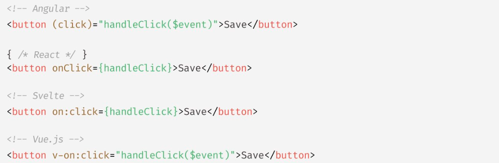

# 이벤트

## 이벤트 드리븐 프로그래밍

이벤트가 발생했을 때 호출될 함수를 `이벤트 핸들러`라 한다.

브라우저가 사용자의 버튼 클릭이나 이벤트를 감지하여 위임받은 특정 함수를 호출한다.

이벤트와 그에 대응하는 함수를 통해 사용자와 애플리케이션은 상호작용 할 수 있다.

프로그램의 흐름을 이벤트 중심으로 제어하는 프로그래밍 방식을 `이벤트 드리븐 프로그래밍`이라 한다.

<br>

## 이벤트 핸들러 어트리뷰트 방식

```html
<body>
    <button onclick="sayHi('Lee')">Click me</button>
    <script>
        function sayHi(name) {
            console.log(`Hi, ${name}`)
        }
    </script>
</body>
```

이벤트 핸들러 등록이란 함수 호출을 브라우저에게 위임하는 것.

CBD (component based development) 방식의 angular/react/svelte/vue 같은

프레임워크/라이브러리에서는 이벤트 핸들러 어트리뷰트 방식으로 이벤트를 처리한다.

CBD에서는 HTML, CSS, JS 를 관심사가 다른 개별적인 요소가 아닌, 뷰를 구성하기 위한 구성 요소로 보기 때문에

관심사가 다르다고 생각하지 않는다.



<br>

## 이벤트 핸들러 프로퍼티 방식

```html
<body>
    <button>Click me</button>
    <script>
        const $button = document.querySelector('button')
        $button.onclick = () => { alert('button click')}
    </script>
</body>
```

앞서 살펴본 어트리뷰트 방식도 결국 DOM 노드 객체의 이벤트 핸들러 프로퍼티로 변환되므로 결과적으로 이벤트 핸들러 프로퍼티 방식과 동일하다고 할 수 있다.

프로퍼티 방식은 어트리뷰트 방식의 HTML과 JS가 섞이는 문제를 해결할 수 있다.

하지만 이벤트 핸들러 프로퍼티에 하나의 이벤트 핸들러만 바인딩할 수 있다는 단점이 있다.

```html
<body>
    <button>Click me</button>
    <script>
        const $button = document.querySelector('button')
        $button.onclick = function() {
            console.log('button clicked 1')
        }
        $button.onclick = function() {
            console.log('button clicked 2')
        }
    </script>
</body>

<!-- 두번째 바인딩된 이벤트 핸들러에의해 첫번째꺼는 실행되지 않는다.  -->

```

<br>

## addEventListener 메서드 방식


```html
<body>
    <button>Click me</button>
    <script>
        const $button = document.querySelector('button')
        
        $button.addEventListener('click', function() {
            console.log('button click')
        })
    </script>
</body>

```

만일 동일한 html요소에서 발생한 동일한 이벤트에 대해

프로퍼티 방식과 addEventListener메서드 방식을 모두 사용해 이벤트 핸들러를 등록하면 어떻게 동작할까

```html
<body>
    <button>Click me</button>
    <script>
        const $button = document.querySelector('button')
        
        $button.onclick = function() {
            console.log('이벤트 핸들러 프로퍼티 방식')
        }
        $button.addEventListener('click', function() {
            console.log('addEventListener 방식')
        }) 
    </script>
</body>

<!-- add EventListener 메서드 방식은 이벤트 핸들러 프로퍼티에 바인딩된 이벤트 핸들러에 아무런 영향을 주지 않는다.

따라서 2개의 이벤트 핸들러가 모두 호출된다.

프로퍼티 방식은 하나 이상의 이벤트 핸들러를 등록할 수 없지만

addEventListener 방식은 하나 이상의 이벤트 핸들러 등록이 가능.

등록된 순서대로 호출된다. -->


<body>
    <button>Click me</button>
    <script>
        const $button = document.querySelector('button')
        
        $button.addEventListener('click', function() {
            console.log('1버튼 클릭')
        })
        $button.addEventListener('click', function() {
            console.log('2버튼 클릭')
        }) 
    </script>
</body>
```

단, addEventListener 를 통해 참조가 동일한 이벤트 핸들러를 중복 등록하면

하나의 이벤트 핸들러만 등록된다.

```html
<body>
    <button>Click me</button>
    <script>
        const $button = document.querySelector('button')
        
        const handleClick = () => console.log('button click')

        // 참조가 동일한 이벤트 핸들러를 중복 등록 -> 하나만 등록된다.
        $button.addEventListener('click', handleClick)
        $button.addEventListener('click', handleClick) 
    </script>
</body>
```

<br>

## 이벤트 핸들러 제거

addEventListener메서드에 전달한 인수와 removeEventListener 메서드에

전달한 인수가 다르면 이벤트 핸들러가 제거되지 않는다.


```html
<body>
    <button>Click me</button>
    <script>
        const $button = document.querySelector('button')
        
        const handleClick = () => console.log('button click')

        $button.addEventListener('click', handleClick)
        // 두 메서드에 전달하는 인수가 일치하지 않으면 제거되지 않음.
        $button.removeEventListener('click', handleClick, true) //실패
        $button.addEventListener('click', handleClick) //성공
    </script>
</body>
```


무명함수를 이벤트 핸들러로 등록한 경우 제거할 수 없다.

이벤트 핸들러를 제거하려면 이벤트 핸들러의 참조를 변수나 자료구조에 저장하고 있어야 하기 때문.

단, 기명 이벤트 핸들러 내부에서 removeEventListener 메서드를 호출해

이벤트 핸들러를 제거하는 것은 가능.

이때 이벤트 핸들러는 단 한번만 호출된다.

다음의 경우 버튼 요소를 여러번 클릭해도 단 한번만 이벤트 핸들러가 호출된다.

```js
$button.addEventListener('click', function foo(){
    console.log('button click')

    $button.removeEventListener('click', foo)
})
```

<br>

이벤트 핸들러 프로퍼티 방식으로 등록한 이벤트 핸들러는 removeEventListener 메서드로 제거할 수없다.

프로퍼티 방식으로 등록한 이벤트 핸들러를 제거하려면 null을 할당한다.
```html
<script>
        const $button = document.querySelector('button')
        
        const handleClick = () => console.log('button click')

        $button.onclick = handleClick

        $button.removeEventListener('click', handleClick) //실패
        
        //null을 할당해 이벤트 핸들러를 제거한다.
        $button.onclick=null;
</script>
```

<br>

## 이벤트 객체