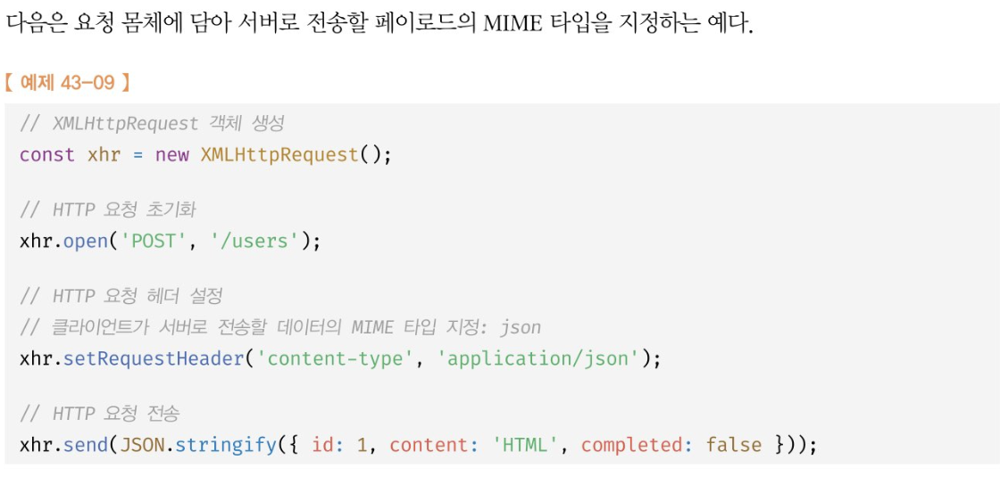

# Ajax

JS를 사용해 브라우저가 서버에게 비동기 방식으로 데이터를 요청,

서버가 응답한 데이터 수신해 웹페이지를 동적으로 갱신하는 프로그래밍 방식을 의미.

ajax는 브라우저에서 제공하는 web API인 `XMLHttpRequest` 객체를 기반으로 동작한다.

`XMLHttpRequest`는 HTTP 비동기 통신을 위한 메서드와 프로퍼티를 제공한다.

<br>

기존의 html을 서버로부터 매번 다시 전송받아 렌더링하는 방식의 패러다임을 바꿨다.

장점 
 
1. 변경할 부분을 갱신하는 데 필요한 데이터만 서버로부터 전송받아 불필요한 데이터 통신이 발생하지 않음.

2. 변경 필요 없는 부분은 다시 렌더링 하지 않는다. 깜빡임 현상 ㄴㄴ

3. 클라이언트와 서버와의 통신이 비동기 방식, 서버에 요청을 보낸 이후 블로킹이 발생하지 않는다.

<br>

## JSON

클라이언트와 서버간의 HTTP 통신을 위한 텍스트 데이터 포맷.

JS에 종속되지 않는 언어 독립형 데이터 포맷.

```json

{
    "name":"Harry",
    "age":"30",
    "alive":"true",
    "hobby":["programming", "music"]
}
```

반드시 큰 따옴표로 묶어야 한다.

<br>

## JSON.stringify

객체를 JSON 포맷의 문자열로 변환한다.

클라이언트가 서버로 객체를 전송하려면

객체를 문자열화해야 하는데 이를 `직렬화`라 함.

```js
const obj = {
    name:"Harry",
    age:30,
    alive:true,
    hobby:["programming", "music"]
}

const json = JSON.stringify(obj)
```

<br>

## JSON.parse

JSON 포맷의 문자열을 객체로 변환한다.

역직렬화. JSON포맷의 문자열을 객체화.

<br>



```js

const xhr = new XMLHttpRequest()

// HTTP요청 초기화

xhr.open('GET', 'https://jsonplaceholder.typicode.com/todos/1')

xhr.send()

xhr.onreadystatechange = () => {
    if(xhr.readyState !== XMLHttpRequest.DONE) return
    
    if(xhr.status === 200){
        console.log(JSON.parse(xhr.response))
    } else {
        console.error('ERRor', xhr.status, xhr.statusText)
    }
    }
```