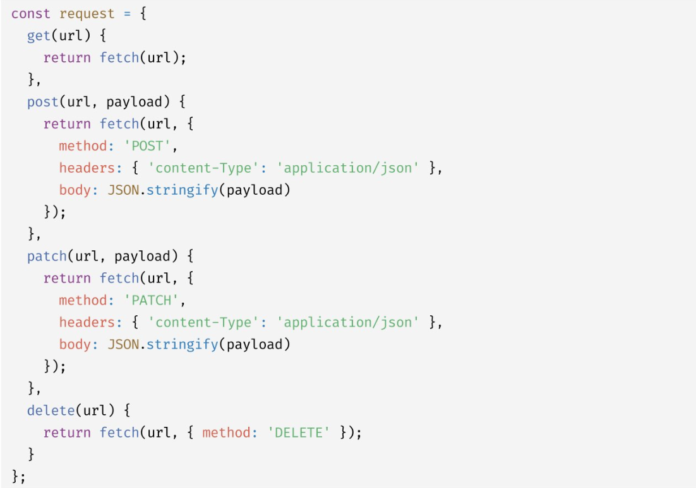

# 프로미스

전통적인 콜백 패턴의 단점을 보완, 비동기 처리 시점을 명확하게 표현할 수 있다.

```js
let g =0

setTimeout(() => {g = 100},0)
console.log(g) // 0
```

비동기 함수인 setTimeout 함수는 콜백 함수의 처리 결과를 외부로 반환하거나

상위 스코프의 변수에 할당하지 못한다.

콜백을 호출 스케줄링한 다음 타이머 id를 반환하고 즉시 종료되기때문.

서버의 응답을 받는 get함수도 비동기.

내부 onload 이벤트 핸들러는 get 함수가 종료된 이후에 실행된다.

onload 이벤트 핸들러의 반환값은 캐치할 수 없다.

<br>

비동기 함수는 비동기 처리 결과를 외부에 반환할 수 없고 상위 스코프의 변수에 할당할 수도 없다.

따라서 비동기 함수의 처리결과에 대한 후속 처리는 비동기 함수 내부에서 수행해야 한다.

<br>

비동기의 문제점 중 하나는 에러처리.

try catch finally 문은 에러 처리를 구현하는 방법이다.

try 코드 블록 내의 setTimeout 함수가 1초 후에 실행되도록 타이머를 설정하고

이후 콜백 함수는 에러를 발생시킨다면.. catch 코드 블록에서 캐치되지 않는다.

지금까지 비동기 처리를 위한 콜백 패턴은 콜백 헬이나 에러 처리가 곤란한 문제가 있었고

극복하기위해 Promise가 나옴.

<br>

promise는 호스트 객체가 아닌 ECMAScript 사양에 정의된 표준 빌트인 객체다.

Promise 생성자 함수는 비동기 처리를 수행할 콜백 함수를 인수로 받는데

resolve와 reject 함수를 인수로 전달받는다.

```js

const promiseGet = url => {
    return new Promise((resolve, reject) => {
        const xhr = new XMLHttpRequest()
        xhr.open('GET', url)
        xhr.send()

        xhr.onload = () => {
            if(xhr.status ===200) {
                resolve(JSON.parse(xhr.response))
            } else {
                reject(new Error(xhr.status))
            }
        }
    })
}

promiseGet('https://~~~~~.com/posts/1')

```

프로미스는 비동기 처리 상태와 처리 결과를 관리하는 객체다.

<br>

## then

then 메서드는 언제나 프로미스를 반환한다.

then의 콜백함수가 프로미스를 반환하면 그 프로미스를 그대로 반환,

아닌 값을 반환하면 그 값을 암묵적으로 resolve또는 reject하여 프로미스를 생성해 반환한다.

<br>

에러 처리는 catch 메서드에서 하는걸 권장.

<br>

```js
promiseGet('URL')
.then(({userId}) => promiseGet('URL'))
.then(userInfo => console.log(userInfo))
.catch(err => console.log(err))

```

then, catch, finally 후속 처리 메서드는 언제나 프로미스를 반환하므로

연속적으로 호출할 수 있다.

이를 프로미스 체이닝이라고 함.

async/await 을 통해 프로미스의 후속 처리 메서드마저 없이

마치 동기 처리처럼 프로미스가 처리 결과를 반환하도록 구현할 수 있다.

<br>

## 프로미스의 정적 메서드

Promise는 주로 생성자 함수로 사용되지만 함수도 객체이므로 메서드를 가질 수 있다.

5가지 정적 메서드를 제공한다.

### Promise.resolve/ Promise.reject

이미 존재하는 값을 래핑하여 프로미스를 생성하기 위해 사용한다.

```js
const resolvedPromise = Promise.resolve([1,2,3])
resolvedPromise.then(console.log) //[1,2,3]
//다음과 동일
const resolvedPromise = new Promise(resolve => resolve([1,2,3]))
resolvedPromise.then(console.log) //[1,2,3]


const rejectedPromise = Promise.refect(new Error('Error'))
rejectedPromise.catch(console.log) // Error:Error
//다음과 동일
const rejectedPromise = new Promise((_, reject) => reject(new Error('Error')))
rejectedPromise.catch(console.log) // Error:Error

```

<br>

## Promise.all

여러 개의 비동기 처리를 모두 병렬 처리할 때 사용.

```js
const requestData1 = () => {
    new Promise(resolve => setTimeout(()=> resolve(1), 3000))
}
const requestData2 = () => {
    new Promise(resolve => setTimeout(()=> resolve(2), 2000))
}
const requestData3 = () => {
    new Promise(resolve => setTimeout(()=> resolve(3), 1000))
}

Promise.all([requestData1(),requestData2(),requestData3()])
.then(console.log) // [1,2,3] 약 3초 소요
.catch(console.error)
```

비동기 처리를 .then 하나씩 처리하면 동기적으로 처리되는데

Promise.all을 이용해 병렬처리 할 수 있다.

첫번째 프로미스가 resolve한 처리결과부터 차례대로 배열에 저장해

그 배열을 resolve하는 새로운 프로미스를 반환한다. 즉, 처리순서가 보장된다.

그러나 전달받은 배열의 프로미스가 하나라도 rejected 상태가 되면

나머지 프로미스가 fulfilled 상태가 되는것을 기다리지않고 즉시 종료한다.

<br>

## Promise.race

Promise.all 메서드와 동일하게 프로미스를 요소로 갖는 배열 등의 이터러블을 인수로 전달받는다.

그러나 fulfilled 상태가 되는것을 기다리는것이 아니라 가장 먼저

fulfilled된 프로미스의 처리 결과를 resolve하는 새로운 프로미스를 반환한다.

```js
Promise.race([
    new Promise(resolve => setTimeout(() => resolve(1), 3000)),
    new Promise(resolve => setTimeout(() => resolve(2), 2000)),
    new Promise(resolve => setTimeout(() => resolve(3), 1000))
])
.then(console.log) //3
.catch(console.log)
```

rejected 상태가 되면 Promise.all 메서드와 동일하게 처리된다.

에러를 reject하는 새로운 프로미스를 즉시 반환한다.

<br>

## Promise.allSettled

프로미스를 요소로 갖는 배열 등의 이터러블을 인수로 전달받는다.

전달받은 프로미스가 모두 settled 상태가 되면 처리 결과를 배열로 반환한다.

반환하는 배열에는 fulfilled 또는 rejected 상태와는 상관없이

Promise.allSettled 메서드가 인수로 전달받은 모든 프로미스들의

처리 결과가 담겨있다.

```js
[
    {status:'fulfilled',value:1},
    {status:'rejected', reason: Error:Error! at <anonymous>:3:60}
]

```

<br>

## 마이크로태스크 큐

```js

setTimeout(()=> console.log(1),0)

Promise.resolve()
.then(()=> console.log(2))
.then(()=> console.log(3))
```

프로미스의 후속 처리 메서드의 콜백 함수는 마이크로 태스크큐에 저장된다.

마이크로 태스크큐는 태스크 큐보다 우선순위가 높다.

이벤트 루프는 콜스택이 비면 먼저 마이크로태스트큐에서 대기하고 있는 함수를 가져와 실행한다.

<br>

## fetch

XMLHttpRequest 객체와 마찬가지로 HTTP 요청 전송 기능을 제공하는 클라이언트 사이드 web API.

XMLHttpRequest 객체보다 사용법이 간단하고 프로미스를 지원하기 때문에

비동기 처리를 위한 콜백 패턴의 단점에서 자유롭다.

fetch 함수는 HTTP 응답을 나타내는 Response 객체를 래핑한 Promise 객체를 반환한다.

```js
fetch('https://jsonplaceholder.typicode.com/todos/1')
.then(res => console.log(res))
```

Response.prototype에는 Response객체에 포함되어있는 HTTP응답 몸체를

위한 다양한 메서드를 제공한다.

MIME 타입이 application/json인 HTTP 응답 몸체를 취득하려면

Response.prototype.json 메서드를 사용한다.

```js
fetch('https://jsonplaceholder.typicode.com/todos/1')
.then(res => res.json())
.then(json => console.log(json))
// json은 역직렬화된 HTTP 응답 몸체다.

```



단축표현식

```js
request.get('URL')
.then(res => res.json())
.then(todos => console.log(todos))
```

이런식으로.