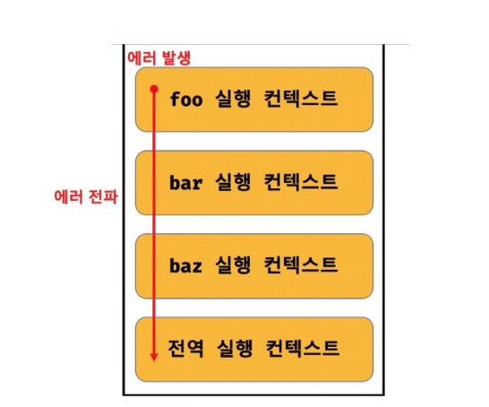

# 에러 처리

발생한 에러에 대해 대처하지 않고 방치하면 프로그램은 가제 종료된다.

```js
console.log('start')

foo() // ReferenceError

console.log('end') // 에러에 의해 프로그램이 강제 종료되어 end는 출력되지 않는다.

```

```js

console.log('start')

try{
    foo()
}catch(err){
    console.error('에러발생', err)
}


console.log('end')  // 강제 종료 되지않고 출력됨.
```

직접적으로 에러를 발생하지는 않는 예외 상황이 있을 수 있다.

querySelector 메서드는 인수로 전달한 CSS 선택자 문자열로 DOM에서 요소 노드를

찾을 수 없는 경우 에러를 발생시키지 않고 null을 반환.

이때 if문으로 메서드의 반환값을 확인하거나

단축평가, 옵셔널 체이닝 연산자를 사용하지 않으면 다음 처리에서 에러로 이어질 가능성이 크다.

<br>

## try...  catch... finally

기본적으로 에러 처리 방법은 크게 두가지.

1.  예외 상황이 발생하면 반환하는 값 (null, -1 등)을 단축 평가 또는 옵셔널 체이닝을 통해

처리.

2. try... catch... finally

<br>

## throw 문

Error 생성자 함수로 에러 객체를 생성한다고 에러가 발생하는 것은 아니다.

즉, 에러 객체 생성과 에러 발생은 의미가 다르다.

```js
try{
    new Error('something wrong')
} catch(error) {
    console.log(error)
}
```

에러를 발생시키려면 try 코드 블록 내에 throw 문으로 에러 객체를 던져야 한다.

```js
try{
    throw new Error('something wrong')
} catch (error) {
    console.log(error)
}

```

```js
const repeat = (n,f) => {
    if (typeof f !== 'function') throw new TypeError('f must be a function')

    for(var i =0; i<n; i++>){
        f(i)
    }
}

try{
    repeat(2,1) // 두 번째 인수가 함수가 아니므로 TypeError 발생
} catch(err) {
    console.error(err) // TypeError : f must be a function
}
```

<br>

## 에러의 전파

에러는 호출자 방향으로 전파된다.

즉, 콜 스택의 아래 방향(실행 중인 실행 컨텍스트가 푸시되기 직전 푸시된 실행 컨텍스트 방향)으로 전파된다.

```js
const foo = () => {
    throw Error('foo에서 발생한 에러')
}

const bar = () => {
    foo()
}

const baz = () => {
    bar()
}

try{
    baz()
} catch(err) {
    console.error(err)
}
```



이처럼 throw된 에러를 캐치하지 않으면 호출자 방향으로 전파된다.

이때 throw된 에러를 캐치해 적절히 대응하면 프로그램을 강제 종료시키지 않고 코드의 실행 흐름을 복구할 수 있다.

**주의할 것은 비동기 함수인 setTimeout이나 프로미스 후속 처리 메서드의 콜백 함수는 호출자가 없다는 것**

이것들은 태스크큐나 마이크로 태스크큐에 일시 저장되었다가 콜 스택이 비면 이벤트 루프에 의해 콜 스택으로 푸시되어 실행된다.

이때 콜 스택에 푸시된 콜백함수의 실행 컨텍스트는 콜 스택의 가장 하부에 존재하게 된다.

그래서 에러를 전파할 호출자가 존재하지 않는다.

<br>