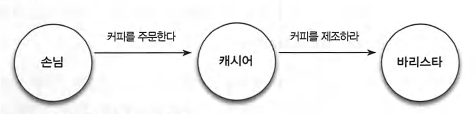
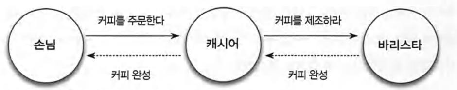

## 객체지향의 중요한 세 가지.

역할, 책임, 협력

따뜻한 커피와 함께할 수 있는 소박한 아침 시간의 여유를 누릴 수 있는 이유는 커피를 주문하는 손님, 주문을 받는 캐시어，커피를 제조하는 바리스타라는 역할이 존재하기 때문이다.

 

## 요청과 응답으로 구성된 협력

일반적으로 하나의 문제를 해결하기 위해 다수의 사람 혹은 역할이 필요하기 때문에 요청은 연쇄적으로 발생한다.

- 커피 주문이라는 협력은 손님이 캐시어에게 원하는 커피를 주문하면서 시작된다. 손님이 캐시어에게 주문하는 것은 커피를 제공해 줄 것을 캐시어에게 요청하는 것이다.

- 주문을 받은 캐시어는 주문 내역이 기록된 컵을 전달함으로써 바리스타에게 주문된 커피를 제조해줄 것을요청한다.

   

- 바리스타는 커피를 제조한 후 제조가 완료됐음을 캐시어에게 알려 주는 것으로 캐시어의 요청에 응답 한다.

- 캐시어는 진동벨을 울려 손님에게 주문된 커피가 준비됐음을 알림으로써 손님의 주문에 응답한다.

## 역할과 책임

사람들은 다른 사람과 협력하는 과정 속에서 특정한 `역할(role)`을 부여받는다.
사람들이 협력을 위해 특정한 역할을 맡고 역할에 적합한 책임을 수행한다는 사실은 몇 가지 중요한 개념을 제시한다.

- 여러사람이 동일한 역할을 수행할 수 있다.

`손님 입장에서 자신이 주문한 커피를 마실수만 있다면 어떤 캐시어가 주문을 받는지는 중요하지 않다.`
만약 캐시어가 카페테리아를 그만둔다면 캐시어라는 역할에 따르는 책임을 수행할 수 있는 다른 사람을 캐시어로 고용하면 된다. 손님은 오늘의 캐시어가 어제의 그 캐시어가 아니어도 크게 개의치 않을 것이다. 결국 손님 입장에서는 캐시어가 주문을 받고 커피가 완성됐다는 사실을 통보하는 책임을 성실히 이행할 수만 있다면 그만이다.

- 역할은 대체 가능성을 의미한다.

`손님 입장에서 캐시어는 대체 가능(substitutable)하다.` 좀 더 정확하 게 말하면 두 명이 동일한 역할을 수행할 수 있다면 요청자 입장에서 둘 중 어떤 사람이 역할을 수행하더라도 문제가 되지 않는다.

- 책임을 수행하는 방법은 자율적으로 선택할 수 있다.

요청을 받은 사람들은 요청을 처리하는 방법을 자유롭게 선택할 수 있다. 커피 제조를 요청받은 바리스타는 자신만의 독특한 방법으로 커피를 제조할 수 있다. 어떤 바리스타는 카푸치노의 거품을 이용해 커피 표면에 아름다운 무늬를 만들기도 하고 어떤 바 리스타는 아메리카노의 향을 좀 더 향기롭게 만드는 방법을 알지도 모른다. `중요한 것은 커피를 제조하라는 동일한 요청을 받더라도 바리스타의 역할을 수행하는 사람들마다 서로 다른 방식으로 요청을 처리할 수 있다는 것이다.` 이처럼 동일한 요청에 대해 서로 다른 방식으로 응답할 수 있는 능력을 `다형성 (polymorphism)`이라고 한다.

- 한 사람이 동시에 여러 역할을 수행할 수 있다.
  캐시어와 바리스타라는 개별적인 역할을 이용해 협력 관계를 묘사했지만 한 사람이 캐시어와 바리스타의 역할을 동시에 수행하는 것도 가능하다.
  현실 속에 살아가는 우리는 모두 둘 이상의 역할을 수행한다. 회사에 출근하연 사원이라는 역알을 수행하며. 집에 돌아와서는 아이의 부모로서의 역할과 누군가의 남편과 아내라는 역할을 수행한다.

 

## 기능을 구현하기 위해 협력하는 객체들

사람을 객체로, 고객의 요청을 메시지로, 바리스타가 요청을 처리하는 방법을 메서드로 비유할 수 있겠다.

협력의 핵심은 특정한 책임을 수행하는 역할들 간의 연쇄적인 요청과 응답을 통해 목표를 달성한다는 것이다.

"객체지향 설계는 적절한 객체에게 적절한 책임을 할당하는 것에서 시작된다."

 

## 협력 속에 사는 객체

객체지향 애플리케이션의 윤곽을 결정하는 것은 역할, 책임, 협력이지만 실제로 협력에 참여하는 주체는 `객체`다.

객체지향을 객체지향이라고 부르는 이유는 패러다임의 중심에 객체가 있기 때문 이다.

협력 공동체의 일원으로서 객체는 다음과 같은 두 가지 덕목을 갖춰야 하며, 두 덕목 사이에서 균형을 유지해야 한다.

**첫째, 객체는 충분히 ‘협력적’이어야 한다.**

외부의 도움을 무시한 채 모든 것을 스스로 처리하려고 하는 전지전능한 객체(god object)는 내부적인 복잡도에 의해 자멸하고 만다.
여기서 충분히 협력적이라는 말이 다른 객체의 명령에 따라 행동하는 수동적인 존재를 의미하는 것은 아니며, 객체는 다른 객체의 명령에 복종하는 것이 아니라 요청에 응답할 뿐이다.

**둘째, 충분히 자율적이어야 한다.**

사람들은 다른 사람의 요청에 따라 행동하지만 최대한 스스로의 판단에 따라 결정하고 행동한다. 캐시어는 손님이 주문하면 행동을 시작하지만 손님에게 음료를 주문하는 절차나 바리스타에게 접수 내역을 전달하는 방법은 스스로 결정한다. 손님이 캐시어에게 어떤 질문을 해야 하고 어떤 방식으로 바리스타에게 주문 내역을 전달하라고 지시하지 않는다. 캐시어는 요청에 대해 스스로 판단하고 행동하는 자율적인 존재다.

`객체지향 설계의 묘미는 다른 객체와 조화롭게 협력할 수 있을만큼 충분히 개방적인 동시에 협력에 참여하는 방법을 스스로 결정할 수 있을 만큼 충분히 자율적인 객체들의 공동체를 설계하는 데 있다.`

 

## 상태와 행동을 함께 지닌 자율적인 객체

흔히 객체를 `상태(state)와 행동(behavior)`을 함께 지닌 실체라고 정의한다. 객체가 협력에 참여하기 위해 어떤 행동을 해야 한다면 그 행동을 하는 데 필요한 상태도 함께 지니고 있어야 한다는 것을 의미한다.

커피를 제조하는 바리스타가 제조 방법을 모른다는 것이 말이 되지 않는 것처럼 객체가 어떤 행동을 하기 위해 필요한 상태를 알지 못한다는 것 역시 말이 되지 않는다. 객체가 협력에 참여하는 과정 속에서 스스로 판단하고 스스로 결정하는 자율적인 존재로 남기 위해서는 필요한 행동과 상태를 함께 지니고 있어야 한다.

`객체의 자율성은 객체의 내부와 외부를 명확하게 구분하는 것으로부터 나온다.` 객체의 사적인 부분은 객체 스스로 관리하고 외부에서 일체 간섭할 수 없도록 차단해야 하며, 객체의 외부에서는 접근이 허락된 수단을 통해서만 객체와 의사소통해야 한다. `객체는 다른 객체가 ‘무엇(what)’을 수행하는지는 알 수 있지만 ‘어떻게(how)’수행하는지에 대해서는 알 수 없다.`

커피를 주문하는 협력 과정에 참여한 손님과 캐시어，바리스타는 외부의 간섭을 받지
않고 스스로 생각하고 스스로 판단하는 자율적인 존재였다. 객체의 관점에서 자율성 이란 자신의 상태를 직접 관리하고 상태를 기반으로 스스로 판단하고 행동할 수 있음을 의미한다.

`자율적인 객체로 구성된 공동체는 유지보수가 쉽고 재사용이 용이한 시스템을 구축할 수 있는 가능성을 제시한다.`

 

## 협력과 메시지

인간들은 타인에게 도움을 요청하기 위해 가장 원초적인 수단인 말부터 컵 옆면에 적어놓은 글자 등 다양한 방법을 활용해 의사소통한다.
객체지향의 세계에서는 오직 한 가지 의사소통 수단만이 존재하는데, 바로 `메시지` 이다.

## 메서드와 자율성

객체는 다른 객체와 협력하기 위해 메시지를 전송한다. 수신자는 먼저 수신된 메시지 를 이해할 수 있는지 여부를 판단한 후 미리 정해진 자신만의 방법에 따라 메시지를 처리한다. 이처럼 객체가 `수신된 메시지를 처리하는 방법을 메서드(method)`라고 부른다.

객체지향 프로그래밍 언어에서 메서드는 클래스 안에 포함된 함수 또는 프로시저를 통해 구현된다. 따라서 어떤 객체에게 메시지를 전송하면 결과적으로 메시지에 대응되는 특정 메서드가 실행된다.

객체지향의 개념에 비유하면 바리스타로 전달된 커피 `제조 요청이 메시지`이
고 `커피를 제조하는 구체적인 방법이 메서드`다.

커피 제조를 요청한 캐시어는 커피가 제조될 것이라고 기대하지만 커피를 제조하는 구체적인 방법에 관해서는 관여하지 않는다.

외부의 요청이 무엇인지를 표현하는 메시지와 요청을 처리하기 위한 구체적인 방법인 메서드를 분리하는 것은 객체의 자율성을 높이는 핵심 메커니즘이다. 이것은 `캡슐화 (encapsulation)`라는 개념과도 깊이 관련돼 있다.

 

## 객체지향의 본질

■ 객체지향이란 시스템을 `상호작용하는 자율적인 객체들의 공동체`로 바라보고 객체를 이용해 시스템을 분할하는 방법이다.

■ 자율적인 객체란 `상태와 행위`를 함께 지니며 스스로 자신을 책임지는 객체를 의미한다.

■ 객체는 시스템의 행위를 구현하기위해 다른 객체와 협력한다.각 객체는 협력내에서 정해진 역할을 수행하며 역할은 관련된 책임의 집합이다.

■ 객체는 다른 객체와 협력하기 위해 `메시지를 전송`하고 메시지를 수신한 객체는 메시지를 처리하는 데 `적합한 메서드를 자율적으로 선택`한다.

 

`클래스의 구조와 메서드가 아니라 객체의 역할, 책임. 협력에 집중하라. 객체지향은 객체를 지향하는 것이지 클래스를 지향하는 것이 아니다.`
