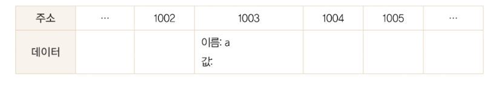
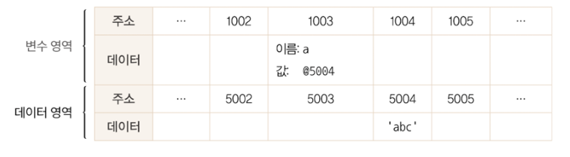

# 데이터 타입

크게 기본형(원시형), 참조형으로 나뉜다.

#### 기본형

값이 담긴 주솟값을 바로 복제.
불변성을 띈다.

- 숫자, 문자열, 불리언, null, undefined, symbol

#### 참조형

값이 담긴 주솟값들로 이루어진 묶음을 가리키는 주솟값을 복제.

- 객체, 배열, 함수, 날짜(Date), 정규표현식

---

<br/>

## 식별자와 변수

변수 - 변할 수 있는 무언가.
식별자 - 어떤 데이터를 식별하는데 사용하는 이름, 즉 변수명.

<br>

### 데이터 할당

```jsx
var a;
a = "abc";

var a = "abc";
```



<br />


