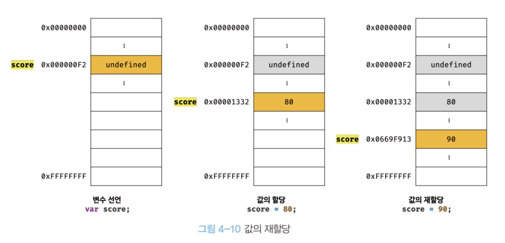

# 변수

#### 하나의 값을 저장하기 위해 확보한 메모리 공간 자체 또는 그 메모리 공간을 식별하기 위해 붙인 이름.

```jsx
10 + 20;
```

컴퓨터는 CPU를 사용해 연산하고, 메모리를 사용해 데이터를 기억한다.

위 예제의 숫자 10, 20은 메모리 상의 임의의 위치에 기억되고 cpu는 이 값을 읽어 연산을 수행한다.

연산 결과로 생성된 30도 메모리 상 임의의 위치에 저장된다.

연산이 끝났고 결과도 메모리에 저장됐지만 숫자값 30을 사용할 수 없다.

사용하고 싶다면 30이 저장된 메모리 공간에 직접 접근해야 하지만<br> 이 방법은 치명적 오류를 발생시킬 수 있다. <br>운영체제가 사용하고 있는 값을 실수로 변경할 수 있기 때문이다.

`그래서 자바스크립트는 개발자의 직접적인 메모리 제어를 허용하지 않는다.`

만약 직접적인 메모리 제어를 허용해도 문제다.

메모리 주소는 코드가 실행될 때 메모리의 상황에 따라 임의로 결정되니<br> 동일 컴퓨터에서 동일 코드를 실행해도 그때마다 저장될 메모리 주소는 변경된다.

기억하고 싶은 값을 저장해두고 읽어들여 재사용하기 위해 변수라는 메커니즘을 사용한다.

<br>

## 변수에 여러 값을 저장하는 방법.

배열이나 객체같은 자료구조를 사용해 여러 값을 그룹화해서 하나의 값처럼 사용할 수 있다.

```jsx
var user = { id: 1, name: "harry" };
var cats = ["veri", "arthur", "samsaek"];
```

<br>

그래서 맨 앞의 코드를 재작성 해보면

```js
var result = 10 + 20;
```

변수에 값을 `할당`, 저장된 값을 읽어 들이는 것을 `참조`라 한다.

변수 이름은 식별자 라고도 한다.

<br>

## 변수 이름은 어디에 등록되는가?

변수 이름을 비롯, 모든 식별자는 `실행 컨텍스트`에 등록된다.
실행 컨텍스트는 JS엔진이 소스를 평가, 실행하기 위해 필요한 환경을 제공하고 실행 결과를 실제로 관리하는 영역이다. 실행 컨텍스트를 통해 `식별자와 스코프`를 관리한다.

변수 이름과 값은 실행 컨텍스트 내에 키,값 형식의 객체로 등록되어 관리된다.

<br>

## 변수 선언의 실행 시점과 호이스팅

```js
console.log(score);

var score;
```

자바스크립트는 인터프리터에 의해 한 줄씩 순차 실행되므로 score를 선언하기 전에 console.log(score)가 실행되어 참조 에러(ReferenceError)가 발생할 것처럼 보이지만 실제로는 undefined가 출력된다.

변수 선언이 코드가 한 줄씩 실행되는 시점, 즉 런타임이 아니라 그 이전 단계에서 먼저 실행되기 때문이다.

JS엔진은 코드 실행에 앞서 평가 과정을 거치는데 이때 변수 선언을 포함한 모든 선언(변수, 함수 선언문)을 찾아내 먼저 실행한다. 이처럼 선언문이 코드의 맨 위로 올려진 것처럼 동작하는 특징을 `호이스팅`이라한다.

`var, let, const, function, class` 키워드를 사용해 선언하는 모든 식별자는 호이스팅된다.

<br>

```js
console.log(score);

var score = 80; 이렇게 하든

//var score;
// score = 80;  요렇게 하든

// score = 80;
// var score;   저렇게 하든

console.log(score);
```

변수 선언과 할당을 하나의 문으로 단축 표현해도 동작은 같다.
JS엔진이 선언과 할당을 2개의 문으로 나누어 실행하기 때문이다.

선언만 호이스팅 되기 때문에 위의 결과는 3가지 모두 같다.

undefined, 80 순서로 출력된다.

<br>

## 값의 재할당

```js
var score = 80;
score = 90;
```

var로 선언한 변수는 선언과 동시에 undefined로 초기화되기 때문에 엄밀히 말하면 처음으로 값을 할당하는 것도 사실은 재할당이다.

값을 재할당 할 수 없어서 변수에 저장된 값을 변경할 수 없다면 변수가 아니라 `상수`라 한다.



이전 값 80이 저장되어 있는 메모리 공간을 지우고 그 메모리 공간에 다시 90을 넣는게 아니다.

새로운 공간에 90을 저장. 그 곳의 메모리 주소를 score가 가리킨다고 생각하면 쉽다.

어떤 변수 식별자도 참조하지 않는 undefined, 80은 garbage collector에 의해 해제되어 메모리 누수를 방지한다.
