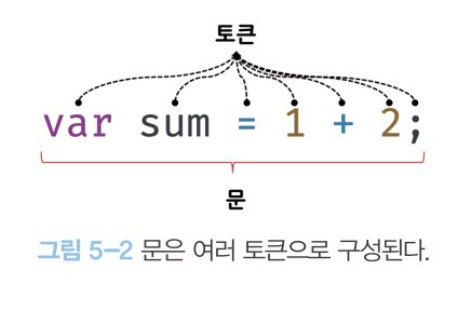
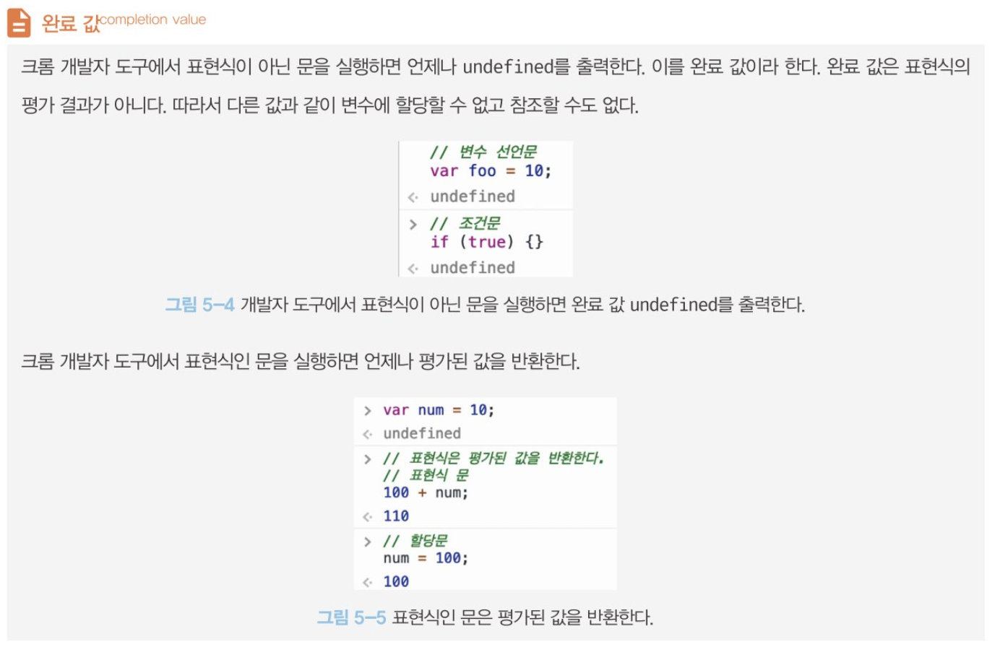

# 표현식과 문

값 - 식이 평가되어 생성된 결과.

## 표현식

값으로 평가될 수 있는 문(statement), 표현식이 평가되면 새로운 값을 생성하거나 기존 값을 참조한다.

```js
var score = 100;
// 리터럴 100은 JS엔진에 의해 평가되어 값을 생성하므로 리터럴 그 자체로 표현식이다.

var score = 50 + 50;
// 리터럴과 연산자로 이뤄져있고, 50+50도 평가되어 숫자값 100을 생성하므로 표현식.

score;
// 변수 식별자를 참조하면 변수 값으로 평가된다. 식별자 참조는 값을 생성하지는 않지만 값으로 평가되므로 표현식.

// 리터럴 표현식
10;
("hello");

// 식별자 표현식(선언이 이미 존재한다고 가정)
sum;
person.name;

// 연산자 표현식
10 + 20;
sum = 10;
sum += 2;

// 함수/메서드 호출 표현식
square();
person.getName();
```

### 값으로 평가될 수 있는 모든 문은 표현식이다 !

<br>

## 문

프로그램을 구성하는 기본 단위이자 최소 실행 단위.
문의 집합이 프로그램.

문은 여러 토큰으로 구성된다. <br>
토큰이란 문법적인 의미를 가지며 문법적으로 더 이상 나눌 수 없는 코드의 기본 요소를 의미한다.

키워드, 식별자, 연산자, 리터럴, 세미콜론, 마침표 등 문법적인 의미를 가지며, <br>
더이상 나눌 수 없는 코드의 기본 요소.



명령문이라고도 부른다. 즉 컴퓨터에 내리는 명령이다.

`선언문, 할당문, 조건문, 반복문` 등으로 구분.

<br>

## 표현식인 문과 아닌 문.

값으로 평가될 수 있느냐, 없느냐.

```js
var a;
// 변수 선언문은 값으로 평가될 수 없다. 표현식이 아닌 문.

a = 3;
// 할당문은 값으로 평가될 수 있어 표현식.

var foo = (a = 3);
console.log(foo); // 3
//표현식인 문은 값처럼 사용할 수 있다.
```


