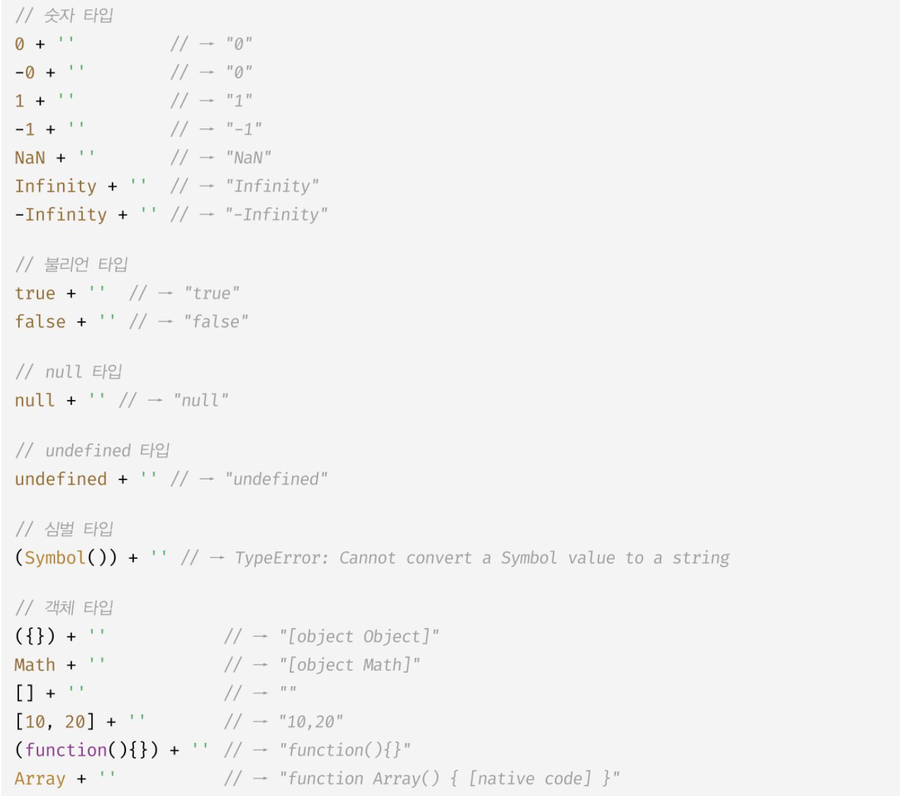

# 타입 변환과 단축 평가

개발자가 의도적으로 값의 타입을 변환하는 것을 `명시적 타입 변환`, `타입 캐스팅` 이라 한다.

```js
// 명시적 타입 변환
var x = 10;
var str = x.toString();

// 암묵적 타입 변환 (타입 강제 변환)
var str2 = x + "";

//변수 x의 값이 변경된 것은 아니다.
console.log(x, typeof x); // 10 number
```

<br>

## 문자열 타입으로 변환



## 숫자 타입으로 변환

```js
1 - "1"; // 0

1 * "10"; // 10

1 / "one"; // NaN

"1" > 0; // true
```

`+` 단항 연산자는 피연산자가 숫자 타입의 갑시 아니면 숫자 타입의 값으로 암묵적 변환을 수행.

```
+'' // 0

+'0' // 0

- '1' // 1

- 'string' // NaN

+true // 1

+false // 0

+null // 0

+undefined // NaN

+Symbol() // TypeError

+{} // NaN

+[] // 0

+[10, 20] // NaN

+(function(){}) // NaN
```

<br>

쉽게는

String(), Number(), Boolean() 빌트인 메서드로 명시적 전환할 수 있다.

<br>

## 단축 평가

논리 연산자를 이용한 단축 평가.

표현식을 평가하는 도중에 평가 결과가 확정된 경우 나머지 평가 과정을 생략하는 것을 말함.

```js
"Cat" && "Dog"; // 'Dog'

"Cat" || "Dog"; // 'Cat'

// 논리합(||) 연산자는 두 개의 피연산자 중 하나만 true여도 반환, 두 번째 피연산자까지 평가하지 않아도 표현식을 평가할 수 있기 때문에 'Cat'을 반환.

"Cat" || "Dog"; // 'Cat'

false || "Dog"; // 'Dog'

"Cat" || false; // 'Cat'

false && "Dog"; // false

"Cat" && false; // false
```

#### 함수 매개변수에 기본값을 설정할 때

```js
function getStringLength(str){
    str = str || '';
    return str.length;
}

get StringLength(); // 0
get StringLength('hi'); // 2

//es6의 매개변수 기본값 설정
function getStringLength(str = ''){
    return str.length;
}

```

#### optional chainning과 차이

```js
var elem = null;
var value = elem?.value;
console.log(value) //undefined

---

var elem = null;
var value = elem && elem.value;
console.log(value) //null

// &&는 좌항 피연산자가 falsy값이면 좌항 피연산자를 그대로 반환.


var str = '';
var length = str && str.length;
console.log(length) // ''
// ''falsy라 str.length를 참조하지 못해 str 그대로 반환.

var str='';
var length = str?.length;
console.log(length) // 0
// 옵셔널체이닝은 falsy라도 null, undefined가 아니면 우항의 프로퍼티 참조를 이어간다.

```

<br>

## null병합 연산자 ??

ES11(ECMAScript2020)에서 도입.

null , undefined인 경우 우항의 피연산자를 반환하고 아니면 좌항의 피연산자를 반환.

```js
var foo = null ?? "default string";
console.log(foo); // 'default string'

---

// falsy인 0이나 ''도 기본값으로서 유효하다면 예기치 않은 동작이 발생할 수 있다.
var foo = '' || "default string";
console.log(foo); // 'default string'
// 0 이나  빈문자열을 거를 수 없다.

---

var foo = '' ?? 'default string';
console.log(foo) // ''
```
