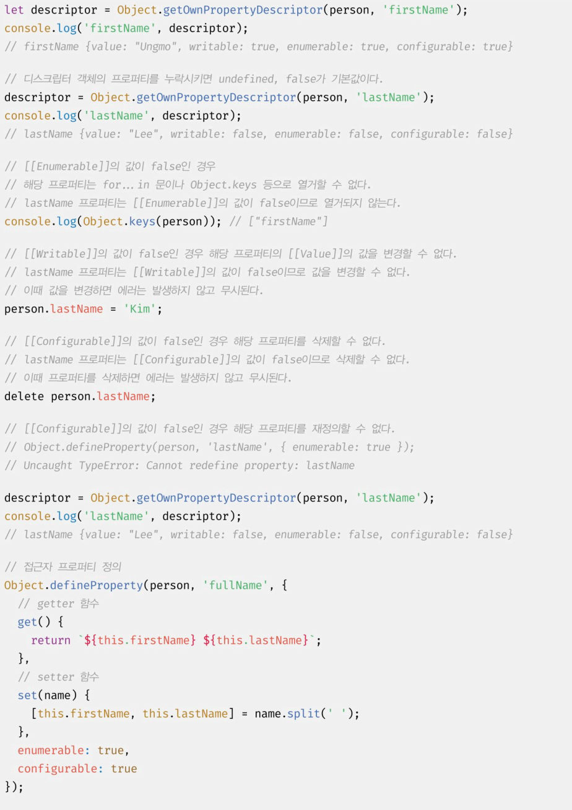
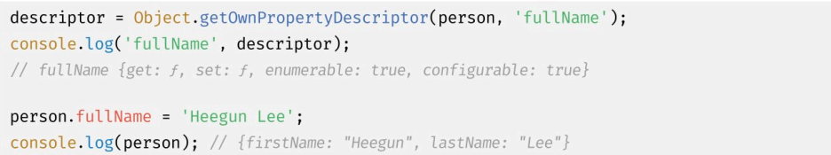

# 프로퍼티 어트리뷰트

## 데이터 프로퍼티

```js
const person = {
    name :'Lee'
}

person.age = 20;

console.log(Object.getOwnPropertyDescriptors(person));

// {
//     name : { value : 'Lee', writable ~~~},
//     age : {value : 20, ~~~}
// }
```

## 접근자 프로퍼티

자체적으로 값을 갖지 않고 다른 데이터 프로퍼티의 값을 읽거나 저장할 때 사용하는 함수로 구성된 프로퍼티.

```js
const person = {
    // 데이터 프로퍼티
    firstName: 'harry',
    lastName: 'seong',

// fullName은 접근자 함수로 구성된 접근자 프로퍼티.
get fullName() {
    return `${this.firstName} ${this.lastName}`
},

//setter 함수
set fullName(name) {
    //배열 디스트럭처링 할당
    [this.firstName, this.lastName] = name.split(' ');
}
}

// 데이터 프로퍼티를 통한 프로퍼티 값의 참조.
console.log(person.firstName + ' ' + person.lastname) // harry seong

// 접근자 프로퍼티를 통한 값의 저장
// 접근자 프로퍼티 fullName에 값을 저장하면 setter함수가 호출된다.
person.fullName = 'heegun lee';
console.log(person) // {firstName: 'heegun', lastName:'lee'}

//접근자 프로퍼티를 통한 값의 참조
//접근자 프로퍼티 fullName에 접근하면 getter 함수가 호출된다.
console.log(person.fullName) // heegun lee

//firstName은 데이터 프로퍼티.
// value, writable, enumerable, configurable
// 프로퍼티 어트리뷰트를 갖는다.
let descriptor = Object.getOwnPropertyDescriptor(person, 'firstName')
conosole.log(descriptor)
// {value :'heegun', writable: true, ~ }

//fullName은 접근자 프로퍼티다.
// 접근자 프로퍼티는 get, set, enumerable, configurable
// 프로퍼티 어트리뷰트를 갖는다.
descriptor = Object.getOwnPropertyDescriptor(person, 'fullName')
console.log(descriptor)
// {get:f, set:f, enumerable: true, configurable: true}
```

<br>

## prototype

어떤 객체의 상위 객체 역할을 하는 객체.

프로토타입은 하위 객체에게 자신의 프로퍼티와 메서드를 상속한다.

<br>

## 프로퍼티 정의

새로운 프로퍼티를 추가하면서 어트리뷰트를 명시적으로 정의하거나,

기존 프로퍼티의 어트리뷰트를 재정의하는것.

```js
const person = {};

//데이터 프로퍼티 정의
Object.defineProperty(person, 'firstName', {
    value:'Ungmo',
    writable: true,
    enumerable: true,
    configurable: true
})

Object.defineProperty(person, 'lastName', {
    value: 'Lee'
})
```




<br>

### Object.defineProperties 메서드로 여러 프로퍼티를 한 번에 정의할 수 있다.

```js
const person = {}

Object.defineProperties(person, {
    // 데이터 프로퍼티 정의
    firstName: {
        value: 'Ungmo',
        writable: true,
        enumerable:true,
        configurable: true
    },
    lastname:{
        value: 'Lee',
        writable: true,
        enumerable:true,
        configurable: true
    },

    // 접근자 프로퍼티 정의
    fullName:{
        get() {
            return `${this.firstName} ${this.lastName}`
        },
        set(){
            [this.firstName, this.lastName] = name.split(' ');
        },
        enumerable: true,
        configurable: true
    }
})

person.fullName = 'Heegun Lee'
console.log(person) // {firstName:'Heegun', lastName:'Lee'}
```

<br>

## 객체 확장 금지

Object.preventExtensions

```js
const person = {name:'Lee'}

console.log(Object.isExtensible(person)) // true

Object.preventExtensions(person)

console.log(Object.isExtensible(person)) // false

person.age = 20; // 무시

//추가는 금지되지만 삭제는 가능하다.
delete person.name;
console.log(person) // {}

//프로퍼티 정의에 의한 추가도 금지.
Object.definePropyerty(person, 'age', {value:20})

```

<br>

## 객체 밀봉

재정의 금지. 읽기와 쓰기만 가능.

```js
const person = {name:'Lee'}

console.log(Object.isSealed(person)) // false

Object.seal(person)

console.log(Object.isSealed(person)) // true

// 프로퍼티 추가, 삭제 불가.
// 값 갱신은 가능.

```

<br>

## 객체 동결

프로퍼티 추가, 삭제, 어트리뷰트 재정의, 프로퍼티 값 갱신 금지. 읽기만 가능.

<br>

지금까지 메서드들은 얕은 변경 방지로 직속 프로퍼티만 변경이 방지됨.

중첩 객체까지 동결 -> 불변 객체를 구현하려면 객체를 값으로 갖는 모든 프로퍼티에 재귀적으로 `Object.freeze` 메서드를 호출해야함.

```js
function deepFreeze(target) {
    if (target && typeof target === 'object' && !Object.isFrozen(target)) {
        Object.freeze(target);
        Object.keys(target).forEach(key => deepFreeze(target[key]))
    }
    return target;
}

const person = {
    name: 'Lee',
    address: {city: 'Seoul'}
}

deepFreeze(person)

console.log(Object.isFrozen(person)) //true
console.log(Object.isFrozen(person.address)) //true
person.address.city = 'Busan'
console.log(person) // {name: 'Lee', address: {city: 'Seoul'}}
```