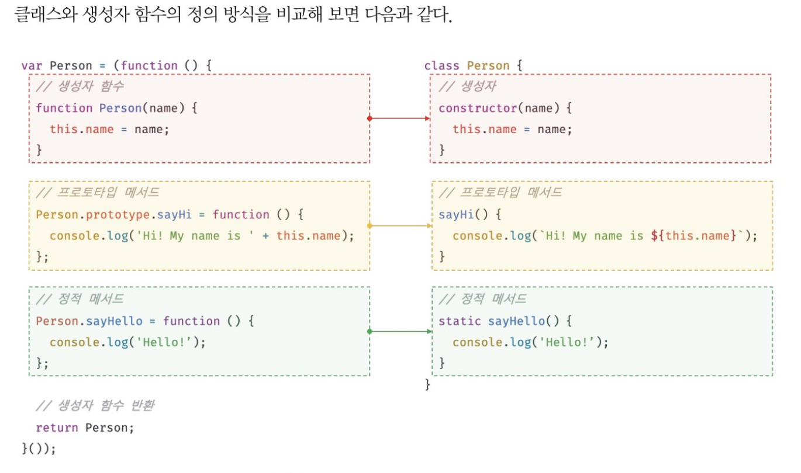

# 클래스

JS는 프로토타입 기반 객체지향 언어.

다른 객체지향 언어와 차이점에 대한 논쟁이 있지만 강력한 객체지향 프로그래밍 능력을 지녔다.

다음과 같이 생성자 함수와 프로토타입을 통해 객체지향 언어의 상속을 구현할 수 있다.

```js

var Person = (function(){
    //생성자 함수
    functin Person(name){
        this.name = name;
    }

    //프로토타입 메서드
    Person.prototype.sayHi = function(){
        console.log('Hi my name is' + this.name)
    }

    //생성자 함수 반환
    return Person;
},())

var me = new Person('Lee')
me.sayHi() // Hi my name is Lee
```

ES6에서 도입된 클래스는 사실 함수이며 기존 프로토타입 기반 패턴을 클래스 기반 패턴처럼

사용할 수 있도록 하는 문법적 설탕, syntactic sugar라고 볼 수도 있다.

단, 클래스와 생성자 함수는 프로토타입 기반 인스턴스를 생성하지만 정확히 동일한 동작을 하는건 아니다.

1. 클래스를 new 연산자 없이 호출하면 에러발생. 생성자 함수는 없이 호출하면 일반 함수로 호출됨.

2. 클래스는 상속을 지원하는 extends, super 키워드를 제공. 생성자 함수는 미지원.

3. 클래스는 호이스팅이 발생하지 않는 것처럼 동작. 함수 선언문으로 정의된 생성자 함수는 `함수 호이스팅`이, 함수 표현식으로 정의한 생성자 함수는 `변수 호이스팅`이 발생한다.

4. 클래스 내의 모든 코드에는 암묵적으로 strict mode. 생성자 함수는 암묵적으로 strict mode 미적용.

5. 클래스의 constructor, 프로토타입 메서드, 정적 메서드는 모두 프로퍼티 어트리뷰트의 값이 false. 열거되지 않는다.

둘은 매우 유사하지만

클래스는 생성자 함수 기반의 객체 생성 방식보다 견고하고 명료하다.

그렇다고 클래스가 JS의 다른 객체 생성방식보다 우월하다는건 아님.

따라서 클래스를 프로토타입 기반 객체 생성 패턴의 단순 문법적 설탕보다는 `새로운 객체 생성 매커니즘`으로 보는게 합당하다.

```js
//클래스 선언문
class Person {}

// 일반적이진 않지만, 
//익명 클래스 표현식
const Person = class {}

//기명 클래스 표현식
const Person = class MyClass {}
```

클래스를 표현식으로 정의할 수 있다는 것은

값으로 사용할 수 있는 일급 객체라는것을 의미. 다음의 특징을 갖는다.

- 무명의 리터럴로 생성가능, 즉, 런타임에 생성 가능.
- 변수나 자료구조(객체, 배열)에 저장 가능.
- 함수의 매개변수에 전달 가능.
- 함수의 반환값으로 사용 가능.

클래스는 값처럼 사용할 수 있는 일급 객체다.

<br>

```js
//클래스 선언문
class Person {
    //생성자
    constructor(name) {
        // 인스턴스 생성 및 초기화
        // name 프로퍼티는 public하다.
        this.name = name;
    }

    // 프로토타입 메서드
    sayHi(){
        console.log(`Hi My name is ${this.name}`)
    }

    // 정적 메서드
    static sayHello() {
        console.log('Hello!')
    }
}

// 인스턴스 생성
const me = new Person('Lee')

// 인스턴스의 프로퍼티 참조
console.log(me.name) //Lee

//프로토타입 메서드 호출
me.sayHi() // Hi My name is Lee

// 정적 메서드 호출
Person.sayHello() //Hello!
```



<br>

## 클래스 호이스팅

클래스는 함수로 평가됨

클래스 선언문으로 정의한 클래스는 함수 선언문과 같이 소스코드 평가 과정,

런타임 이전에 먼저 평가되어 함수 객체를 생성한다.

```js
class Person {}

console.log(typeof Person) // function
```

```js
console.log(Person)
 // ReferenceError:Cannot access'Person'einitialization

// 클래스선언문 
class Person {}
```

클래스 선언문은 마치 호이스팅이 발생하지 않는 것처럼 보이나 그렇지 않다.

```js
const Person = '';

{
    //호이스팅이 발생하지 않는다면 ''이 출력되어야 한다.
    console.log(Person);
    //ReferenceError : Cannot access 'Person'
    class Person {}
}

```

let, const 키워드로 선언한 변수처럼 호이스팅 된다.

모든 선언문은 런타임 이전에 먼저 실행되기 때문에 결국 호이스팅은 다 발생된다.

다른 방식일 뿐.

<br>

## 인스턴스 생성

함수는 new 연산자의 사용 여부에 따라 일반함수나 생성자 함수로 호출되지만,

클래스는 인스턴스를 생성하는 것이 유일한 존재 이유이므로 new 연산자와 반드시 함께 호출한다.

```js
const Person = class MyClass {}

// 함수 표현식과 마찬가지로 클래스를 가리키는 식별자로 인스턴스를 생성해야 한다.

const me = new Person();

console.log(MyClass) // ReferenceError

const you = new MyClass(); // ReferenceError

```

<br>

## 메서드

클래스 몸체에서 정의할 수 있는 메서드는 constructor, 프로토타입 메서드, 정적 메서드의 세 가지가 있다.

### constructor

```js
class Person {
    constructor(name) {
        this.name = name;
    }
}
```

constructor는 클래스 내에 한 개만 존재할 수 있고,

생략할 수 있다.

생략하면 빈 constructor가 암묵적으로 정의된다.

constructor를 생략한 클래스는 빈 constructor에 의해 빈 객체를 생성한다.

```js
class Person {
    constructor() {}
}

const me = new Person()
console.log(me) // Person {}
```

프로퍼티 초기화

```js
class Person {
    constructor(){
        this.name = 'harry'
        this.address = 'Seoul'
    }
}

const me = new Person();
console.log(me) // Person {name: "harry", address:"Seoul"}


```

인수로 초기값 전달

```js
class Person {
    constructor(name, address){
        this.name = name
        this.address = address
    }
}

const me = new Person('harry', 'Seoul');
console.log(me) // Person {name: "harry", address:"Seoul"}

```

constructor 내부에서 return 문을 반드시 생략해야한다.

this를 암묵적으로 return 하기 때문. return은 this가 아닌 다른 값을

반환해버린다. 이 동작은 클래스의 기본 동작을 훼손한다.

<br>

### 프로토타입 메서드

생성자 함수로 인스턴스를 생성하는 경우엔

```js
function Person(name) {
    this.name = name;
}

Person.prototype.sayHi = function () ~~~
```

클래스를 이용해 인스턴스를 생성할땐

prototype 프로퍼티 메서드를 추가하지 않아도 기본적으로

프로토타입 메서드가 된다.

```js
class Person {
    constructor(name){
        this.name = name;
    }

    //프로토타입 메서드
    sayHi(){
        console.log(`my name is ${this.name}`)
    }
}

const me = new Person('Lee')
me.sayHi() // my name is 'Lee'
```

<br>

### 정적 메서드

생성자 함수의 경우

```js
function Person(name){
    this.name = name;
}

//정적 메서드 
Person.sayHi = function () {
    console.log('Hi')
}

Person.sayHi() //Hi
```

class에서는..

```js

class Person {
    constructor(name){
        this.name = name;
    }

    static sayHi(){
        console.log('hi')
    }
}

Person.sayHi() // hi
```

정적 메서드는 클래스에 바인딩된 메서드가 되며

함수 객체로 평가됨. 클래스 정의가 평가되는 시점에 함수 객체가 되므로

인스턴스와 달리 별다른 생성 과정이 필요 없다.

따라서, 정적 메서드는 클래스 정의 이후 인스턴스를 생성하지 않아도 호출할 수 있다.


정적 메서드는 인스턴스로 호출할 수 없다.

인스턴스의 프로토타입 체인 상에는 클래스가 존재하지 않기 때문.

클래스의 메서드를 상속받을 수 없다.

```js
const me = new Person('Lee')
me.sayHi() //TypeError

```


<br>

### 정적 메서드와 프로토타입 메서드의 차이

1. 자신이 속한 프로토타입 체인이 다르다.

2. 정적 메서드는 클래스로 호출, 프로토타입 메서드는 인스턴스로 호출.

3. 정적 메서드는 인스턴스 프로퍼티를 참조할 수 없지만 프로토타입 메서드는 인스턴스 프로퍼티를 참조할 수 있다.

```js
class Square {
    static area(width, height) {
        return width * height;
    }
}

console.log(Square.area(10, 10)) //100


--------------

class Square {
    constructor(width, height){
        this.width = width;
        this.height = height;
    }

    //프로토타입 메서드
    area() {
        return this.width * this.height;
    }
}

const squ = new Square(10, 10);
console.log(squ.area(10, 10)) //100

```

메서드 내부 this는 메서드를 호출한 객체, 마침표(.) 연산자 앞에 기술한 객체에 바인딩됨.

squ 객체로 area호출했기 때문에 area 내부의 this는 squ 객체를 가리킴.

정적 메서드는 클래스로 호출, 내부의 this는 인스턴스가 아닌 객체를 가리킴.

**즉, 프로토타입 메서드와 정적 메서드 내부의 this 바인딩이 다르다.**

this를 사용하지 않는 메서드는 정적 메서드로 정의하는 것이 좋다.

<br>

### 클래스에서 정의한 메서드의 특징

1. function 키워드 생략한 메서드 축약 표현을 사용.

2. 객체 리터럴과 다르게 클래스에 메서드를 정의할 때는 콤마 불필요.

3. 암묵적 strict mode 실행.

4. for in 문이나 Object.keys 메서드 등으로 열거할 수 없다. 즉 프로퍼티의 열거 가능 여부를 나타내며, 불리언 값을 갖는 프로퍼티 어트리뷰트 [[Enumerable]]의 값이 false.

5. 내부 메서드 [[Construct]]를 갖지 않는 non-constructor다.
new 연산자와 함께 호출할 수 없다.

<br>

## 클래스의 인스턴스 생성 과정

1. 인스턴스 생성과 this 바인딩

2. 인스턴스 초기화

3. 인스턴스 반환

```js
class Person {
    constructor(name){
        // 1. 암묵적으로 인스턴스가 생성, this에 바인딩됨
        console.log(this) // Person{}
        console.log(Object.getPrototypeOf(this) === Person.prototype) // true

        // 2. this에 바인딩되어 있는 인스턴스를 초기화.
        this.name = name;
        // 3. 완성된 인스턴스가 바인딩된 this가 암묵적으로 반환된다.
    }
}

```

<br>

## 프로퍼티

constructor 내부 코드가 실행되기 이전에 constructor 내부의 this에는 이미 클래스가 암묵적으로 생성한 인스턴스인 빈 객체가 바인딩되어 있다.

접근자 프로퍼티는 자체적 값은 갖지않고 다른 데이터 프로퍼티의 값을 읽거나 저장할 때 사용.

getter setter로 구성.

```js
const person = {
    firstName : 'harry',
    lastName: 'Seong',


get fullName(){
    return `${this.firstName} ${this.lastName}`
},
set fullname(name){
    [this.firstName, this.lastName] = name.split(' ')
}
}

console.log(`${person.firstName} ${person.lastName}`) // harry Seong

person.fullName = 'Heegun Lee'
console.log(person) // {firstName:"Heegun", lastName:"Lee"}

console.log(person.fullName) // Heegun Lee

```

class로

```js
class Person {
    constructor(firstName, lastName) {
        this.firstName = firstName;
        this.lastName = lastName;
    }

    get fullName(){
        return `${this.firstName} ${this.lastName}`
    }

    set fullName(name){
        [this.firstName, this.lastName] = name.split(' ')
    }
}

const me = new Person('harry', 'Seong')

console.log(`${me.firstName} ${me.lastName}`) // harry Seong

person.fullName = 'Heegun Lee'
console.log(me) // {firstName:"Heegun", lastName:"Lee"}

console.log(me.fullName) // Heegun Lee

```

setter는 단 하나의 매개변수만 선언할 수 있다.

클래스의 메서드는 기본적으로 프로토타입 메서드가 된다.

따라서 클래스의 접근자 프로퍼티 또한 인스턴스 프로퍼티가 아닌 프로토타입의 프로퍼티가 된다.

<br>

### 클래스 필드 정의 제안

클래스 기반 객체지향 언어에서 클래스가 생성할 `인스턴스의 프로퍼티`를 가리키는 용어다.

클ㅐ스 몸체에서 클래스 필드를 정의하는 경우 this에 클래스 필드를 바인딩해서는 안된다.

this는 클래스의 constructor와 메서드 내에서만 유효하다.

```js
class Person {
    this.name // SyntaxError
}

```

클래스 필드를 참조하는 경우 자바같은 클래스 기반 언어에서는 this를 

생략할 수 있으나 JS에서는 this를 반드시 써야함.

```js

class Person {
    name ='Lee'

    constructor(){
        console.log(name) //ReferenceError
    }
}

new Person();
```

클래스 필드에 초기값을 할당하지 않으면 undefined를 갖는다.

```js
class Person {
    name;
}

const me = new Person();
console.log(me) // Person {name: undefined}

```

인스턴스를 생성할 때 외부의 초기값으로 클래스 필드를 초기화해야 할 필요가 있다면 

```js
class Person {
    name;

    constructor(name){
        this.name = name;
    }
}

const me = new Person('Lee')
console.log(me) // Person{name: 'Lee'}

```


이처럼 인스턴스를 생성할 당시 클래스 필드를 초기화한다면

constructor 밖에서 클래스 필드를 정의할 필요가 없다.

어차피 constructor내부에서 클래스 필드를 참조해 초기값을 할당해야 한다.

클래스가 생성한 인스턴스에 클래스 필드에 해당하는 프로퍼티가 없다면 자동 추가되기 때문.

```js
class Person {
    constructor(name) {
        this.name = name
    }
}

const me = new Person('Lee')
console.log(me) // Person {name:'Lee'}

```

함수는 일급 객체이므로 클래스 필드에 할당할 수 있다.

따라서 클래스 필드를 통해 메서드를 정의할 수도 있다.

```js
class Person {
    name = 'Lee'

    getName = function (){
        return this.name;
    }
}

const me = new Person()
console.log(me) // Person {name: 'Lee', getName:f}
console.log(me.getName()) // Lee

```

이처럼 클래스 필드에 함수를 할당하는 경우 이 함수는 프로토타입 메서드가 아닌 인스턴스 메서드가 된다.

모든 클래스 필드는 인스턴스 프로퍼티가 되기 때문이다.

따라서 클래스 필드에 함수를 할당하는 것은 권장하지 않는다.

<br>

## private 필드 정의 제안

24.5절 캡슐화와 정보은닉에서 살펴보았듯, JS는 캡슐화를 완전하게 지원하지 않는다.

js에서 인스턴스 프로퍼티는 인스턴스를 통해 클래스 외부에서 언제나 참조할 수 있다. 즉, 언제나 public이다.

```js
class Person {
    constructor(naem) {
        this.name = name; // 인스턴스 프로퍼티는 기본적으로 public하다.
    }
}

const me = new Person('Lee')
console.log(me.name) //Lee


---------------

class Person {
    name = 'Lee'
}
const me = new Person()
console.log(me.name) // Lee
```

private 필드를 정의할 수 있는 새로운 표준 사양이 제안되어있다고 한다.

최신 브라우저와 최신 node(12이상)에도 마찬가지로 구현되어 있다고 한다.

private 필드의 선두에는 #을 붙여준다. 참조할때도.

```js
class Person{
    #name = '';

    constructor(name){
        this.#name = name;
    }
}
const me = new Person('Lee')

console.log(me.#name); // SyntaxError

```

private 필드는 클래스 내부에서만 참조할 수 있다.

<br>

직접 접근하는 방법은 없고, 접근자 프로퍼티를 통해 간접적으로 접근하는 방법은 유효하다.

```js
class Person {
    #name = '';

    constructor(name){
        this.#name = name;
    }

    get name(){
        return this.#name.trim();
    }
}

const me = new Person('  Lee  ');
console.log(me.name) // Lee

```

private 필드는 반드시 클래스 몸체에 정의해야 한다. constructor에 정의하면 에러남.


<br>

## static 필드 정의 제안

클래스에는 static 키워드로 정적 메서드를 정의할 수 있다.

하지만 static을 이용해 정적 필드를 정의할 수는 없었다.

또 지금은 가능하다함.

```js
class MyMath {
    static PI = 22 / 7;

    static #num = 10;

    static increment(){
        return ++MyMath.#num;
    }
}

console.log(MyMath.PI) // 3.141592
console.log(MyMath.increment()) //11
```

<br>

## 상속에 의한 클래스 확장

상속에 의한 클래스 확장은 지금까지 살펴본 프로토타입 기반 상속과는 다른 개념이다.

프로토타입 체인을 통해 다른 객체의 자산을 상속받는 개념이었다면,

기존 클래스를 상속받아 새로운 클래스를 확장하여 정의하는 것.

클래스는 상속을 통해 기존 클래스를 확장할 수 있는 문법이 기본 제공.

생성자 함수는 그렇지 않다.

Bird, Lion 클래스는 상속을 통해 Animal 클래스의 속성을 그대로 사용하면서 자신만의 고유한 속성만 추가해 확장할 수 있다.

```js
class Animal {
    constructor(age, weight) {
        this.age = age;
        this.weight = weight;
    }

    eat() { return 'eat'}

    move() { return 'move'}
}

class Bird extends Animal {
    fly() {return 'fly'}
}

const bird = new Bird(1, 5);

console.log(bird) // Bird {age: 1, weight: 5}
console.log(bird instanceof Bird) //true
console.log(bird instanceof Animal) //true

console.log(bird.eat()) //eat
console.log(bird.move()) //move
console.log(bird.fly()) //fly
```

extends 키워드를 사용한 클래스 확장은 간편하고 직관적.

생성자 함수는 클래스와 같이 상속을 통해 다른 생성자 함수를 확장할 수 있는 문법이 없다.

<br>

## extends

상속을 통해 확장된 클래스를 서브클래스.

서브(자식)클래스에게 상속된 클래스를 수퍼(부모)클래스라 부름.

수퍼클래스와 서브클래스는 인스턴스의 프로토타입 체인 뿐 아니라

클래스간의 프로토타입 체인도 생성한다.

<br>

## 동적 상속

extends 키워드는 클래스 뿐 아니라 생성자 함수를 상속받아 클래스를 확장할 수도 있다. 단, extends 키워드 앞에는 클래스가 와야함.

```js
function Base(a) {
    this.a = a;
}

class Derived extends Base {}

const derived = new Derived(1);
console.log(derived) // Derived {a:1}

```

동적으로 상속받을 대상을 결정할 수 있다.

```js
function Base1() {}

class Base2 {}

let condition = true;

class Derived extends (condition ? Base1 : Base2){}

const derived = new Derived()
console.log(derived) // Derived {}

console.log(derived instanceof Base1) // true
console.log(derived instanceof Base2) // false

```

<br>

## 서브클래스의 constructor

constructor에서 살펴봤듯, 클래스에 constructor 생략하면

비어있는 constructor가 암묵적으로 정의됨.

서브 클래스에서 constructor를 생략하면 클래스에 다음과 같은 

constructor가 암묵적으로 정의됨.

```js

constructor( ...args) { super(...args)}

//args는 new 연산자와 함께 클래스를 호출할 때 전달한 인수의 리스트.
// super는 수퍼 클래스의 constructor를 호출해 인스턴스를 생성함.
```

수퍼클래스와 서브클래스 모두 constructor를 생략하면?

```js
class Base {}

class Derived exends Base {}

```

```js
class Base {
    constructor(){}
}

class Derived extends Base {
    constructor(...args){super(...args)}
}

const derived = new Derived()
console.log(derived) // Derived {} 
```

 프로퍼티를 소유하는 인스턴스를 생성하려면 constructor 내부에서 인스턴스에 프로퍼티를 추가해야 한다.

 <br>

 ## super 키워드

 함수처럼 호출할 수도 있고 this와 같이 식별자처럼 참조할 수 있는

 특수한 키워드다.

 - super를 호출하면 수퍼클래스의 constructor를 호출한다.
 - super를 참조하면 수퍼클래스의 메서드를 호출할 수 있다.

 
 <br>

#### super 호출
수퍼클래스의 constructor 내부에서 추가한 프로퍼티를 그대로 갖는 인스턴스를 생성한다면

서브클래스의 constructor를 생략가능.

이때 new 연산자와 함께 서브클래스를 호출하면서 전달한 인수는 모두 서브클래스에 암묵적으로 정의된 constructor의 super호출을 통해 수퍼클래스의 constructor에 전달된다.

```js
class Base {
    constructor(a,b) {
        this.a = a;
        this.b = b;
    }
}

class Derived extends Base {
    //암묵적 constructor
    // constructor(...args) { super(...args) }
}

const derived = new Derived(1,2)
console.log(derived) // {a:1, b:2}
```

<br>

추가한 프로퍼티를 갖는 인스턴스를 생성한다면 서브클래스의 constructor를 생략할 수 없다.

new와 함께 서브 클래스를 호출하면서 전달한 인수 중에

수퍼클래스의 constructor에 전달할 필요가 있는 인수는 서브클래스의

constructor에서 호출하는 super를 통해 전달.

```js
class Base {
    constructor(a,b) {
      this.a = a;
      this.b = b;
    }
}

class Derived extends Base {
    constructor(a,b,c) {
        super(a,b)
        this.c = c;
    }
}


const derived = new Derived(1,2,3) 
console.log(derived) // Derived {a:1, b:2, c:3}
```

