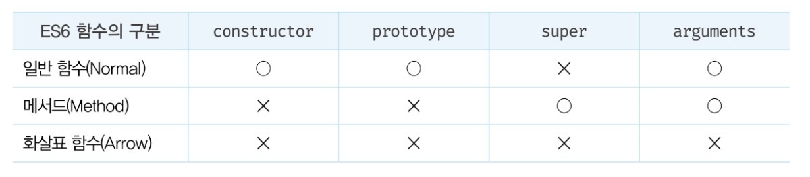

# ES6 함수의 추가 기능

ES6 이전까지 JS의 함수는 별다른 구분없이

일반함수, new 와 함께 생성자함수, 객체에 바인딩된 메서드로서 호출할 수 있었다.

언뜻보면 편리하지만 실수를 유발하고 성능 면에서도 손해란다.

다시말해 ES6이전의 모든 함수는 callable 이면서 constructor이다.

메서드라 부르던 객체에 바인딩된 함수도 마찬가지.

함수에 전달되어 보조 함수 역할을 하는 콜백까지도 constructor 이기 때문에 불필요한 프로토타입 객체를 생성한다.


이러한 문제를 해결하기 위해 세 종류로 구분함.



**ES6의 메서드와 화살표 함수는 non-constructor이다. !!!**

<br>

## 메서드

ES6사양에서 메서드 축약 표현으로 정의된 함수만 의미한다.

```js
const obj = {
    x:1,
    foo(){
        return this.x;
    },
    bar:function(){ return this.x}
}

console.log(obj.foo()) //1
console.log(obj.bar()) //1
```

인스턴스를 생성할 수 없는 non-constructor라고 했다.

```js
new obj.foo() // TypeError
new obj.bar() // bar {}
```

foo는 인스턴스도 프로토타입도 생성하지 않는다.

참고로 표준 빌트인 객체가 제공하는 프로토타입 메서드와 정적 메서드는 모두 non-constructor다.

(toUpperCase, isFinite, map, from ...)

<br>

ES6 메서드는 자신을 바인딩한 객체를 가리키는 내부 슬롯 [[HomeObject]]를 갖는다.

super 참조는 내부 슬롯을 사용해 수퍼클래스의 메서드를 참조하므로 내부 슬롯을 갖는 메서드는 super 키워드를 사용할 수 있다.

```js

const base = {
    name: 'harry',
    sayHi(){
        return `hi ${this.name}`
    }
}

const derived = {
    __proto__:base,
    sayHi(){
        return `${super.sayHi()}. how r u ?`
    }
}

console.log(derived.sayHi()) // hi harry. how r u ?
```

메서드가 아닌 함수는 super 키워드를 사용할 수 없다.

```js

const derived = {
    __proto__:base,
    sayHi:function(){
        //SyntaxError 'super' keyword unexpected here
        return `${super.sayHi()}. how r u ?`
    }
}

```

본연의 기능을 추가하고 의미적으로 맞지 않는 constructor 기능은 제거했다.

따라서 메서드를 정의할 때 프로퍼티 값으로 익명 함수 표현식을 할당하는 이전의 방식을 사용하지 않는 것이 좋다.

<br>

## 화살표 함수

표현도 간략하거니와

콜백 함수 내부에서 this가 전역 객체를 가리키는 문제를 해결하기 위한 대안으로 유용.

함수 선언문으로 정의할 수 없고 표현식으로 정의해야한다.

```js
const multiply = (x,y) => x * y

multiply(2,3) //6
```

함수 몸체가 하나의 문으로 구성된다면 함수 몸체를 감싸는 중괄호를 생략 가능.

그러나, 표현식이 아니라 문이라면 에러가 발생한다. 문은 반환할 수 없기 때문.(중괄호 생략 불가)

```js
const arrow = () => const x = 1; // SyntaxError
```

객체 리터럴을 반환하는 경우 소괄호로 감싸줘야 한다.

<br>

### 일반함수와의 차이

1. 화살표 함수는 non-constructor.

    prototype 프로퍼티가 없고 프로토타입도 생성하지 않는다.

2. 중복된 매개변수 이름을 선언할 수 없다.

    일반함수는 중복된 매개변수 이름 선언해도 에러안남.

    ```js
    function noraml(a, a) {return a+a}
    console.log(normal(1,2)) //4
    // strict mode에서는 에러남.
    ```

3. 화살표 함수는 함수 자체의 this, arguments, super, new.target 바인딩을 갖지 않음.

상위 스코프의 this, arguments, super, new.target을 참조.
상위 스코프도 화살표 함수면 더 상위 

<br>

## this

!! 콜백 함수 내부의 this 문제 !!

22장에서 보았듯,

**함수의 호출 방식에 따라 동적으로 결정된다.**

```js
class Prefixer {
    constructor(prefix) {
        this.prefix = prefix;
    }

    add(arr){
        //프로토타입 메서드 내부인 이곳에서 this는 메서드를 호출한 객체(prefixer)를 가리킨다.
        // 그러나 밑의 콜백 내부의 this는 undefined를 가리킨다.
        //map 메서드가 콜백 함수를 일반 함수로서 호출하기 때문이다.
        return arr.map(function (item){
            return this.prefix + item
        })
    }
}

const prefixer = new Prefixer('-webkit-')
console.log(prefixer.add(['transition','user-select']))
```

기대하는 결과는 ['-webkit-transition','-webkit-user-select']다.

하지만 type error

일반 함수로 호출되는 모든 함수 내부의 this는 전역 객체를 가리킨다.

그런데 클래스 내부 모든 코드에는 strict mode가 암묵적으로 적용된다.

그래서 this에 전역 객체가 아닌 undefined가 바인딩된다.

es6이전에는 아래같은 방법을 씀.

```js
add(arr){
    const that = this
    return arr.map(function (item) {
        return that.prefix+ ' ' + item
    })
}
```

es5에선 map의 두번째 인자로 this를 전달하는 방식과

bind, call 메서드로 명시적으로 주는 방법도 있는데 다 필요없고 이제

화살표 함수로 하면 된다.

화살표 함수는 자체 this 바인딩을 갖지 않기 때문에 화살표 내부에서 this를 참조하면 상위 스코프의 this를 그대로 참조. 이를 `lexical this`라 한다.

함수가 정의된 위치에 의해 결정된다는 의미.

화살표 함수는 함수 자체의 this 바인딩을 갖지 않기 때문에 `call, apply, bind`같은 메서드로 this 교체조차도 할 수 없다.

언제나 상위 스코프의 this 바인딩을 참조한다.

<br>

## 메서드를 화살표 함수로 정의하는 것은 피한다.

```js
const person = {
    name: 'harry',
    sayHi:() => console.log(`Hi ${this.name}`)
}

person.sayHi() // Hi
```

메서드 정의는 역시 메서드 축약 표현!!

```js
const person = {
    name: 'harry',
    sayHi(){
        console.log(`Hi,${this.name}`)
    }
}

person.sayHi() //Hi, harry
```

프로퍼티를 동적으로 할당하려면 일반함수를 할당한다.

```js
function Person(name){
    this.name = name
}

Person.prototype.sayHi = functin () { console.log(`hi, ${this.name}`)}
const person = new Person('harry')
person.sayHi() //hi, harry
```

일반 함수가 아닌 메서드를 동적 추가하고 싶다면 객체 리터럴을 바인딩하고 프로토타입의 constructor 프로퍼티와 생성자 함수 간의 연결을 재설정한다.

```js
functio Person(name){
    this.name = name;
}

Person.prototype = {
    //constructor 프로퍼티와 생성자 함수 간의 연결을 재설정.
    constructor: Person,
    sayHi(){ console.log(`hi, ${this.name}`)}
}

const person = new Person('harry')
person.sayHi() // hi, harry
```

메서드 축약 표현이 베스트다.

<br>

## super

화살표 함수는 자체 super 바인딩을 갖지 않아 화살표 함수 내부에서 super를 참조하면

this와 마찬가지로 상위 스코프의 super를 참조한다.

<br>

## arguments

화살표 함수는 자체의 arguments 바인딩또한 갖지 않는다.

따라서 화살표 함수 내부에서 arguments를 참조하면 this와 마찬가지로 상위 스코프의 arguments를 참조한다.


```js
(function(){
    //상위 스코프인 즉시 실행 함수의 arguments를 가리킴.
    const foo = () => console.log(arguments) //{'0':1, '1':2}
    foo(3,4)
}(1,2))

//전역함수 -> 전역객체를 가리킴. - 없음
const foo = () => console.log(arguments)
foo(1,2) //ReferenceError
```

arguments 객체는 함수를 정의할 때 매개변수의 개수를

확정할 수 없느 가변 인자 함수를 구현할 때 유용하다고 했다.

하지만 화살표 함수에서는 arguments 객체를 사용할 수 없다.

arguments 객체를 참조할 수 있지만 자신에게 전달된 인자 목록이 아닌

상위 함수에 전달된 인수 목록을 참조하는 것.

화살표 함수로 가변 인자 함수를 구현해야할 경우 `Rest 파라미터를` 사용해야 한다.

```js
function foo(...rest) {
    console.log(rest) // [1,2,3,4,5]
}

foo(1,2,3,4,5)
```

일반 매개변수와 함께 사용가능

```js

function foo(param, ...rest){
    console.log(param) // 1
    console.log(rest) // [2,3,4,5]
}

foo(1,2,3,4,5)

function bar(param1, param2, ...rest){
    console.log(param1) //1
    console.log(param1) //2
    console.log(rest) //[3,4,5]
}

bar(1,2,3,4,5)
```

반대로는 안된다.

```js
function foo( ...rest, param1, param2) {}
foo(1,2,3,4,5)
```

함수 정의시 선언한 매개변수 개수를 나타내는 length 프로퍼티에 영향을 주지 않음.

```js
function foo(...rest){}
console.log(foo.length) //0

function bar(x, ...rest){}
console.log(bar.length) //1

function baz(x, y, ...rest){}
console.log(baz.length) //2

```

arguments는 유사배열 객체라 배열 메서드 쓰려면 배열로 변환해줘야하는 번거로움이 있는데

그래서 rest 쓴다.

하지만 화살표 함수는 함수 자체의 arguments 객체를 갖지 않는다.

따라서 화살표 함수로 가변인자 함수를 구현할땐 반드시 rest 파라미터를 이용한다.

<br>

## 매개변수 기본값

인수가 전달되지 않은 매개변수의 값은 undefinedd이다.

매개변수에 기본값을 할당, 방어 코드.
```js
function sum(x,y) {
    x = x || 0
    y = y || 0

    return x+y
}

console.log(sum(1,2)) //3
console.log(sum(1)) // 1
```

ES6에서 도입된 매개변수 기본값은 함수 내에서 수행하던 인수체크, 초기화를 간소화.

인수를 전달하지 않은 경우와 undefined를 전달한 경우에만 유효.

```js
function sum(x=0, y=0){
    return x+y
}

console.log(sum(1,2)) // 3
console.log(sum(1)) // 1

---------------


function logName(name="harry") {
    console.log(name)
}

logName() // harry
logName(undefined) // harry
logName(null) //null
```

