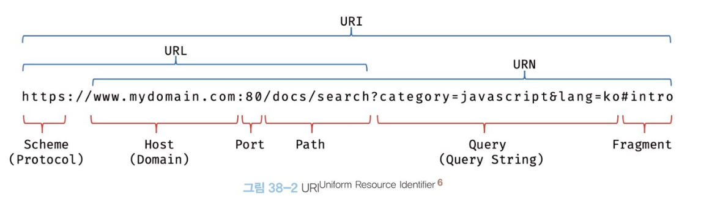
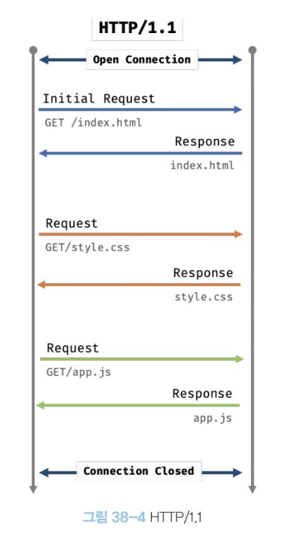
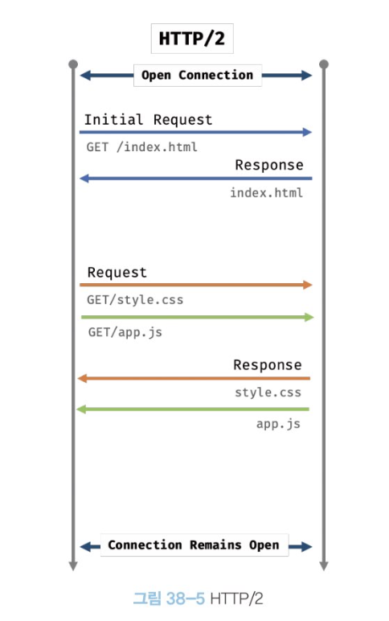
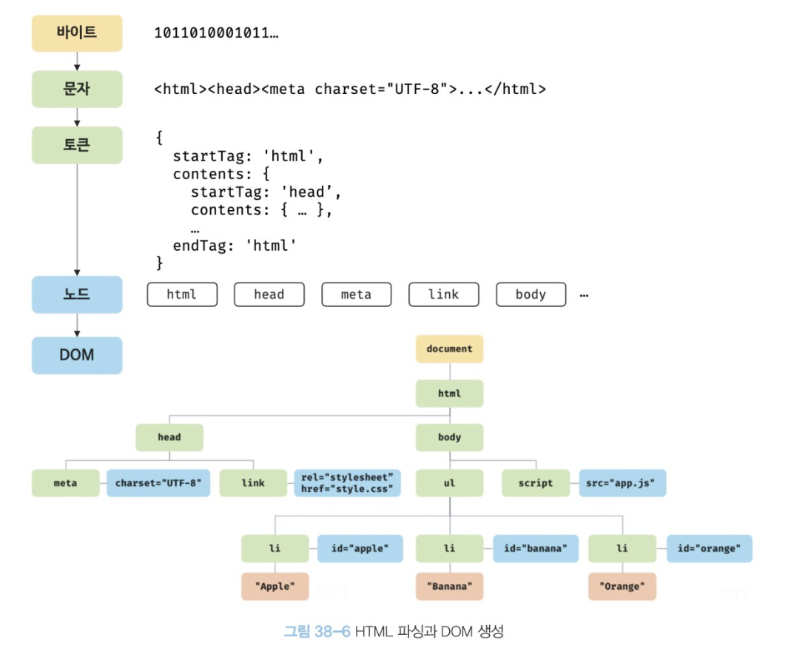

# 브라우저의 렌더링

구글의 V8엔진으로 빌드된 JS 런타임 환경인 node의 등장으로

JS는 웹브라우저를 벗어나 서버사이드 앱 개발에서도 사용할 수 있는 범용 개발 언어가 되었다.

대부분의 프로그래밍 언어는 `운영체제`나 `가상머신` 위에서 실행되지만

웹애플리케이션의 클라이언트 사이드 자바스크립트는 브라우저에서 HTML, CSS와 함께 실행된다.

 

## 렌더링 과정

1. 브라우저는 HTML, CSS, JS, 이미지, 폰트 등 렌더링에 필요한 리소스를 요청, 서비스로부터 응답을 받는다.

2. 브라우저의 렌더링 엔진은 응답된 HTML과 CSS를 파싱해 DOM, CSSOM을 생성. 이들을 결합해 렌더 트리를 생성.

3. 브라우저의 JS엔진은 서버로부터 응답된 JS를 파싱하여 AST를 생성하고 바이트코드로 변환 실행한다. 이때 JS는 DOM API를 통해 DOM , CSSOM을 변경할 수 있다. 변경된 DOM, CSSOM은 다시 렌더 트리로 결합된다.

4. 렌더 트리를 기반으로 HTML요소의 레이아웃을 계산하고 브라우저 화면에 HTML요소를 페인팅한다.

 

## 요청과 응답

브라우저의 핵심 기능은 필요한 리소스를 서버에 요청하고 응답받아 시각적으로 렌더링 하는 것.

렌더링에 필요한 리소스는 모두 서버에 존재하므로 요청해 응답받은 리소스를 파싱하여 렌더링하는 것이다.

서버에 요청을 전송하기 위해 브라우저는 주소창을 제공.

URL의 호스트 이름이 DNS를 통해 IP 주소로 변환되고 이 IP 주소를 갖는 서버에게 요청을 전송한다.

기본적으로 루트요청에는 index.html을 응답하도록 설정되어있다.

요청과 응답은 개발자도구의 network 패널에서 확인가능.

네트워크 패널을 활성화하기 전에 브라우저가 이미 응답을 받은 경우 응답된 리소스가 표시되지 않는다. 새로고침 해야됨.

처음 사이트에 들어가면 요청도 하지않은 CSS, JS, 이미지, 폰트등이 응답된다.

브라우저의 렌더링 엔진이 html(index.html)을 파싱하는 도중에 외부 리소스를 로드하는 태그, 즉 css파일을 로드하는 link 태그, 이미지파일을 로드하는 태그, js를 로드하는 script태그를 만나 **html의 파싱을 일시 중지하고 해당 리소스 파일을 서버로 요청**하기 때문이다.

 

## HTTP1.1 과 HTTP 2.0

HTTP는 웹에서 브라우저와 서버가 통신하기 위한 프로토콜(규약)이다.

1.1, 2.0의 차이를 간략히 살펴보자.

1.1에선 기본적으로 커넥션 당 하나의 요청과 응답만 처리.

여러개의 요청을 한번에 전송할 수 없고 응답 또한 마찬가지.

리소스의 동시 전송이 불가능한 구조로 요청할 리소스의 개수에 비례해 응답 시간도 증가한다.

2.0은 커넥션 당 여러개의 요청과 응답, 다중 요청/응답이 가능하다.

페이지 로드 속도가 1.1에 비해 약 50% 정도 빠르다고 알려져 있다.

 

## HTML 파싱과 DOM 생성

응답받은 HTML문서는 문자열로 이루어진 순수한 텍스트다.

브라우저에 시각적인 픽셀로 렌더링하려면 브라우저가 이해할 수 있는 자료구조로 변환해 메모리에 저장해야 한다.

다음 과정을 통해 브라우저가 이해할 수 있는 자료구조인 `DOM`을 생성한다.

1. 서버에 존재하던 HTMl 파일이 요청에 의해 응답된다.

2. 브라우저는 서버가 응답한 HTML 문서를 바이트(2진수)형태로 응답받는다. 응답된 바이트 형태의 HTML문서는 meta태그의 charset 어트리뷰트에 의해 지정된 인코딩 방식 (UTM-8)을 기준으로 문자열로 변환된다. 참고로 여기 선언된 인코딩 방식은 content-type:text/html; charset=utf-8과 같이 응답 헤더에 담겨 응답된다. 브라우저는 이를 확인하고 문자열로 변환한다.

3. 문자열로 변환된 HTML을 읽어들여 문법적 의미를 갖는 코드의 최소 단위인 토큰들로 분해한다.

4. 각 토큰들을 객체로 변환, 노드들을 생성한다. 토큰의 내용에 따라 문서노드, 요소 노드, 어트리뷰트 노드, 텍스트 노드가 생성됨. 이후 DOM을 구성하는 기본 요소가 된다.

5. HTML 문서는 중첩 관계를 갖는다. 부자 관계가 형성되는데 이러한 관계를 반영하여 모든 노드들을 트리 자료구조로 구성한다. 이 노드들로 구성된 트리 자료 구조를 DOM 이라고한다.

#### 즉, DOM은 HTML 문서를 파싱한 결과물이다.

 

## 렌더 트리 생성

렌더링 엔진은 서버로부터 응답된 HTML, CSS를 파싱해 각각 DOM, CSSOM을 생성한다.

그리고 렌더링을 위해 `렌더 트리`로 결합된다.

이때 렌더링 되지 않는 노드와 css에 의해 비표시되는 노드들은 포함하지 않는다. 

즉 렌더 트리는 브라우저 화면에 렌더링되는 노드만으로 구성된다.

이후 완성되 렌더 트리는 각 HTML 요소의 레이아웃을 계산하는데 사용되며 브라우저 화면에 픽셀을 렌더링하는 페인팅 처리에 입력된다.

지금까지 살펴본 브라우저의 렌더링 과정은 반복해서 실행될 수 있다.

- Js에 의한 노드 추가 또는 삭제
- 브라우저 창의 리사이징에 의한 뷰포트 크기 변화
- HTML 요소의 레이아웃에 변경을 발생시키는 width/height, margin, padding, border 등의 스타일 변경

레이아웃 계산과 페인팅을 다시 실행하는 리렌더링은 비용이 많이 드는, 성능에 악영향을 주는 작업이다.

 

## 자바스크립트 파싱과 실행

HTML 문서를 파싱한 결과물로서 생성된 DOM은 문서의 구조와 정보뿐 아니라 HTML요소와 스타일 등을 변경할 수 있는 프로그래밍 인터페이스로 DOM API를 제공한다.

즉, JS 코드에서 DOM API를 사용하면 이미 생성된 DOM을 동적으로 조작할 수 있다.

렌더링 엔진은 HTML을 한 줄씩 순차 파싱하며 DOM을 생성해 나가다가 JS 태그를 만나면 DOM 생성을 일시 중단.

JS 파일이나 script 태그 내의 JS 코드를 파싱하기 위해 JS 엔진에 제어권을 넘긴다. 이후 JS 파싱과 실행이 종료되면 렌더링 엔진으로 다시 제어권을 넘겨 HTML 파싱이 중단된 지점부터 다시 시작, DOM 생성을 재개한다.

JS엔진은 HTML과 CSS파싱해 돔을 생성하듯 자바스크립트를 해석해 AST를 생성한다.

AST를 기반으로 인터프리터가 실행할 수 있는 중간 코드인 바이트코드를 생성해 실행한다.

 

### 토크나이징

단순한 문자열인 JS 코드를 어휘분석해 문법적 의미를 갖는 코드의 최소 단위인 토큰들로 분해한다. 이 과정을 렉싱이라 하기도 하지만 토크나이징과 미묘한 차이가 있다.

### 파싱

토큰들의 집합을 구문분석하여 AST를 생성.

AST는 토큰에 문법적 의미와 구조를 반영한 트리 구조의 자료구조다.

AST는 인터프리터나 컴파일러만이 사용하는 것은 아니다.

AST를 사용하면 TypeScript, Babel, Prettier같은 트랜스파일러를 구현할 수도 있다. 

### 바이트코드 생성과 실행

파싱의 결과물로서 생성된 AST는 인터프리터가 실행할 수 있는 중간 코드인 바이트코드로 변환되고 인터프리터에 의해 실행됨.

 

## 리플로우와 리페인트

JS 코드에 DOM이나 CSSOM을 변경하는 DOM API가 사용된 경우 이때 변경된 DOM, CSSOM은 다시 렌더트리로 결합되고 변경된 렌더 트리를 기반으로 레이아웃과 페인트 과정을 거쳐 브라우저의 화면에 다시 렌더링한다.

이를 `리플로우, 리페인트` 라고 한다.

리플로우는 레이아웃 계산을 다시 하는 것을 말함.

노드 추가/삭제, 요소의 크기/위치 변경, 윈도우 리사이징 등

리페인트는 재결합된 렌더 트리를 기반으로 다시 페인트하는 것.

반드시 순차적으로 동시에 실행되는 것은 아니다.

레이아웃에 영향이 없는 변경은 리플로우 없이 리페인트만 실행된다.

 

이처럼 브라우저는 동기적으로 위에서 아래로 순차적으로 HTML, CSS, JS를 파싱하고 실행한다.

이것은 script 태그의 위치에 따라 HTML 파싱이 블로킹되어 DOM 생성이 지연될 수 있다는 것을 의미.

그래서 보통 body요소의 가장 아래에 script 태그를 위치시킴.

- dom이 완성되지 않은 상태에서 JS가 dom을 조작하면 에러가 발생할 수 있다.
- JS 로딩/파싱/실행으로 인해 HTML 요소들의 렌더링에 지장받는 일이 발생하지 않아 페이지 로딩 시간이 단축된다.

 

앞의 JS 파싱에 의한 DOM 생성의 중단 문제를 해결하기 위해 async, defer 어트리뷰트가 추가됨.

외부 JS파일을 로드하는 경우에만 사용가능. src 어트리뷰트가 없는 인라인 Js에는 사용 불가.

### async 어트리뷰트

html 파싱, 외부 자바스크립트 파일의 로드가 비동기적으로 동시진행.

단, JS 파싱과 실행은 JS 파일의 로드가 완료된 후 진행되며 이때 html 파싱이 중단됨.

### defer 어트리뷰트

async와 마찬가지, 단 자바스크립트의 파싱과 실행은 html파싱이 완료된 직후, 즉 DOM 생성이 완료된 직후 진행된다. DOM 생성이 완료된 이후 실행되어야 할 JS에 유용하다.