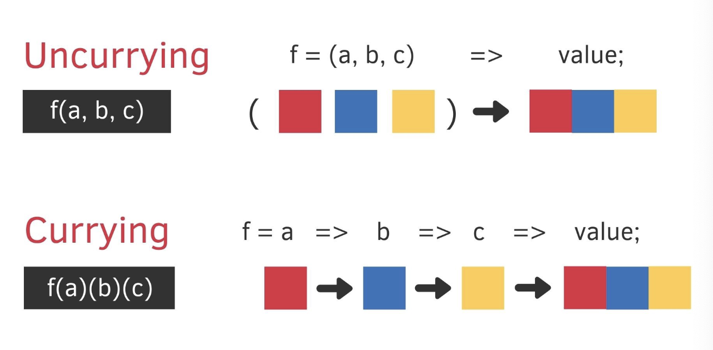

## OT 무엇을 배울 것인가.

```jsx
function createH1(props) {
    ...
}
function createDiv(props) {
    ...
}

const creatorMap = {
  h1: createH1,
  div: createDiv,
};
function createElement(type, props) {
  return creatorMap[type](props);
}
```

기존 createElement에
switch문으로 type별 element를 생성하는 함수를 위처럼 바꿈.

h2가 추가된다고 하면,
creatorMap에 h2:createH2 해준다.
creaeElement에는 영향이 없음.

-> 변화에 대한 영향 범위를 특정범위로 축소
-> 단단하고 견고해진다.

<br>

#### 지금도 createElement가 creatorMap 이라고하는 외부 변수에 의존하고 있다.

- creatorMap이 바뀌었을때 createElement가 잘못될 가능성이 있다.

```jsx
const createElement = (type,props) => creatorMap[type](props);

->

커링?
const createElement = map => (type, props) => map[type](props);

->

createElement를 만드는 팩토리같은 역할.
const coupler = (map) => (type, props) => map[type](props);
const createElement = coupler(creatorMap);
```

이렇게 하면 createElement는 creatorMap객체의 종속성을 끊어내게 됨.

<br>

---

<br>

## +

## 커링

다중 인수를 갖는 함수를 단일 인수를 갖는 함수들의 함수열로 바꾸는 것.



```jsx
// 커링 변환을 하는 curry(f) 함수 (일반함수 ver)
function curry(f) {
  return function (a) {
    return function (b) {
      return f(a, b);
    };
  };
}

// 커링 변환을 하는 curry(f) 함수 (화살표함수 ver)
const curry = (f) => (a) => (b) => f(a, b);

// f에 전달된 함수
const sum = (a, b) => a + b;

const curriedSum = curry(sum);

console.log(curriedSum(1)(2)); // 3
```

<br>

## 객체 데이터를 가져오는 커링

#### 커링을 사용하지 않은 경우

```jsx
const todos = [
  { id: 3, content: "HTML", completed: false },
  { id: 2, content: "CSS", completed: true },
  { id: 1, content: "Javascript", completed: false },
];

const getTodosIdArr = (todos) => todos.map((todo) => todo.id);
const getTodosContentArr = (todos) => todos.map((todo) => todo.content);
const getTodosCompletedArr = (todos) => todos.map((todo) => todo.completed);

console.log(getTodosIdArr(todos)); // [ 3, 2, 1 ]
console.log(getTodosContentArr(todos)); // [ 'HTML', 'CSS', 'Javascript' ]
console.log(getTodosCompletedArr(todos)); // [ false, true, false ]
```

#### 커링을 사용한 경우

```jsx
const todos = [
  { id: 3, content: "HTML", completed: false },
  { id: 2, content: "CSS", completed: true },
  { id: 1, content: "Javascript", completed: false },
];

const get = (property) => (object) => object[property];

const getId = get("id");
const getContent = get("content");
const getCompleted = get("completed");

const getTodosIdArr = (todos) => todos.map(getId);
const getTodosContentArr = (todos) => todos.map(getContent);
const getTodosCompletedArr = (todos) => todos.map(getCompleted);

console.log(getTodosIdArr(todos)); // [ 3, 2, 1 ]
console.log(getTodosContentArr(todos)); // [ 'HTML', 'CSS', 'Javascript' ]
console.log(getTodosCompletedArr(todos)); // [ false, true, false ]
```

<br>

---

<br>
<br>
## 1타 쌍피

웹 애플리케이션을 개발할때 가장 많은 문제점을 일으키는 `Dom api`

DOM = html을 브라우저가 렌더링 하기 위해서 가공시켜놓은 객체.

dom 자체를 쓰지 않는 컨셉. -> react

<br>
<br><br><br>

---

## 변경하지 않고 확대하기

소프트웨어를 두가지로 나눠놓자.
바뀌는 부분과, 안바뀌는 부분.

상당히 중요한 코드는 안바뀌는 쪽으로 두면
소프트웨어 안정성이 높아진다.

아래 두 방법이 있다.

### 1. 플러그인

    대표적으로 크롬 브라우저. 확장 프로그램(extension)
    기존 기능은 두고 더 많은 기능을 추가할 수 있다.

### 2. 미들웨어

    컴퓨터 제작회사가 사용자의 특정 요구한대로 제공하는 프로그램.
    예로 express가 있다.


    둘다 호스트 코드에 변경없이 새로운 기능을  추가할 수 있는 구조를 제공한다는 공통점이 있지만 차이가 있고 그것을 앞으로 알아볼 것.

이런 소프트웨어 아키텍처 말고도
ui 단에서의 `component architecture`가 있다.

변경과 관련된 주제이다.

<br><br><br>

---

<br>

## 웹 프론트엔드 개발환경

bundler - webpack
bebel이 loader로 제공된다.

바벨자체도 플러그인 아키텍처로 되어있다.

## 결론 : react가 dom이 가진 문제점을 어떻게 해결할 것인가.
