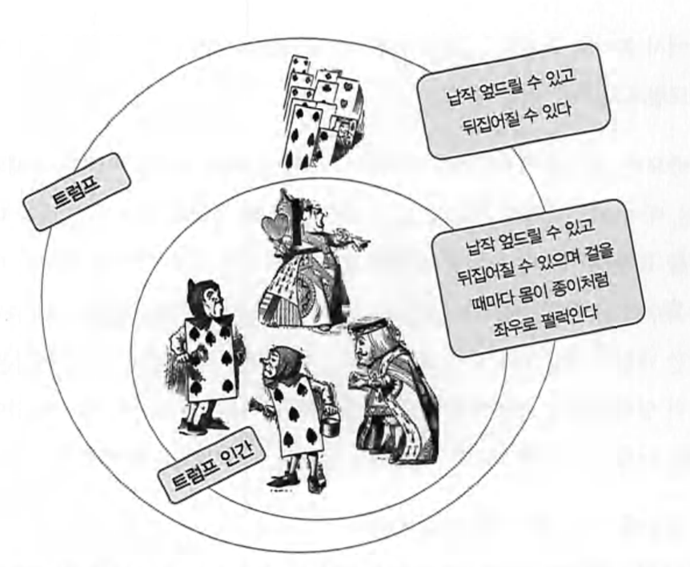

# 3. 타입과 추상화

프로그램을 작성하기위한 중요한 전제 조건은 추상화를 정확하게 다루는 능력이다.

一 키스 데블린(Keith DevlinjDevlin 2003]

Harry beck이란 영국인이 전기회로 도면과 지도를 융합하여 현대의 지하철 노선도의 원형을 디자인했다.

- 기존의 노선도는 실제와 유사한 물리적인 지형위에 구불구불 운행 노선과 역 간 거리를 사실적으로 묘사하고 있었다.
- 그러나 지하철 승객의 목적은 하나의 역에서 다른 역으로 이동하는 것 뿐이다.

`정확성`을 버리고 `목적`에 집중해 지하철 노선을 추상화한 것이다.

 

## 추상화

어떤 목적에 대해 불필요한 부분을 무시함으로써 복잡도를 극복하는 방법이다.

#### 추상화에는 2가지 차원이 있다.

1. 구체적인 사물들 간의 공통점은 취하고 차이점은 버리는 일반화를 통해 단순하게 만드는 것.

   - 이야기에서 앨리스는 정원사, 병사, 왕자와 공주, 왕비, 왕 등 인물들의 공통점만을 취해 트럼프라는 개념으로 추상화 했다.

2. 중요한 부분을 강조하기위해 불필요한 세부 사항을 제거하는 것.
   - 트럼프에 속하는 객체들의 공통점 중에서도 중요하다고 생각하는 몸이 납작하고 두 손과 발이 몸 모서리에 달려있다는 사항 외에 불필요한 부분들을 무시하고 있다.

이처럼 공통점을 기반으로 객체들을 묶기 위한 그릇을 `개념(concept)`이라고 한다.

#### 개념을 적용하는 예를 들자면,

- 길에 다니는 교통수단에 대해서 '자동차'라는 개념을 적용.
- 북스터디를 하는 우리는 '인간'이라는 개념.
- 공통점을 기준으로 개념을 적용한다?
- 라이언, 해리, 필 에는 '인간' 말고도 '남자'라는 개념을 적용할 수 있다. 레나는 '남자' 개념에 대한 공통점이 없어(내연을 만족시키지 못하기 때문에) '남자'개념을 적용할 수 없다.

객체에 특정한 개념을 적용할 수 있어 개념 그룹의 일원이 될 때 객체를 그 개념의 `인스턴스(instance)`라고 한다.

개념이 class와 같은것으로 느껴졌는데 class를 생각하는 것이 아니라 행동과 협력에 집중한 객체설계를 위해 확장된 의미의 '개념'을 사용하는 것 아닐까.

 

## 개념의 세 가지 관점

1. 심볼(symbol) : 개념을 가리키는 간략한 이름이나 명칭
2. 내연(intension) : 개념의 완전한 정의를 나타내며 내연의 의미를 이용해 객체가 개념에 속하는지 여부를 확인할 수 있다.
3. 외연(extension) : 개념에 속하는 모든 객체의 집합(인스턴스들이 모여 이뤄진 집합)

심볼 - 앨리스가 인물들을 추상화해 정의한 개념의 이름은 '트럼프'이다.
내연 - 앨리스가 '몸이 납작하고 두 손, 발이 네모난 몸 모서리에 달려있다는 트럼프에 대한 설명이 내연이다.
외연 - 앨리스 이야기에서 정원사, 병사, 신하, 왕자와 공주, 왕, 왕비 모두 외연을 구성하는 객체 집합.

 

---

 

## 타입은 개념이다.

앨리스는 정원의 인물들을 대부분 트럼프라는 `타입`으로 분류했다.
타입의 정의는 개념의 정의와 완전히 동일하지만, 컴퓨터 내부로 들어오는 순간 기계적인 의미로 윤색되어 혼란스러운 부분이 있다.

 

## 행동이 우선이다.

- 객체가 어떤 행동을 하느냐에 따라 객체의 타입이 결정된다.
- 객체의 타입은 객체의 내부 표현과는 아무런 상관이 없다.
- 동일한 책임을 수행하는 일련의 객체는 동일한 타입에 속한다고 말할 수 있고 동일한 행동을 하기만 하면 된다.
- 동일한 데이터를 가지고 있더라도 다른 행동을 한다면 그 객체들은 서로 다른 타입으로 분류돼야 한다.

 

- 같은 타입에 속한 객체는 행동만 동일하다면 서로 다른 데이터를 가질 수 있다.
- 다만 내부의 표현 방식이 다르기 때문에 동일한 메시지를 처리하는 방식이 서로 다를 수 있다.
  - 이것은 다형성을 의미하며 동일한 요청에 다른 방식으로 응답할 수 있는 능력을 뜻한다.

#### 동일한 메시지를 서로 다른 방식으로 처리하기 위해서는 객체들은 동일한 메시지를 수신할 수 있어야 하기 때문에 결과적으로 다형적인 객체들은 동일한 타입(또는 타입 계층)에 속하게 된다.

객체에서도 타입에서도 행동 행동 행동 !! 을 강조하며 책임 주도 설계 언급.

 

## 타입의 계층

타입과 타입 사이에는 `일반화/특수화` 관계가 존재할 수 있다.

#### 트럼프 계층

정원사，병사, 신하，왕자와 공주，하객으로 참 석한 왕과 왕비들，하트 잭, 하트 왕과 하트 여왕은 정말로 트럼프인가?

 

그렇지 않다.
단지 트럼프와 몇 가지 특징을 공유하기 때문에 트럼프라고 불렀을 뿐이다.
객체가 동일한 타입으로 분류되기 위해서는 `공통의 행동`을 가져야 하는데

트럼프는 납작 엎드릴 수 있고 뒤집어질 수 있지만 걸어다닐 수는 없다.

따라서 정확히는,
`트럼프 타입`으로 불렸던 객체들을 `트럼프 인간` 이라는 타입으로 분류하는것이 옳다.

트럼프는 트럼프 인간보다 더 일반적인(포괄적인) 개념이다.
트럼프 인간은 트럼프를 좀 더 특수하게 표현한 것이다.

트럼프 인간 타입의 객체는 트럼프 타입의 객체가 할 수 있는 모든 행동을 할 수 있고
추가적으로 걸어다니는 행동을 더 할 수 있다.

외연의 관점에서 살펴보면,
트럼프 인간 타입에 속한 객체는 트럼프 타입의 객체에도 함께 속해야 한다.
위의 그림처럼 트럼프 인간 타입의 외연은 트럼프 타입의 외연의 부분 집합으로 표현할 수 있다.

이 두 개념 사이의 관계를
`일반화/특수화` 관계라고 한다.

여기서 중요한 것은 객체지향에서 일반화/특수화 관계를 결정하는 것은 객체의 상태를
표현하는 데이터가 아니라 행동이라는 것이다.

일반적인 타입을 `슈퍼타입(Supertype)` 이라고 하고 좀 더 특수한 타입을 `서브타입(Subtype)`이라고 한다.
서브타입은 슈퍼타입을 대체할 수 있어야 한다.
결국 트럼프 인간은 트럼프이므로 납작 엎드리거나 뒤집어지기만 하는 경우에는 트럼프를 대체하더라도 무방할 것이다.
따라서 어떤 타입을 다른 타입의 서브타입이라고 말할 수 있으려면 다른 타입을 대체할 수 있어야 한다.

 

## 일반화는 추상화를 위한 도구다

일반화/특수화 계층은 객체지향 패러다임에서 추상화의 두 번째 차원을 적절하게 활용하는 대표적인 예다.

- 앨리스가 '기껏해야 트럼프에 불과해'라고 생각했을때 앨리스는 걸을 수 있는 트럼프 인간의 특수한 능력은 제거하고 종이 조각처럼 쉽게 뒤집어지는 트럼프의 특성에 집중한 것이다.

- 불필요한 트럼프 인간의 특성은 제거해 상황을 단순하게 만들었다.

  

## 타입의 목적

타입을 사용하는 이유는 인간의 인지 능력으로는 시간에 따라 동적으로 변하는 객체의 복잡성을 극복하기가 너무 어렵기 때문이다.

p.103
