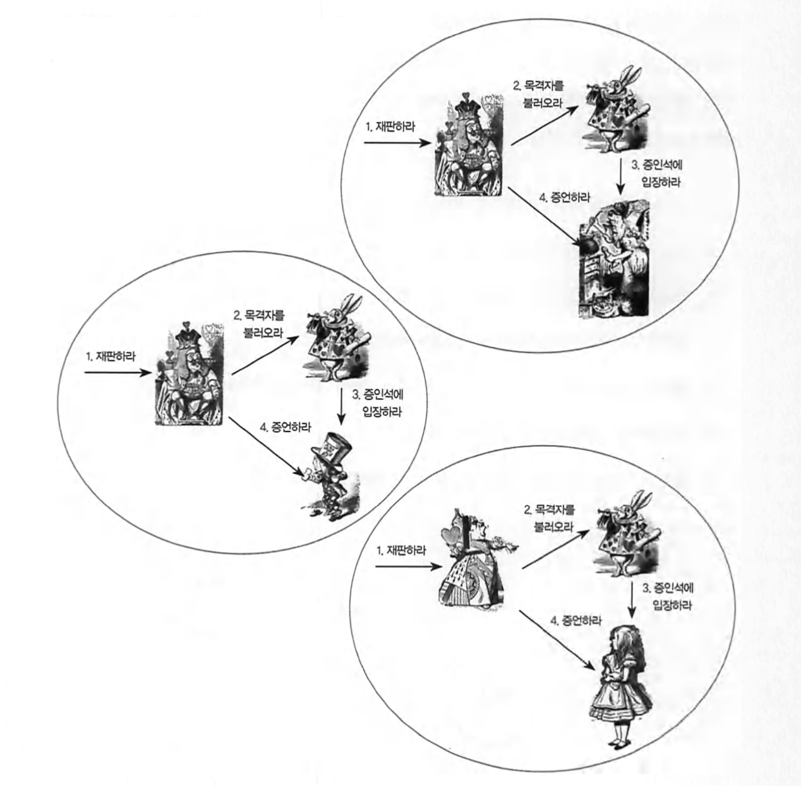

# 4. 역할, 책임, 협력

협력은 한 사람이 다른 사람에게 도음을 요청할 때 시작된다.

다른 사람으로부터 요청을 받은 사람 역시 자신에게 주어진 일을 처리하던 중에 다른 사람의 도움이 필요한 경우가 있다.

결과적으로 협력은 `다수의 요청과 응답`으로 구성 된다.

#### 왕은 `재판을 수행`하라는 요청에 응답할 수 있고 응답할 의무가 있기 때문에 재판을 수행할 `책임`을 갖는다.

객체와 책임이 이리저리 부유하는 상황에서 성급하게 구현에 뛰어드는 것은 변경에 취약하고 다양한 협력에 참여할 수 없는 비자율적인 객체를 낳게 됨으로 책임을 어떻게 구현할 것인가는 객체와 책임이 제자리를 잡은후에 고려해야한다.

## 책임의 분류

- 하는것

  - 객체를 생성하거나 계산을 하는 등의 스스로 하는 것.
  - 다른 객체의 행동을 시작시키는 것과 활동을 제어하고 조절하는 것.

- 아는것
  - 개인적인 정보에 관해 아는 것.
  - 관련된 객체에 관해 아는 것.
  - 자신이 유도하거나 계산할 수 있는 것에 대해 아는 것.

ex)

```
1. 왕은 재판집행이라는 책임을 수행하기위해 하얀토끼에게 목격자를 부르라고 요청,
2. 모자장수에게 증언하라고 요청,
```

이 경우 다른 객체들의 활동을 제어하고 조율하는 `'하는것`'과 관련된 책임을 수행하고 있다.

```
1. 하얀 토끼는 목격자가 모자 장수라는 사실을 알고있다.
2. 동시에 모자 장수가 증인석에 입장하도록 요청.
```

1번 책임은 관련된 객체에 대해 아는 것.
2번 책임은 다른 객체의 행동을 시작시키는 것.

따라서 토끼는 아는것과 하는것 두가지 종류의 책임을 모두 수행하고 있다.

```
1. 모자 장수는 스스로 입장해야함.
2. 아는 사실에 대해 증언해야함.
```

1번 책임은 객체를 생성하거나 계산을 하는 등의 스스로 하는것'의 범주에 해당.
2번 책임은 자신이 유도하거나 계산할 수 있는 것에 관해 아는것에 해당.
모자 장수도 역시 협력 안에서 아는것, 하는것 두 가지 종류의 책임을 모두 수행하고 있다.

<br>

#### 객체의 책임은 일반적으로 외부에서 접근 가능한 공용 서비스의 관점에서 이야기 한다.

책임은 객체의 외부에 제공해줄 수 있는 정보와 서비스의 목록이다.

따라서 책임은 객체의 공용 인터페이스를 구성한다.

이 개념은 뒤에서 다룰 캡슐화로 이어진다..;

<br>

**책임은 아는것과 하는것으로 분류할 수 있으며 외부에 제공할 수 있는 정보와 서비스의 목록으로 공용 인터페이스를 구성한다.**

<br>

---

<br>

## 책임과 메시지

한 객체가 다른 객체에게 주어진 책임을 수행하도록 요청을 보내는 것을 `메시지 전송`이라고 한다.

객체 간의 협력은 메시지를 통해 이뤄진다.

<br>

## 역할

어떤 객체가 수행하는 `책임의 집합`으로 볼 수 있다.
재사용이 가능하고 유연한 객체지향 설계에 중요한 구성요소이다.



왕대신 여왕이 집행,
요리사나 앨리스가 증언.
역할을 수행하는 객체가 달라졌을 뿐
재판이 이뤄지는 과정은 동일하다.


판사, 증인이라는 역할을 사용해 위의 세 협력을 모두 포괄할 수 있는 하나의 협력으로 추상화했다.

역할의 개념을 사용하면 유사한 협력을 추상화해서 다양한 객체들이 협력에 참여할 수 있기 때문에 협력이 유연해지며 재사용성이 높아진다.

리액트 컴포넌트 설계에서도 재사용 가능한 컴포넌트를 만들때 그 컴포넌트가 있는 목적을 생각하며 만들어 가는 과정이 책에서 말하는 협력의 추상화와 같다는 생각을 했다.

## 협력을 따라 흐르는 객체의 책임

올바른 객체를 설계하기 위해 먼저 견고하고 깔끔한 협력을 설계해야한다. 4장까지 넘어오면서 계속 행동, 협력을 강조하고 있는데 행동과 협력을 먼저 설계하는 이유가 위의 예시처럼
중복되는 협력을 없애고 재사용성을 개선할 수 있겠다.

<br>

---

<br>

## 객체지향 설계 기법

1. 책임 주도 설계(Responsibility-driven design)

   - 협력에 필요한 책임들을 식별, 적합한 객체에 책임을 할당하는 방식.
   - 시스템이 사용자에게 제공해야하는 기능인 시스템 책임을 파악, 더 작은 책임으로 분할한다.
     분할된 책임을 수행할 수 있는 적절한 객체 또는 역할을 찾아 책임을 할당한다.

2. 디자인 패턴 - 전문가들이 반복적으로 사용하는 해결 방법을 정의해 놓은 설계 템플릿의 모음. 역할, 책임, 협력의 모음이다.
   <br> 책임-주도 설계는 객체의 역할，책임, 협력을 고안하기 위한 방법과 절차를 제시하고 디자인 패턴은 책임-주도 설계의 결과를 표현한다. 패턴은 모범이 되는 설계이다.

Gof의 디자인패턴, 클린아키텍처도 읽어봐야겠다.
<br>

3. 테스트 주도 개발(Test-driven Development) - 테스트를 먼저 작성, 테스트를 통과하는 구체적인 코드를 추가하면서 완성해가는 방식.
   <br>테스트-주도 개발의 기본 흐름은 실패하는 테스트를 작성하고，테스트를 통과하는 가장 간단한 코드를 작성한 후 리팩터링(Refactoring)[Fowler 1999]을 통해 중복을 제거하는 것이다.
