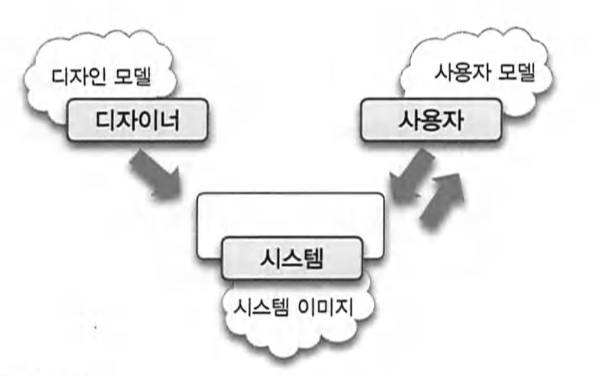
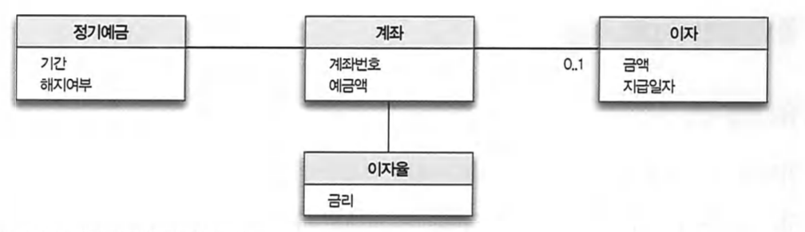

# 6. 객체 지도

목적지에 가는 법.

#### 1. 물어보는 것.

기능적이고 해결방법 지향적인 접근법.

일반적이지도, 재사용 가능하지도 않다.
중요한 지리적 랜드마크가 없다면 경로를 설명하기도 어렵고 설명만으로 경로를 찾기도 어렵다.

#### 2. 지도를 보고간다.

    구조적이고 문제 지향적인 접근법.

    길을 찾는 구체적인 기능이 아니라 길을 찾을 수 있는 구조를 제공한다.

    현재의 목적 뿐 아니라 다양한 목적을 위해 재사용될 수 있다.

    지도를 만드는 사람은 사용자가 구체적으로 어떤 목적으로 지도를 사용할 지 알지 못한다.

지도 사용자의 요구사항은 계속 바뀐다.

- 마을까지의 길을 찾기.
- 집으로의 길 찾기. 등등

기능에 대한 요구사항이 계속 변함에도 상대적으로 잘 변하지 않는 안정적인 지형 정보를 기반으로 한다.

지도 은유의 핵심은 기능이 아니라 구조를 기반으로 모델을 구축하는 편이 좀 더 범용적이고 이해하기 쉬우며 변경에 안정적이라는 것이다.

사람들에게 직접 길을 묻는 접근법은 기능에 구조를 종속시키는 방법이 며 지도는 구조에 기능을 종속시키는 방법.

객체지향은 자주 변경되는 기능이 아니라 안정적인 구조를 기반으로 시스 템을 구조화한다.

기능이 아니라 구조를 바탕으로 시스템을 분할하는 객체지향의 또 다른 측면에 관해 설명한다.

### 자주 변경되는 기능이 아니라 안정적인 구조를 따라 역할, 책임，협력을 구성하라.

  

---

 

## 기능 설계 대 구조 설계

모든 소프트웨어 제품의 설계에는 두 가지 측면이 존재한다. 하나는 ‘기능(function)’ 측면의 설계이고, 다른 하나는 ‘구조(structure)’측면의 설계다.

훌륭한 기능이 훌륭한 소프트웨어를 만드는 충분조건이라고 한다면 훌륭한 구조는 훌 륭한 소프트웨어를 만들기 위한 필요조건이다.

성공적인 소프트웨어들이 지닌 공통적
인 특징은 훌륭한 기능을 제공하는 동시에 사용자가 원하는 새로운 기능을 빠르고 안정 적으로 추가할 수 있다는 것이다.

설계라는 행위를 중요하게 만드는 것은 변경에 대 한 필요성이다. 안타깝게도 변경을 피할 수 있는 방법은 없기 때문에 좋은 설계에 대한 압력 역시 피할 수 없다.

훌륭한 설계자는 사용자가 만족할 수 있는 훌륭한 기능을 제공하는 동시에 예 측 불가능한 요구사항 변경에 유연하게 대처할 수 있는 안정적인 구조를 제공하는 능력
을 갖춰야 한다.

미래에 대비하는 가장 좋은 방법은 변경을 예측하는 것이 아니라 변경을 수용할 수 있는 선택의 여지를 설계에 마련해 놓는 것이다.

나중에 설계하는 것을 허용하는 것이며, 설계의 일차적인 목표는 변경에 소요되는 비용을 낮추는 것이 다[Metz 2012].

변경의 여지를 남겨 놓는 가장 좋은 방법은 자주 변경되는 기능이 아닌 안정적인 구조룰 중심으로 설계하는 것이다.

객체지향 접근방법은 자주 변경되지 않는 안정적인 객체 구조를 바탕으로 시 스템 기능을 객체 간의 책임으로 분배한다.
변하는 부분, 안변하는 부분.

 

## 두 가지 재료 : 기능과 구조

객체지향 세계를 구축하기 위해서는 사용자에게 제공할 기능’과 기능을 담을 안정적인
‘구조’라는 재료가 준비돼 있어야 한다.

■ 구조는 사용자나 이해 관계자들이 도메인(domain)에 관해 생각하는 개념과 개념들간의 관계로 표현한다.

■ 기능은 사용자의 목표를 만족시키기 위해 책임을 수행하는 시스템의 행위로 표현한다.

일반적으로 기능을 수집하고 표현하기 위한 기법을 유스케이스 모델링

구조를 수집하고 표현하기 위한 기법을 도메인 모델링

 

## 안정적인 재료 : 구조

#### 도메인 모델

병원 - 환자기록 보관 조회
은행 - 자산관리, 보호
게임유저들 - 지루함을 해결

사용자가 프로그램을 사용하는 대상 분야를 도메인이라고 한다.

도메인 모델에서 모델이란 대상을 단순화해서 표현한 것이다. 모델은 지식을 선택적으
로 단순화하고 의식적으로 구조화한 형태다[Evans 2003].
추상화

은행 업무에 종사하는 사람들은 은행 도메인을 고객과 계좌 사이의 돈의 흐름으로 이해 할 것이다.

중고 자동차 판매상은 구매되는 자동차와 판매되는 자동차의 교환으로 자동차 도메인을 바라볼 것이다.

게임 플레이어들은 게임 도메인을 캐릭터와 몬스터. 그리고 몬스터가 떨구는 아이템 간의 관계로 파악한다.

프로그래밍에 종사하는 사람들은 프로그래밍 도메인을 커피를 입력으로 코드를 출력하는 함수로 파악한다.

도메인 모델은 이해관계자들이 바라보는 `멘탈 모델(Mental Model)`이다. 멘탈 모델이란 사람들이 자기 자신, 다른 사람，환경, 자신이 상호작용하는 사물들에 대해 갖는 모형이다.

도널드 노먼(Donald Norman)은 제품을 설계할 때 제품에 관한 모든 것이 사용자들 이 제품에 대해 가지고 있는 멘탈 모델과 정확하게 일치해야 한다고 주장한다.

사용자들은 자신의 멘탈 모델과 유사한 방식으로 제품이 반응하고 움직일 것이 라고 기대하기 때문에 훌륭한 디자인이란 사용자가 예상하는 방식에 따라 정확하게 반 응하는 제품을 만드는 것이다.

사용자 모델은 사용자가 제품에 대해 가지고 있는 개념들의 모습이다. 디자인 모델은 설계자가 마음 속에 갖고 있는 시스템에 대한 개념화다. 시스템 이미지 는 최종 제품이다.

도메인 모델은 도메인에 대한 사용자 모델，디자인 모델, 시스템 이미지를 포괄하도록 추상화한 소프트웨어 모델이다. 따라서 도메인 모델은 소프트웨어에 대한 멘탈 모델 이다.

도널드 노먼의 주장을 요약하면 최종 제품은 사용자의 관점을 반영해야 한다는 것이 다. 이것은 소프트웨어 개발에도 동일하게 적용할 수 있다. 최종 코드는 사용자가 도메 인을 바라보는 관점을 반영해야 한다. 이것은 곧 애플리케이션이 도메인 모델을 기반
으로 설계돼야 한다는 것을 의미한다.

 

도메인 모델을 기반으로 코드를 작성하는 두 번째 이유는 도메인 모델이 제공하는 구조가 상대적으로 안정적이기 때문이다.

실제 운영되는 정기예금 상품을 매우 단순화한 것이지만 일반적으로 사람들이 정기예금에
관해 생각하는 개념과 규칙을 모두 포함하고 있다.

사용자 모델의 관점을 반영한다.

개념의 정의와 속성은 은행 업무에 서 다뤄지는 정기예금의 정의가 변경되지 않는 한 쉽게 바뀌지 않을 것이다.

정기예금과 관련된 중요한 비즈니스 규칙과 정책을 반영하고 있다. 도메인 모델의 장점은 비즈니스의 개념과 정책을 반영하는 안정적인 구조를 제공한다는 것이다.

비록 도메인 모델이 도메인과 관련된 중요한 개념과 관계를 보여준다고 해도 실제로 사 용자에게 중요한 것은 도메인 모델이 아니라 소프트웨어의 기능이다.

소프트웨어의 존 재 이유는 사용자가 원하는 목표를 달성할 수 있는 다양한 기능을 제공하는 것이다. 따 라서 사용자에게 제공할 기능을 기술한 정보가 필요하다. 객체지향 커뮤니티에서는 오 래 전부터 소프트웨어의 기능을 기술하기 위해 `유스케이스`라는 유용한 기법을 사용해왔다.

 

## 불안정한재료: 기능

#### 유스케이스

기능적 요구사항이란 시스템이 사용자에게 제공해야 하는 기능의 목록을 정리한 것이다.

훌륭한 기능적 요구사항을 얻
기 위해서는 목표를 가진 사용자와 사용자의 목표를 만족시키기 위해 일련의 절차를 수 행하는 시스템 간의 ‘상호작용’관점에서 시스템을 바라봐야한다.

사용자의 목표를 달성하기 위해 사용자와 시스템 간에 이뤄지는 상호작용의 흐름을 텍스트로 정리한 것을 유스케이스라고 한다.

사용자 목표가 유스케이스의 핵심이다. 유스케이 스는 공통의 사용자 목표를 통해 강하게 연관된 시나리오의 집합이다.
